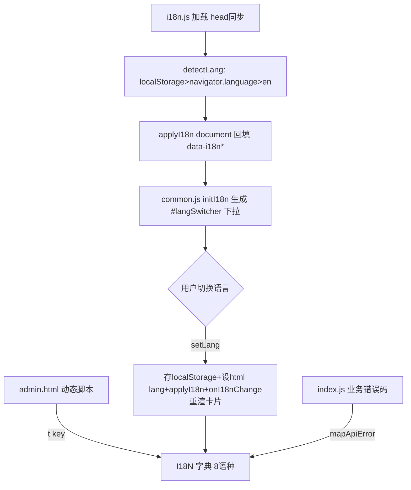

## 用户需求

网页需支持多语言展示，依据用户操作系统语言自动适配，并允许用户手动切换。默认语言为英语，额外支持：中文、俄语、日语、韩语、西班牙语、法语、德语。

## 产品概述

在现有 Cloudflare Workers + 静态前端（login.html / admin.html）上增加国际化能力。用户首次访问时根据 `navigator.language` 自动判定语言（命中支持列表则用，否则回退英语）；通过页面右上角的语言切换器可随时手动切换，选择持久化到 `localStorage`，刷新后保持。

## 核心特性

- 自动语言检测：优先读取已保存语言，其次按浏览器语言匹配支持语种，最终回退英语。
- 手动切换：登录页与管理后台右上角提供语言下拉选择器，切换即时生效并持久化。
- 静态与动态文案全覆盖：页面静态文本（标题、标签、按钮、提示、页脚）与后台 JS 动态生成的卡片、模态框、Toast 提示均随语言切换。
- 后端错误本地化：将 `index.js` 抛出的业务错误改为稳定错误码，前端统一映射成本地化文案，避免非中文环境下出现中文报错。
- 八语种文案：英语（默认）、中文、俄语、日语、韩语、西班牙语、法语、德语。

## 技术栈

- 纯静态前端：HTML + 原生 JavaScript（无构建步骤），由 Cloudflare Assets 从 `./dist` 提供。
- 样式沿用现有 `dist/theme.css`（DaisyUI v5 设计令牌）与 Tailwind，不引入新框架。
- 新增 `dist/i18n.js` 作为共享国际化引擎，与 `common.js` 一致在 `<head>` 内同步引入，避免文本闪烁。

## 实现方案

### 总体策略

采用「字典 + 属性声明 + 函数调用」三层本地化：

1. **字典层**：`dist/i18n.js` 内定义 `I18N` 对象，键为语义化 key，值为各语种字符串；同时定义 `LANGS` 支持语种清单（含本地显示名）。
2. **静态层**：HTML 元素用 `data-i18n` / `data-i18n-ph` / `data-i18n-title` / `data-i18n-tip` 声明，由 `applyI18n(root)` 统一回填。
3. **动态层**：`admin.html` 内联脚本中所有硬编码中文改为 `t('key')` 调用；切换语言时触发 `onI18nChange` 钩子重新渲染卡片列表与已打开模态框的动态文本。

### 关键技术决策

- **语言判定顺序**：`localStorage('lang')` → `navigator.language` 前缀匹配（如 `zh-CN`→`zh`）→ 默认 `en`。回退保证任何环境都有完整英文兜底。
- **避免中英混排**：`setLang(lang)` 负责 ①写 `localStorage` ②设 `<html lang>` ③`applyI18n(document)` 回填静态 ④调用 `window.onI18nChange?.()` 重渲动态内容。后台在 `onI18nChange` 中调用 `renderCurrentPage()` 重建卡片（卡片内部文本本就用 `t()` 生成）。
- **首屏防闪烁**：`i18n.js` 在 `<head>` 同步加载，于 `DOMContentLoaded` 立即 `applyI18n`；HTML 源中保留中文仅作无 JS 时的降级，正常加载会被即时替换。
- **后端错误码化**：`index.js` 的 `throw new Error('中文')` 改为 `throw new Error('PATH_RESERVED')` 等稳定码（不改动业务逻辑与 SQL），前端 `mapApiError(data)` 将码映射为 `t('err_xxx')`，未命中码则回退通用提示。
- **可测试性**：`i18n.js` 末尾加 `if (typeof module!=='undefined') module.exports={I18N,LANGS,t}` 导出守卫，便于 Node 校验脚本复用同一份字典。

### 性能与可靠性

- `applyI18n` 为一次性 DOM 遍历（O(节点数)），开销可忽略；语言切换仅重渲当前卡片列表（单页 ≤50 条），无额外网络请求。
- 字典完整性与 key 一致性由独立 Node 校验脚本保证（见验证）。
- `t(key,params)` 支持 `{name}` 占位插值，缺失 key 时回退英语再回退 key 字符串，绝不抛错。

## 实现要点

- **dist/i18n.js（NEW）**：导出 `LANGS`、`I18N`、`t()`、`detectLang()`、`applyI18n(root)`、`setLang(lang)`、`createLangSwitcher(mountEl)`；定义 `#langSwitcher` 占位渲染逻辑（原生 `<select>` 下拉，含 8 语种）。
- **dist/common.js（MODIFY）**：在 `DOMContentLoaded` 初始化中新增 `initI18n()`（设 html lang、执行 `applyI18n`、生成语言选择器到 `#langSwitcher`）。
- **dist/login.html（MODIFY）**：为标题/品牌/标签/输入框/按钮/页脚/tooltip 加 `data-i18n*`；右上角新增 `#langSwitcher` 占位（与主题切换并排）。
- **dist/admin.html（MODIFY）**：
- 静态：顶部导航、操作区、说明面板、创建/编辑/详情/删除模态框、筛选/排序/分页、页脚等全部加 `data-i18n*`，新增 `#langSwitcher`。
- 动态：约 40 处 `showAlert('中文')`、卡片 badge/按钮文本、`createMappingCard`、`showDetailModal`、`openEditModal` 等改为 `t()`；新增 `window.onI18nChange = () => { renderCurrentPage(); /* 重渲卡片 */ }`；错误提示改用 `mapApiError(data)`。
- **index.js（MODIFY）**：`createMapping`/`deleteMapping`/`updateMapping` 的 5 类 `throw` 改为错误码：`PATH_RESERVED`、`WECHAT_DATA_REQUIRED`、`PATH_DELETE_RESERVED`、`INVALID_INPUT`、`INVALID_EXPIRY`。

## 架构设计



模块关系：两页共享 `common.js`+`i18n.js`；`i18n.js` 不依赖任何后端，纯前端字典与 DOM 操作；`admin.html` 通过全局 `window.i18n`/`window.onI18nChange` 与引擎解耦。

## 目录结构

```
dist/
├── i18n.js        # [NEW] 国际化引擎：LANGS、I18N 八语种字典、t()、detectLang()、applyI18n()、setLang()、createLangSwitcher()；末尾 module.exports 守卫供 Node 校验
├── common.js      # [MODIFY] 在 DOMContentLoaded 初始化中接入 initI18n()（设 html lang、applyI18n、渲染语言选择器）
├── login.html     # [MODIFY] 为静态文本加 data-i18n*/占位符；右上角新增 #langSwitcher 占位
└── admin.html     # [MODIFY] 静态文本加 data-i18n* + #langSwitcher；内联脚本约40处中文改为 t()，新增 onI18nChange 重渲钩子，错误提示走 mapApiError
index.js           # [MODIFY] 5 类业务错误改为稳定错误码（PATH_RESERVED 等），不改变 SQL/逻辑
_i18n_check.mjs    # [NEW/临时] Node 校验脚本：校验 8 语种 key 一致性 + 源码 t()/data-i18n 使用的 key 均存在于 en 字典；验证后删除
```

## 关键代码结构

```javascript
// dist/i18n.js 核心接口（实现细节略）
const LANGS = [
  { code: 'en', label: 'English' }, { code: 'zh', label: '中文' },
  { code: 'ru', label: 'Русский' }, { code: 'ja', label: '日本語' },
  { code: 'ko', label: '한국어' }, { code: 'es', label: 'Español' },
  { code: 'fr', label: 'Français' }, { code: 'de', label: 'Deutsch' },
];
const I18N = { en: { /* ... */ }, zh: { /* ... */ }, ru:{}, ja:{}, ko:{}, es:{}, fr:{}, de:{} };
function t(key, params) { /* 回退：当前语言>en>key */ }
function detectLang() { /* localStorage > navigator.language > 'en' */ }
function applyI18n(root) { /* 处理 data-i18n / -ph / -title / -tip */ }
function setLang(lang) { /* 持久化 + html lang + applyI18n + onI18nChange */ }
function createLangSwitcher(mountEl) { /* 渲染 <select id="langSelect"> 并绑定 change */ }
```

## 设计风格

在现有专业商务风（DaisyUI v5 + 企业蓝 #2563EB）基础上，于页面右上角主题切换按钮旁新增一个语言切换选择器。采用原生 `<select>` 下拉（DaisyUI `select select-bordered select-xs md:select-sm` 样式），与主题按钮视觉权重一致、对齐整齐，保持克制不破坏既有布局。

## 布局与交互

- **登录页**：右上角绝对定位容器内，语言选择器与主题圆形按钮水平并排，选择器宽度自适应、圆角与按钮协调。
- **管理后台**：顶部导航栏右侧按钮组中，语言选择器插入在主题按钮与「退出」按钮之间，使用 `join` 或独立 `select` 保持间距一致。
- **交互**：切换即时生效，下拉展开显示 8 语种本地名；选中项与当前语言一致；切换后整页（含动态卡片与模态框）文案刷新，无刷新闪烁。
- **响应式**：移动端选择器缩小尺寸（`select-xs`），与既有按钮组在窄屏自动换行对齐。