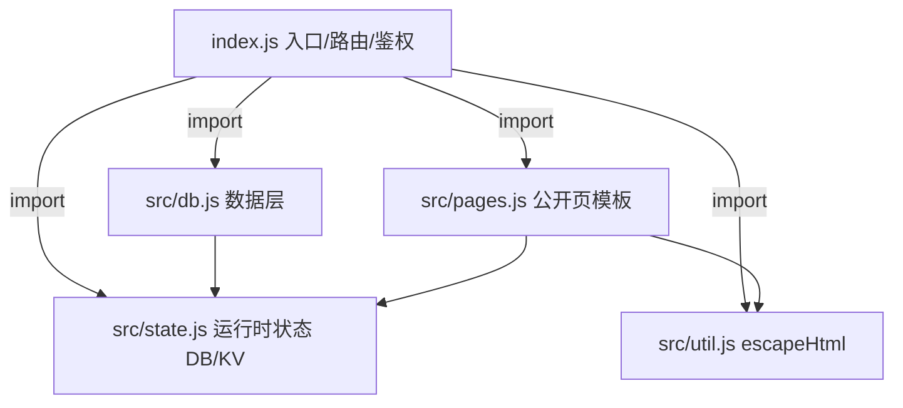

## 用户需求

将单体后端 `index.js`(约 969 行)做"轻量拆分",提升可维护性,但保持线上行为完全不变。用户已确认采用轻量方案:仅抽出数据层与公开页模板,路由/鉴权/接口分发仍留在 `index.js`。

## 核心目标

- 新增共享模块承载跨文件运行时状态(`DB`/`KV_BINDING`)与工具函数,解决 ES module 拆分后的状态共享问题。
- 把"数据层"(数据库初始化、CRUD、输入校验、KV 迁移)抽到 `src/db.js`。
- 把"公开页"(过期页/微信活码页的 HTML 模板、`PUBLIC_I18N`、`pickLang`)抽到 `src/pages.js`。
- `index.js` 退化为路由/鉴权/接口分发骨架。

## 约束与边界

- Cloudflare Workers 项目,采用 `export default { fetch, scheduled }` 模块写法;`wrangler`(esbuild) 部署时打包为单文件 Worker,运行时与单文件等价,无性能/体积惩罚。
- 纯重构:不修改任何业务逻辑、SQL、文案、i18n 内容,仅做文件重组。
- 禁止随意 `git push`,仅 `git add` + `git commit`,推送需用户明确确认。
- 文档中英双语同步约定(英文根目录、中文 `docs/zh/`)继续保持。

## 技术栈

- 运行环境:Cloudflare Workers(模块语法 `export default`)。
- 语言:JavaScript(ES Modules,支持 `import`/`export`)。
- 打包:Wrangler 内置 esbuild,多文件在部署时合并为单一 Worker 脚本,线上行为与单文件一致。
- 数据库:Cloudflare D1(经 `env.DB`),KV 经 `env.KV_BINDING`。

## 实现方案

采用"共享状态模块 + 职责拆分"策略,把 `index.js` 拆为 4 个新文件 + 1 个瘦身后的入口:

1. **`src/state.js`(新增,共享运行时状态)**:导出 `export let DB`、`export let KV_BINDING` 与 `export function initState(env){ DB = env.DB; KV_BINDING = env.KV_BINDING; }`。

- 关键决策:利用 ES module 的 **live binding** 特性——命名导入的 `let` 绑定在 `initState()` 重赋值后,所有 `import { DB }` 的模块同步可见,无需把 `env` 层层下传,改动面最小、风险最低。

2. **`src/util.js`(新增,工具)**:仅导出 `escapeHtml(str)`。
3. **`src/db.js`(新增,数据层)**:`import { DB, KV_BINDING } from './state.js'`,导出 `banPath`、`PATH_MAX/NAME_MAX/TARGET_MAX/PATH_RE`、`normalizeTarget`、`validateMappingInput`、`initDatabase`、`listMappings`、`createMapping`、`deleteMapping`、`pinMapping`、`updateMapping`、`getExpiringMappings`、`cleanupExpiredMappings`、`migrateFromKV`。函数体内直接引用导入的 `DB`/`KV_BINDING`(live binding)。
4. **`src/pages.js`(新增,公开页)**:`import { DB } from './state.js'; import { escapeHtml } from './util.js';` 导出 `PUBLIC_LANGS`、`PUBLIC_I18N`、`pickLang`,以及两个渲染函数 `renderExpiredPage({ name, lang, T, expiry })` 与 `renderWechatPage({ name, lang, T, qrCodeData })`(由原 L754-929 两段内联模板改写为带参、返回 HTML 字符串的函数)。
5. **`index.js`(修改,入口骨架)**:

- 删除已迁出的常量与函数,顶部补充 4 组 import。
- `fetch` 与 `scheduled` 内的 `KV_BINDING = env.KV_BINDING; DB = env.DB;` 统一替换为 `initState(env);`。
- 过期模板块(L754-836)与微信模板块(L842-928)改为调用 `renderExpiredPage(...)` / `renderWechatPage(...)`,保留原 `status`/`headers`(`404` + `Content-Type: text/html;charset=UTF-8` + `Cache-Control: no-store`)。
- 保留:鉴权三函数、`api/mapping` GET 的 `DB.prepare`、redirect 查询的 `DB.prepare`、全部路由分发逻辑(这些仍直接 `import { DB }` 使用)。

## 实现要点(防回归)

- **仅重组不改逻辑**:SQL 语句、校验规则、文案、i18n 键值一律原样迁移,杜绝行为变化。
- **live binding 验证**:`state.js` 用 `export let`,`db.js`/`pages.js`/`index.js` 用命名导入;注意 `db.js` 的 `migrateFromKV` 同时用到 `DB` 与 `KV_BINDING`,需两者都导入。
- **`index.js` 仍引用 `DB`**:两处 `DB.prepare(...)` 保留在入口内,因此入口必须 `import { DB, initState } from './src/state.js'`。
- **路径**:新文件置于 `src/` 目录,`index.js` 与 `wrangler.toml` 的 `main` 指向不变(仍是根目录 `index.js`),新文件为相对导入 `./src/xxx.js`。

## 架构设计



## 目录结构

```
serverless-qrcode-hub/
├── index.js            # [MODIFY] 入口:路由分发 + 鉴权(clearAuthCookie/setAuthCookie/verifyAuthCookie) + 接口处理;import 四个子模块;fetch/scheduled 调用 initState(env)
└── src/
    ├── state.js        # [NEW] 共享运行时状态:export let DB / KV_BINDING + initState(env);供 db.js/pages.js/index.js 经 live binding 读取
    ├── util.js         # [NEW] escapeHtml(str) 工具函数
    ├── db.js           # [NEW] 数据层:banPath、PATH_*/PATH_RE、normalizeTarget、validateMappingInput、initDatabase、listMappings、createMapping、deleteMapping、pinMapping、updateMapping、getExpiringMappings、cleanupExpiredMappings、migrateFromKV
    └── pages.js        # [NEW] 公开页:PUBLIC_LANGS、PUBLIC_I18N(8语种)、pickLang、renderExpiredPage()、renderWechatPage()
```

## 验证方式

- 对每个新文件及 `index.js` 执行 `node --check` 语法校验。
- 重启 `npm run dev:local` 冒烟测试:列表/分页、新增/编辑/删除、重定向跳转、过期页、微信活码页、定时任务 `scheduled` 路径。
- 若 `docs/CODE_DESIGN.md`(及 `docs/zh/CODE_DESIGN.md`)描述单文件结构,需同步更新为已拆分结构(中英同步约定)。
- 提交:`git add` + `git commit`,**不** `git push`。