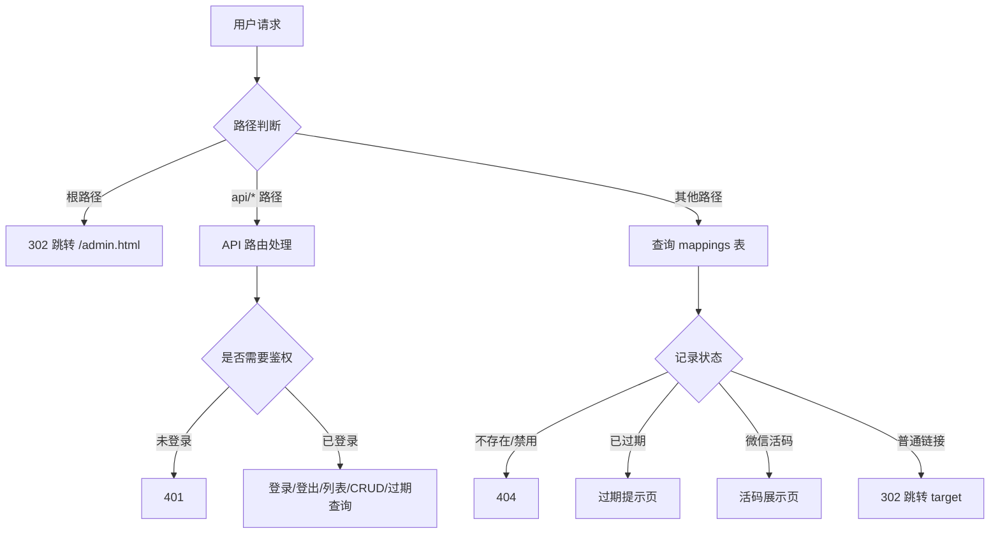

## 用户需求

分析整个 serverless-qrcode-hub 项目，生成一份详尽的中文代码设计文档，要求逐函数、逐流程"详细说明每一个逻辑"，而非仅做概览。

## 产品概述

serverless-qrcode-hub 是一个基于 Cloudflare Workers + D1 数据库的"无服务器"永久二维码与短链接系统。用户通过管理后台创建短链或微信群活码，访问短链时普通链接 302 跳转，微信活码则渲染原始二维码页面供长按识别。系统自带密码鉴权，并提供定时检查过期链接的能力。

## 核心特性

- 短链创建/编辑/删除/分页查询（D1 单表存储，path 为主键）
- 微信群活码：上传识别二维码图片，访问时展示原图供长按识别
- 密码登录鉴权（Cookie 明文 token）
- 二维码识别（ZXing）与自定义样式生成（qr-code-styling）
- 定时任务（cron）检查即将过期/已过期链接并输出日志
- 深色/浅色/跟随系统三态主题切换
- KV 到 D1 的数据迁移兼容逻辑

## 技术栈

- 运行环境：Cloudflare Workers（compatibility_date 2025-03-10）
- 存储：Cloudflare D1（SQLite 兼容，绑定名 DB）
- 静态资源：Cloudflare Assets（./dist 目录，绑定 ASSETS）
- 前端：原生 HTML + Tailwind CSS v4 + daisyUI v5，第三方库 qr-code-styling.js（生成）、zxing.js（识别）
- 部署：Wrangler v4（dev/deploy 脚本）

## 文档编写方案

### 策略

以单一 Markdown 文件 `docs/CODE_DESIGN.md` 输出，按"架构总览 → 后端 → 前端 → 配置部署"分层组织。对每个函数/事件处理函数逐一说明：功能、入参、内部逻辑分支、SQL/API 调用、返回结构、边界与异常。所有解释基于已核实的源码（index.js / dist/login.html / dist/admin.html / wrangler.toml）。

### 架构图（后端请求流转）



### 关键实现说明

- 数据库迁移兼容：initDatabase 通过 PRAGMA table_info 检测列，对旧表 ALTER 添加 isWechat / qrCodeData。
- 分页与总数：`listMappings` 用 CTE + 子查询一次性返回数据与 total_count，避免 N+1。
- 微信活码原理：qrCodeData 存原始图片 DataURL，服务端渲染 HTML 内联展示，区别于普通 302。
- 安全性提示：Cookie token 为明文密码，文档需单独标注风险与改进建议。
- cleanupExpiredMappings / migrateFromKV 当前未被路由/定时任务调用，文档需指明其"保留未启用"状态。

## 目录结构（新增/修改）

```
docs/
└── CODE_DESIGN.md   # [NEW] 详尽中文代码设计文档，覆盖架构、后端逐函数、前端逐模块、配置部署、安全与优化建议
```