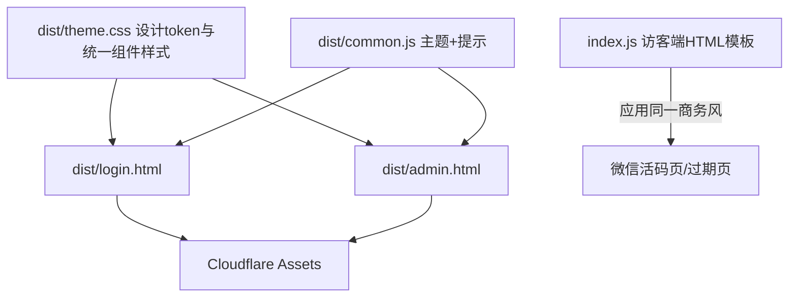

## 用户需求

优化 serverless-qrcode-hub 的整个 UI 界面，建立统一的"专业商务风"设计系统，覆盖登录页、管理后台与访客端页面（微信活码页、链接过期页）。

## 产品概述

当前项目前端为原生 HTML + Tailwind CSS v4 + DaisyUI v5，无构建步骤，静态资源由 Cloudflare Assets 提供。界面功能完整但视觉偏朴素，两页存在大量重复的主题脚本代码。本次优化在**不改动后端业务逻辑**的前提下，统一设计语言，提升观感与可用性。

## 核心特性

- **统一设计系统**：通过新增共享 CSS（设计 token：主色、圆角、阴影、间距、字体栈）与共享 JS（主题切换、消息提示），定义一致的视觉规范，消除两页重复代码。
- **视觉美感（专业商务风）**：稳重克制的企业蓝/靛蓝主色 + 中性灰阶；柔和分层阴影、统一圆角、精致卡片与表格；深浅色双主题同步打磨。
- **交互体验**：统一的按钮按压/卡片 hover 抬升/弹窗入场过渡；表单聚焦态（focus ring）；toast 提示与骨架屏/错误态动画。
- **响应式/移动端**：登录卡片、管理后台创建表单栅格在手机端堆叠；表格 sticky 操作列与横向滚动提示；navbar 与卡片在小屏良好呈现。
- **访客端页面视觉统一**：微信活码展示页与链接过期页改为同一专业商务风（保留 no-store 缓存头与 404 语义）。
- **修复已知前端问题**：冗余的第二个 DOMContentLoaded、copyDecodedText 引用不存在的 #addNewRow、未声明的全局变量 qrCode、无调用方的 updateMapping 冗余函数。

## 技术栈选择

- 保持现有栈：原生 HTML + Tailwind CSS v4（`/tailwindcss@4.js`）+ DaisyUI v5（`/daisyui@5.css`），Cloudflare Workers 静态 Assets 提供 `./dist`。
- **不引入构建步骤**：通过新增共享 CSS/JS 覆盖 DaisyUI/Tailwind 默认变量与组件样式来实现设计系统，HTML 仅做结构调整。
- 图标采用 lucide-icons 提供的 SVG（替换现有内联手绘 SVG，不使用 emoji）。
- 设计系统细节（配色、排版、间距）由 ui-ux-pro-max 技能生成专业商务风规范。

## 实现方案

### 总体策略

以"设计 token 下沉到共享文件"为核心：新建 `dist/theme.css` 承载设计语言（覆盖 DaisyUI v5 的 `--color-primary`、`--radius`、`--shadow` 等 CSS 变量，并定义卡片/按钮/输入框/表格/badge/弹窗/骨架屏/toast 的统一精致样式与过渡动画）；新建 `dist/common.js` 承载 pre-render 主题 IIFE、`toggleTheme`/`updateThemeIcon`、统一 `showAlert`/toast、系统主题监听，供两页共享。login.html 与 admin.html 在引入 daisyui css 之后 `<link>` 引入 theme.css、在脚本区引入 common.js，从而删除重复代码。

### 关键技术决策

- **设计 token 用 DaisyUI v5 变量覆盖**：DaisyUI v5 基于 CSS 变量（`--color-primary`、`--radius-box` 等），在 `:root`/定制主题上覆盖即可全局生效，避免逐组件写样式，符合 DRY。
- **共享脚本抽离**：两份页面主题脚本（IIFE + toggleTheme + updateThemeIcon + 系统监听）完全一致，抽离到 common.js 消除不一致风险，并统一 alert 为带图标/动画的 toast。
- **仅改外观不动逻辑**：index.js 的访客端 HTML 为模板字符串输出，仅替换其内部 HTML/CSS（加品牌头、卡片、深浅色 `@media` 适配），保持 `no-store` 缓存头、404 语义、活码 DataURL 渲染逻辑不变。
- **移动端优先**：沿用现有表格 sticky 操作列 + 横向滚动提示模式并打磨；栅格在窄屏堆叠（grid-cols-1）。

### 性能与可靠性

- 新增 theme.css/common.js 经 Assets 自动提供，仅增加两次静态请求，开销极小；CSS 变量覆盖无运行时成本。
- 骨架屏/动画使用 CSS transition（GPU 友好），避免 JS 驱动的频繁重排。
- 保留现有分页与 DocumentFragment 批量渲染，不引入额外重渲染。

## 实施注意事项

- 保持 `/daisyui@5.css`、`/tailwindcss@4.js` 的引入顺序与方式不变；theme.css 必须在其后引入以正确覆盖变量。
- 不改 index.js 的路由、数据库、鉴权分支；仅替换 visitor-facing 模板字符串外观。
- 修复 `copyDecodedText` 中 `document.getElementById('addNewRow')` 报错（移除或补元素）；声明 `qrCode` 变量或合并冗余 QR 逻辑；删除无调用方的 `updateMapping`。
- 完成后用 `wrangler dev` 本地预览验证两页与深浅色，并更新 `docs/CODE_DESIGN.md` 受影响的章节（1.2 技术栈、3/4 前端详解、6.5 已知问题）。

## 架构设计

前端三页面共享同一设计系统，依赖关系：



后端 index.js 逻辑层不被修改，仅其内部 HTML 模板字符串复用 theme.css 的样式思路（内联等效 CSS，因访客页不走 /assets 的 theme.css）。

## 目录结构

```
dist/
├── theme.css          # [NEW] 专业商务风设计系统：CSS 变量(主色/圆角/阴影/间距/字体)覆盖 + 卡片/按钮/输入框/表格/badge/弹窗/骨架屏/toast 统一精致样式与过渡动画，浅深双主题。
├── common.js          # [NEW] 共享脚本：pre-render 主题 IIFE、toggleTheme/updateThemeIcon、showAlert/toast、系统主题变化监听。供 login.html 与 admin.html 引用。
├── login.html         # [MODIFY] 引入 theme.css 与 common.js；应用渐变背景、精致登录卡片、聚焦态与错误动画；移动端适配；移除内联重复主题脚本。
├── admin.html         # [MODIFY] 引入 theme.css 与 common.js；统一 navbar/卡片/表格/badge/弹窗视觉；修复冗余 DOMContentLoaded、#addNewRow 报错、qrCode 声明、删除冗余 updateMapping；完善移动端。
└── (index.js)         # [MODIFY] 仅替换访客端(微信活码页/过期页)模板字符串的 HTML 外观为同一商务风，保持路由/缓存/语义不变。
docs/
└── CODE_DESIGN.md     # [MODIFY] 同步更新技术栈、前端详解与"已知前端问题"章节。
```

## 设计风格

采用**专业商务风（Professional / Business）**：稳重克制的企业蓝/靛蓝主色搭配 slate 中性灰阶，营造可信、清晰的品牌感。统一圆角（rounded-xl）、柔和分层阴影、克制留白与栅格间距；深浅双主题均打磨为高级感底色。交互上以微妙的 hover 抬升、聚焦环、弹窗 scale/fade 入场、骨架屏与 toast 过渡提升质感，避免浮夸动效。

## 页面规划（核心 3 屏）

### 1. 登录页（login.html）

- 顶部区块：右上角主题切换圆按钮（ghost）。
- 主体卡片：居中玻璃感/纯色卡片，顶部品牌标题区（含小 logo 或图标 + "登录" 标题），密码输入框（聚焦环、清晰 label），登录按钮（主色、按压态、loading spinner），错误提示淡入（alert-error）。
- 底部 footer：GitHub 链接与求 Star 文案，浅灰底。
- 背景：极淡的蓝/靛径向或线性渐变 + 细微几何纹理，移动端内边距与字号适配。

### 2. 管理后台（admin.html）

- 顶部 navbar：左侧品牌标题（主色 + 图标），右侧主题按钮 + 退出登录（error 描边）。
- 使用说明卡片：collapse 折叠，统一标题样式与箭头。
- 二维码识别与创建卡片：左上传区（虚线边框、hover/拖拽态高亮）、识别结果子卡；右创建表单（统一 input/textarea/date/toggle 样式）。
- 短链管理卡片：筛选按钮组（全部/即将过期/已过期，主色/warning/error 高亮）、骨架屏、表格（行 hover、状态 badge 精致、sticky 操作列）、分页控件。
- 弹窗：二维码弹窗（scale/fade 入场、logo 开关、点样式选择、下载按钮）、删除确认弹窗。
- 浮动 toast 容器：统一成功/错误提示。

### 3. 访客端页面（index.js 输出）

- 微信活码页：居中卡片、wechat.svg 图标、提示文案、原始二维码大图（DataURL），深浅色适配。
- 链接过期页：居中提示卡片、过期日期、联系管理员文案，404 语义不变。

## 交互与响应式

- 统一按钮 `active:scale-[0.98]`、卡片 `hover:shadow-2xl hover:-translate-y-0.5` 过渡；弹窗 `modal-box` 加 `transition` 与入场类。
- 表单 `input/textarea` 增加 `focus:border-primary focus:ring-2 focus:ring-primary/30`。
- 移动端：创建表单 `grid-cols-1` 堆叠；navbar 两端对齐；表格保留 sticky 操作列 + 滚动提示；卡片内边距缩小。

## Agent Extensions

### Skill

- **ui-ux-pro-max**
- 用途：在动手前生成专业商务风设计系统（配色、排版、间距、深浅色规范），为 theme.css 提供权威设计依据。
- 预期结果：产出可落地的商务风设计 token 与组件样式规范，确保视觉一致且高级。
- **lucide-icons**
- 用途：搜索并下载适用于登录/管理/访客页的 Lucide SVG 图标（如锁、太阳/月亮/显示器、上传、二维码、编辑、删除、下载等），替换现有内联手绘 SVG。
- 预期结果：所有图标统一为 Lucide 风格 SVG，无 emoji，尺寸一致（默认 24x24）。