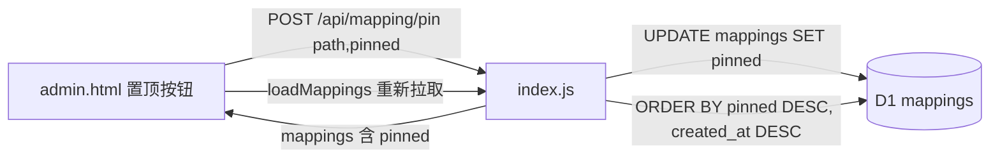

## 用户需求

为 serverless-qrcode-hub 增加「条目全局置顶，并且一直生效」的功能。

## 产品概述

在管理后台中，允许管理员对任意一条短链映射（新建的或老数据）进行「置顶 / 取消置顶」操作。置顶后的条目在列表查询时永远排在最前面（跨分页、跨会话、刷新后均保持），且不影响其他业务逻辑（访客端重定向、活码页、过期页均不变）。

## 核心特性

- **数据库自动迁移**：在 `initDatabase()` 中沿用既有 `isWechat` / `qrCodeData` 的迁移模式，新增 `pinned` 列（`INTEGER DEFAULT 0`）。部署后下一个到达生产 Worker 的请求自动补列，老数据默认 `0`（未置顶），完全向后兼容。
- **全局排序**：列表查询改为 `ORDER BY pinned DESC, created_at DESC`，置顶项天然落在第 1 页顶部，真正「全局 / 一直生效」。
- **置顶接口**：新增 `POST /api/mapping/pin`，按主键 `path` 更新 `pinned` 值（`0/1`）。
- **前端操作**：管理后台表格每行新增「置顶 / 取消置顶」按钮；已置顶行显示「置顶」badge 标识。
- **手动排序兼容**：现有「条目名称 / 短链名」手动排序在比较时优先以 `pinned` 为首要键，保证手动排序时置顶项仍始终位于顶部。

## 技术栈选择

- 后端：Cloudflare Workers（`index.js` 单文件），数据层为 D1（SQLite 兼容），沿用既有 `DB.prepare().bind().run()/.all()` 模式。
- 前端：原生 HTML + Tailwind CSS v4 + DaisyUI v5（无构建步骤，`dist/admin.html` 由 Cloudflare Assets 提供）。
- 图标：沿用现有文本按钮风格（编辑/删除/二维码），置顶按钮同样使用文本标签（置顶/取消），与现有 `.join` 按钮组保持一致，不引入额外 SVG 依赖。

## 实现方案

### 总体策略

以「最小改动、复用既有模式」为核心：后端在 `initDatabase` 增加一列迁移、调整 `listMappings` 排序、新增 `pinMapping` 函数与 `/api/mapping/pin` 路由；前端在三个行操作模板中各加一个置顶按钮，点击后调用接口并重新加载列表使排序生效，同时在置顶行加 badge，并把现有手动排序的首要比较键改为 `pinned`。

### 关键技术决策

- **迁移沿用 PRAGMA + ALTER 模式**：`initDatabase` 每次请求都执行，已有 `isWechat`/`qrCodeData` 两次加列先例；新增 `pinned` 列照此实现，`ALTER TABLE ADD COLUMN` 在 D1 上安全、非破坏性、幂等（靠 `if (!columns.includes('pinned'))` 守卫跳过）。
- **排序用 SQL 而非前端**：`ORDER BY pinned DESC, created_at DESC` 让数据库直接产出正确顺序，跨分页天然成立，避免前端再排序的复杂性与不一致；`pinned` 基数低（0/1），排序开销可忽略。
- **行操作按钮保持文本风格**：现有 `admin.html` 行操作区为 `.join` 文本按钮组（编辑/删除/二维码），新增第 4 个「置顶」按钮沿用同一结构，无需引入图标库，降低改动面。
- **置顶按钮触发整表重载**：点击后 `POST /api/mapping/pin`，成功后调用既有 `loadMappings()` 重新拉取并渲染，使置顶顺序立即生效（沿袭现有「删除后 reload」的交互习惯）。
- **手动排序尊重置顶**：在现有 `sortConfig` 的 `get`/比较逻辑前，先以 `item[1].pinned` 降序比较，再走名称/短链名比较，保证「一直生效」在用户手动排序时依然成立。

### 性能与可靠性

- `ORDER BY pinned DESC` 复用既有 `listMappings` 的 CTE + `LIMIT/OFFSET` 分页，无额外全表扫描；`pinned` 仅 0/1，排序成本极低。
- 迁移为幂等单条 `ALTER`，仅当列缺失时执行，正常请求几乎零开销。
- 接口仅按主键 `path` 更新单行，带 `path` 必填校验，避免空更新。
- 不改动访客端重定向、活码页、过期页逻辑与缓存头，blast radius 控制在管理后台内。

## 实施注意事项

- `listMappings` 使用 `SELECT filtered.*`，加列后自动包含 `pinned`，仅需在第 116-123 行构建对象时补 `pinned: row.pinned === 1`，无需改 SELECT 列表。
- 三个行操作模板（普通行 920-924、编辑态 961-965、恢复行 1047-1051）都要加置顶按钮并绑定 `onclick`，避免编辑/恢复流程下丢失置顶能力。
- 置顶按钮文案需根据当前 `pinned` 状态动态显示「置顶」或「取消」，可在渲染时通过 `mapping.pinned` 判断。
- 接口返回 `{success:true}` 后调用 `loadMappings()`，沿用现有错误处理与 `showAlert` 提示。

## 架构设计

后端 D1 表与前端表格通过 `pinned` 字段贯通：



## 目录结构

```
index.js              # [MODIFY] 1) initDatabase 增加 pinned 列迁移；2) listMappings 改为 ORDER BY pinned DESC, created_at DESC 并在映射对象补 pinned 字段；3) 新增 pinMapping(path, pinned) 函数；4) 新增 POST /api/mapping/pin 路由。
dist/admin.html       # [MODIFY] 1) 三个行操作模板(普通/编辑/恢复)各加「置顶/取消」按钮与 onclick；2) 置顶行显示「置顶」badge；3) 手动排序比较逻辑优先按 pinned；4) 新增调用 /api/mapping/pin 的函数。
docs/CODE_DESIGN.md   # [MODIFY] 同步更新：数据库表字段(pinned)、listMappings 排序、新增 pin 接口章节（可选，建议补充）。
```

## 关键代码结构

```js
// index.js - 新增数据库函数
async function pinMapping(path, pinned) {
  await DB.prepare('UPDATE mappings SET pinned = ? WHERE path = ?')
    .bind(pinned ? 1 : 0, path).run();
}

// index.js - 新增路由（POST /api/mapping/pin）
if (path === 'api/mapping/pin' && request.method === 'POST') {
  const { path: p, pinned } = await request.json();
  if (!p) return new Response(JSON.stringify({ error: 'Missing path' }), { status: 400, headers: { 'Content-Type': 'application/json' } });
  await pinMapping(p, pinned);
  return new Response(JSON.stringify({ success: true }), { headers: { 'Content-Type': 'application/json' } });
}
```