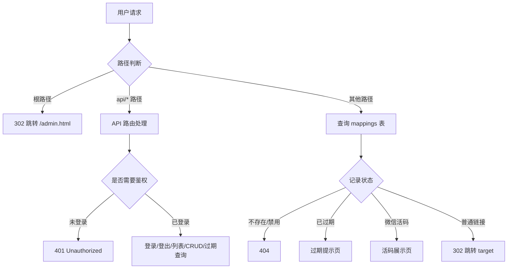

# serverless-qrcode-hub 代码设计文档

> 本文档对 `serverless-qrcode-hub` 项目进行逐文件、逐函数、逐流程的详尽说明，所有说明均基于当前真实源码（`index.js`、`dist/login.html`、`dist/admin.html`、`wrangler.toml`、`package.json`）核实，而非概览性描述。

---

## 目录

1. [项目概览](#1-项目概览)
2. [后端 index.js 详解](#2-后端-indexjs-详解)
3. [前端 login.html 详解](#3-前端-loginhtml-详解)
4. [前端 admin.html 详解](#4-前端-adminhtml-详解)
5. [配置与部署](#5-配置与部署)
6. [安全与优化建议](#6-安全与优化建议)

---

## 1. 项目概览

### 1.1 简介

`serverless-qrcode-hub` 是一个基于 **Cloudflare Workers + D1（SQLite 兼容）数据库**的"无服务器"永久二维码与短链接系统。核心能力：

- 用户通过管理后台创建**短链**或**微信群活码**；
- 访客访问短链时：普通链接执行 `302` 跳转，微信活码渲染原始二维码页面供长按识别；
- 自带密码 Cookie 鉴权；
- 提供定时任务（cron）检查即将过期 / 已过期链接并输出日志；
- 支持深色 / 浅色 / 跟随系统三态主题切换；
- 保留从 KV 向 D1 迁移的历史兼容逻辑（当前未启用）。

### 1.2 技术栈

| 层次 | 技术 |
|------|------|
| 运行环境 | Cloudflare Workers（`compatibility_date = "2025-03-10"`） |
| 存储 | Cloudflare D1（SQLite 兼容，绑定名 `DB`） |
| 静态资源 | Cloudflare Assets（`./dist` 目录，绑定名 `ASSETS`） |
| 前端 | 原生 HTML + Tailwind CSS v4 + daisyUI v5 |
| 二维码生成 | `qr-code-styling.js`（前端） |
| 二维码识别 | `zxing.js`（前端 ZXing） |
| 部署 | Wrangler v4（`dev` / `deploy` 脚本） |

### 1.3 目录结构

```
serverless-qrcode-hub/
├── index.js            # Worker 入口：数据库初始化、路由、重定向、定时任务
├── wrangler.toml       # Wrangler 部署配置（D1 绑定、cron、Assets、环境变量）
├── package.json        # 脚本与依赖（仅 wrangler 开发依赖）
├── pnpm-lock.yaml
├── README.md           # 项目说明
├── MIGRATE.md          # 部署 / 迁移图文指引
├── LICENSE
├── images/             # README/MIGRATE 用到的截图
├── dist/               # 构建产物（静态前端），由 ASSETS 提供
│   ├── login.html      # 登录页
│   ├── admin.html      # 管理后台
│   ├── daisyui@5.css
│   ├── tailwindcss@4.js
│   ├── theme.css        # 专业商务风设计系统（覆盖 DaisyUI 主题变量 + 统一组件样式）
│   ├── common.js        # 登录/后台共享：首屏主题、主题切换、统一 Toast/Alert
│   ├── qr-code-styling.js
│   ├── zxing.js
│   ├── wechat.svg
│   └── favicon.svg
└── docs/
    └── CODE_DESIGN.md  # 本文档
```

### 1.4 整体架构（后端请求流转）



静态资源（如 `/login.html`、`/daisyui@5.css`）由 Cloudflare Assets 自动服务，不经过 `index.js` 的 `fetch` 逻辑（Assets 优先于 Worker 脚本，或按配置 fallback）。

### 1.5 数据模型

D1 表 `mappings` 通过 `initDatabase()` 以 `CREATE TABLE IF NOT EXISTS` 创建，字段如下：

| 字段 | 类型 | 约束 | 说明 |
|------|------|------|------|
| `path` | TEXT | `PRIMARY KEY` | 短链名，作为主键（URL path 部分） |
| `target` | TEXT | `NOT NULL` | 目标 URL（普通短链）或原始二维码 DataURL（微信活码，与 `qrCodeData` 同时存） |
| `name` | TEXT | 可空 | 条目名称（展示用，如"音乐群1"） |
| `expiry` | TEXT | 可空 | 过期时间（ISO 字符串），为空表示永久有效 |
| `enabled` | INTEGER | `DEFAULT 1` | 是否启用（1=启用，0=禁用），禁用后访问返回 404 |
| `created_at` | TEXT | `DEFAULT CURRENT_TIMESTAMP` | 创建时间 |
| `isWechat` | INTEGER | `DEFAULT 0`（后加列） | 是否为微信二维码（1=是） |
| `qrCodeData` | TEXT | 后加列 | 微信活码原始二维码图片的 DataURL |

> 历史兼容说明：`isWechat` 与 `qrCodeData` 两列通过 `initDatabase()` 中的 `ALTER TABLE` 兼容逻辑动态添加（见 2.2）。这是从旧版 KV 结构向 D1 迁移的遗留产物。

索引：

- `idx_expiry ON mappings(expiry)`
- `idx_created_at ON mappings(created_at)`
- `idx_enabled_expiry ON mappings(enabled, expiry)`（组合索引，用于过期查询）

### 1.6 数据流

- **写路径**：前端 `admin.html` 通过 `/api/mapping`（POST/PUT/DELETE）→ `createMapping` / `updateMapping` / `deleteMapping` → D1 写入。
- **读路径（后台）**：`/api/mappings`（分页列表）、`/api/mapping?path=`（单条）、`/api/expiring-mappings`（过期统计）。
- **读路径（访客）**：任意非 `api/` 路径 → 查询 `mappings` → 决定 302 跳转 / 活码页 / 过期页 / 404。
- **鉴权**：登录写 `Cookie: token=密码明文`；后续 API 通过 `verifyAuthCookie` 校验。

---

## 2. 后端 index.js 详解

### 2.1 模块级变量与 `banPath`

```js
let KV_BINDING;
let DB;
const banPath = [
  'login', 'admin', '__total_count',
  'admin.html', 'login.html',
  'daisyui@5.css', 'tailwindcss@4.js',
  'qr-code-styling.js', 'zxing.js',
  'robots.txt', 'wechat.svg',
  'favicon.svg',
];
```

- `KV_BINDING` / `DB`：模块级可变变量，在每次请求 / 定时任务开始时由 `env` 赋值（见 `fetch` 与 `scheduled` 入口）。**注意**：`KV_BINDING` 在 `wrangler.toml` 中并未配置 `[kv_namespaces]`，因此实际运行时为 `undefined`；当前仅 `migrateFromKV()` 使用，而该函数未被调用（见 2.10 / 6.2）。
- `banPath`：系统保留路径名单。用途有两处：
  1. `listMappings` 查询时 `WHERE path NOT IN (...)`，避免在管理列表里显示系统保留名；
  2. `createMapping` / `deleteMapping` / `updateMapping` 校验时拒绝用户使用这些名称（避免与静态资源 / 路由冲突）。
  - 其中 `__total_count` 是一个特殊的占位保留名（历史上用于 KV 分页计数，当前无实际作用，仅保留在名单中）。

### 2.2 `initDatabase()` — 数据库初始化

```js
async function initDatabase() { ... }
```

- **入参**：无（直接使用模块级 `DB`）。
- **逻辑步骤**：
  1. `CREATE TABLE IF NOT EXISTS mappings (...)`：建表，主键 `path`。
  2. `PRAGMA table_info(mappings)`：读取列信息，得到 `columns` 数组（列名列表）。
  3. 若 `columns` 不含 `'isWechat'`，执行 `ALTER TABLE mappings ADD COLUMN isWechat INTEGER DEFAULT 0`。
  4. 若 `columns` 不含 `'qrCodeData'`，执行 `ALTER TABLE mappings ADD COLUMN qrCodeData TEXT`。
  5. 依次 `CREATE INDEX IF NOT EXISTS` 创建三个索引（`idx_expiry`、`idx_created_at`、`idx_enabled_expiry`）。
- **设计意图**：实现**向前兼容的表结构迁移**——旧表（仅有前 7 列，无 `isWechat` / `qrCodeData`）在首次运行时自动补列，避免每次部署都需手动改表。
- **调用时机**：`fetch` 与 `scheduled` 入口都会在执行业务前 `await initDatabase()`。因全部使用 `IF NOT EXISTS` / 存在性判断，重复调用安全且幂等。
- **边界**：`PRAGMA` 与 `ALTER TABLE` 在 D1 上均支持；若表已是最新结构，补列分支跳过，仅重建索引（索引创建本身也幂等）。

### 2.3 Cookie 相关函数

#### 2.3.1 `verifyAuthCookie(request, env)`

```js
function verifyAuthCookie(request, env) {
  const cookie = request.headers.get('Cookie') || '';
  const authToken = cookie.split(';').find(c => c.trim().startsWith('token='));
  if (!authToken) return false;
  return authToken.split('=')[1].trim() === env.PASSWORD;
}
```

- **入参**：`request`（Request 对象，读 `Cookie` 头）；`env`（含 `PASSWORD`）。
- **逻辑**：
  1. 取 `Cookie` 头，空则 `''`。
  2. 按 `;` 分割，找到以 `token=` 开头的那段（`.trim()` 后再判断）。
  3. 找不到 → 返回 `false`（未登录）。
  4. 找到 → 取 `=` 后（`.split('=')[1]`）并 `.trim()`，与 `env.PASSWORD` 严格相等比较。
- **返回值**：布尔。
- **安全提示**：`token` 值即**密码明文**（见 2.11 登录接口），此处直接明文比对，无任何签名 / 哈希 / 过期校验（Cookie 本身的 `Max-Age` 控制过期）。详见 [6.1](#61-鉴权安全性)。

#### 2.3.2 `setAuthCookie(password)`

```js
function setAuthCookie(password) {
  return {
    'Set-Cookie': `token=${password}; Path=/; HttpOnly; SameSite=Strict; Max-Age=86400`,
    'Content-Type': 'application/json'
  };
}
```

- **入参**：`password`（即明文密码）。
- **返回**：响应头对象。`Set-Cookie` 写入 `token=密码`，作用域 `/`，`HttpOnly`（JS 不可读），`SameSite=Strict`，`Max-Age=86400`（1 天）。`Content-Type: application/json`。
- **用途**：登录成功时作为响应头返回（见 2.11）。

#### 2.3.3 `clearAuthCookie()`

```js
function clearAuthCookie() {
  return {
    'Set-Cookie': 'token=; Path=/; HttpOnly; SameSite=Strict; Max-Age=0',
    'Content-Type': 'application/json'
  };
}
```

- **入参**：无。
- **返回**：响应头对象。通过 `Max-Age=0` 使 Cookie 立即失效（等效删除），实现登出（见 2.11）。

### 2.4 数据库操作函数

#### 2.4.1 `listMappings(page = 1, pageSize = 10)`

```js
async function listMappings(page = 1, pageSize = 10) { ... }
```

- **入参**：`page`（页码，默认 1）、`pageSize`（每页条数，默认 10）。
- **逻辑**：
  1. `offset = (page - 1) * pageSize`。
  2. 构造带 CTE 的 SQL：
     - `filtered_mappings` CTE：`SELECT * FROM mappings WHERE path NOT IN (?, ?, ...)`，参数用 `banPath` 展开成 `?` 占位符。
     - 主查询从 `filtered_mappings` 取全部列，并附加子查询 `(SELECT COUNT(*) FROM filtered_mappings) as total_count`，`ORDER BY created_at DESC`，`LIMIT ? OFFSET ?`。
     - `.bind(...banPath, pageSize, offset)`：先展开 `banPath` 数组，再追加 `pageSize`、`offset`。
  3. 若结果为空（`results.results` 为空或长度 0），返回 `{ mappings: {}, total: 0, page, pageSize, totalPages: 0 }`。
  4. 否则：`total = results.results[0].total_count`；遍历每行，以 `path` 为键构建 `mappings` 对象（含 `target/name/expiry/enabled(===1)/isWechat(===1)/qrCodeData`）。
  5. 返回 `{ mappings, total, page, pageSize, totalPages: Math.ceil(total / pageSize) }`。
- **关键点**：用**单个查询**同时返回分页数据与总数（`total_count` 通过 CTE 子查询计算），避免"先查总数再查分页"的 N+1 问题。`total_count` 会出现在每一行上，取首行即可。
- **返回结构**：
  ```json
  {
    "mappings": { "<path>": { "target":"...", "name": "...", "expiry": "...", "enabled": true, "isWechat": false, "qrCodeData": null } },
    "total": 42,
    "page": 1,
    "pageSize": 10,
    "totalPages": 5
  }
  ```
- **注意**：`mappings` 是**对象（键值对）**而非数组。前端 `loadMappings` 用 `Object.entries(data.mappings)` 转成数组。

#### 2.4.2 `createMapping(path, target, name, expiry, enabled = true, isWechat = false, qrCodeData = null)`

```js
async function createMapping(path, target, name, expiry, enabled = true, isWechat = false, qrCodeData = null) { ... }
```

- **入参**：完整映射字段。
- **校验逻辑**（任一失败 `throw new Error`）：
  1. `!path || !target || 类型非 string` → `Invalid input`。
  2. `banPath.includes(path)` → `该短链名已被系统保留，请使用其他名称`。
  3. `expiry` 存在且 `isNaN(Date.parse(expiry))` → `Invalid expiry date`（仅校验可解析，不校验是否过去）。
  4. `isWechat && !qrCodeData` → `微信二维码必须提供原始二维码数据`。
- **写入**：`INSERT INTO mappings (path, target, name, expiry, enabled, isWechat, qrCodeData) VALUES (?, ?, ?, ?, ?, ?, ?)`。其中：
  - `name` → `name || null`
  - `expiry` → `expiry || null`
  - `enabled` → 布尔转 `1/0`
  - `isWechat` → 布尔转 `1/0`
  - `qrCodeData` → 原值（微信时为 DataURL）
- **边界**：`path` 为主键，若已存在会抛 D1 唯一约束错误，由上层 `fetch` 的 try/catch 捕获（非 `Invalid input`，故映射为 HTTP 500，见 2.11）。
- **调用方**：仅 `fetch` 的 POST `/api/mapping` 与 `migrateFromKV()`。

#### 2.4.3 `deleteMapping(path)`

```js
async function deleteMapping(path) { ... }
```

- **入参**：`path`（字符串）。
- **校验**：
  1. `!path || 类型非 string` → `Invalid input`。
  2. `banPath.includes(path)` → `系统保留的短链名无法删除`。
- **写入**：`DELETE FROM mappings WHERE path = ?`。
- **边界**：删除不存在的 `path` 不会报错（D1 `DELETE` 无匹配行只影响 0 行）。

#### 2.4.4 `updateMapping(originalPath, newPath, target, name, expiry, enabled = true, isWechat = false, qrCodeData = null)`

```js
async function updateMapping(originalPath, newPath, target, name, expiry, enabled = true, isWechat = false, qrCodeData = null) { ... }
```

- **入参**：`originalPath`（定位原记录）、`newPath`（新短链名，可为改名）。
- **校验**：
  1. `!originalPath || !newPath || !target` → `Invalid input`。
  2. `banPath.includes(newPath)` → 保留名拒绝。
  3. `expiry` 存在且不可解析 → `Invalid expiry date`。
  4. **保留原二维码数据**：若 `!qrCodeData && isWechat`，先 `SELECT qrCodeData FROM mappings WHERE path = originalPath` 取原值回填；若仍为空且 `isWechat` 为真 → `微信二维码必须提供原始二维码数据`。
- **写入**：`UPDATE mappings SET path=?, target=?, name=?, expiry=?, enabled=?, isWechat=?, qrCodeData=? WHERE path = ?`，依次绑定 `newPath, target, name||null, expiry||null, enabled?1:0, isWechat?1:0, qrCodeData, originalPath`。
- **设计意图**：编辑微信活码时，若用户未重新上传图片，则沿用旧 `qrCodeData`，避免误清空；普通链接编辑不受影响。

#### 2.4.5 `getExpiringMappings()`

```js
async function getExpiringMappings() { ... }
```

- **入参**：无。
- **时间计算**：
  - `today = new Date()`，`setHours(23,59,59,999)`，得今天 23:59:59 → `dayStart`（ISO，`now` 变量名实际是"今天结束"，命名略有歧义）。
  - `todayStart` 为今天 0 点，`dayStart = todayStart.toISOString()`。
  - `threeDaysFromNow = todayStart + 3 天`，再 `setHours(23,59,59,999)` → `threeDaysLater`。
- **SQL**（CTE + CASE）：
  ```sql
  WITH categorized_mappings AS (
    SELECT path,name,target,expiry,enabled,isWechat,qrCodeData,
      CASE
        WHEN datetime(expiry) < datetime(?) THEN 'expired'
        WHEN datetime(expiry) <= datetime(?) THEN 'expiring'
      END as status
    FROM mappings
    WHERE expiry IS NOT NULL
      AND datetime(expiry) <= datetime(?)   -- 注意此处用 threeDaysLater
      AND enabled = 1
  )
  SELECT * FROM categorized_mappings ORDER BY expiry ASC
  ```
  - 绑定：`(dayStart, threeDaysLater, threeDaysLater)`。
- **分类逻辑**：
  - `expiry` 早于今天 0 点 → `expired`；
  - `expiry` 介于今天 0 点 ~ 三天后 23:59:59 → `expiring`；
  - `expiry` 晚于三天后 → 被 `WHERE datetime(expiry) <= threeDaysLater` 过滤掉，不返回。
- **返回结构**：遍历结果，按 `status` 归入 `{ expiring: [], expired: [] }`，每条含 `path/name/target/expiry/enabled/isWechat/qrCodeData`。
- **备注**：代码注释与 `scheduled` 日志文案写"2 days"，但实际计算窗口为**3 天**（见 [6.3](#63-注释与逻辑不一致)）。该接口**不使用分页参数**，一次返回全部符合条件的记录；前端 `loadExpiringMappings` 在客户端再做分页（见 4.17）。

#### 2.4.6 `cleanupExpiredMappings(batchSize = 100)` — 保留未启用

```js
async function cleanupExpiredMappings(batchSize = 100) { ... }
```

- **逻辑**：循环分批删除 `expiry < now` 的记录：
  1. `SELECT path FROM mappings WHERE expiry IS NOT NULL AND expiry < ? LIMIT batchSize`（绑定 `now = new Date().toISOString()`）。
  2. 空则 `break`。
  3. 否则 `DELETE FROM mappings WHERE path IN (...)`。
  4. 若本批数量 `< batchSize` → `break`（已处理完）。
- **状态**：**当前未被任何路由或定时任务调用**（见 [6.2](#62-未启用的函数)）。

#### 2.4.7 `migrateFromKV()` — 保留未启用

```js
async function migrateFromKV() { ... }
```

- **逻辑**：从 KV 批量迁移到 D1（历史兼容）：
  1. `do ... while(cursor)` 循环，`KV_BINDING.list({ cursor, limit: 1000 })`。
  2. 对每个 key：若不在 `banPath` 中，则 `KV_BINDING.get(key.name, { type: "json" })`，取到则 `createMapping(...)`（传 `target/name/expiry/enabled/isWechat/qrCodeData`）。
  3. 单条失败 `console.error` 并跳过，不影响其他。
- **状态**：**当前未被调用**；且 `KV_BINDING` 在 `wrangler.toml` 未配置（为 `undefined`），若调用会直接报错（见 [6.2](#62-未启用的函数)）。

### 2.5 `fetch(request, env)` — 请求入口

```js
export default {
  async fetch(request, env) {
    KV_BINDING = env.KV_BINDING;
    DB = env.DB;
    await initDatabase();
    const url = new URL(request.url);
    const path = url.pathname.slice(1);   // 去掉前导 '/'
    ...
  },
  async scheduled(...) { ... }
};
```

- **入口首步**：赋值模块级 `KV_BINDING` / `DB`，`await initDatabase()`。
- `path = url.pathname.slice(1)`：例如 `/admin.html` → `admin.html`，`/abc` → `abc`，`/` → `''`。

#### 2.5.1 根路径跳转

```js
if (path === '') {
  return Response.redirect(url.origin + '/admin.html', 302);
}
```

- 访问站点根 `/` → 302 跳转到 `/admin.html`（管理后台）。

#### 2.5.2 API 路由（`path.startsWith('api/')`）

按 `path` 与 `method` 分支：

**a) 登录 `api/login` POST（无需先鉴权）**

```js
if (path === 'api/login' && request.method === 'POST') {
  const { password } = await request.json();
  if (password === env.PASSWORD) {
    return new Response(JSON.stringify({ success: true }), { headers: setAuthCookie(password) });
  }
  return new Response('Unauthorized', { status: 401 });
}
```

- 解析 JSON，取 `password`。
- 等于 `env.PASSWORD` → 返回 `{ success: true }`，并带 `Set-Cookie`（明文密码）。
- 否则 → 401 `Unauthorized`（纯文本，无 JSON 体）。

**b) 登出 `api/logout` POST（无需先鉴权）**

```js
if (path === 'api/logout' && request.method === 'POST') {
  return new Response(JSON.stringify({ success: true }), { headers: clearAuthCookie() });
}
```

- 返回 `{ success: true }`，`Set-Cookie` 使 `token` 失效。

**c) 鉴权拦截**

```js
if (!verifyAuthCookie(request, env)) {
  return new Response('Unauthorized', { status: 401 });
}
```

- 之后所有 API 都需通过 Cookie 校验，否则 401。

**d) 已鉴权分支（`try` 包裹）**

- `api/expiring-mappings` GET → `getExpiringMappings()` → JSON。
- `api/mappings` GET → 解析 `page` / `pageSize`（`parseInt(...) || 1/10`），调 `listMappings` → JSON。
- `api/mapping`（无子路径）按 `method` 分发：
  - **GET**：取 `?path=`，缺失 → 400 `{ error: 'Missing path parameter' }`；查不到 → 404 `{ error: 'Mapping not found' }`；否则返回单条映射 JSON。
  - **POST**：`request.json()` → `createMapping(...)` → `{ success: true }`。
  - **PUT**：`request.json()` → `updateMapping(...)` → `{ success: true }`。
  - **DELETE**：`request.json()` 取 `path` → `deleteMapping(path)` → `{ success: true }`。
- 其余 `api/*` → 404 `Not Found`。
- **异常捕获**：`catch (error)` 返回：
  ```js
  new Response(JSON.stringify({ error: error.message || 'Internal Server Error' }),
    { status: error.message === 'Invalid input' ? 400 : 500, headers: {...} })
  ```
  即 `Invalid input` → 400，其余（含 D1 唯一约束 / SQL 错误）→ 500。

#### 2.5.3 URL 重定向处理（`path` 非空且非 `api/`）

```js
if (path) {
  try {
    const mapping = await DB.prepare(`SELECT ... FROM mappings WHERE path = ?`).bind(path).first();
    if (mapping) {
      if (!mapping.enabled) return 404 'Not Found';
      if (mapping.expiry) {
        const today = new Date(); today.setHours(23,59,59,999);
        if (new Date(mapping.expiry) < today) {
          // 返回"链接已过期"HTML 页
        }
      }
      if (mapping.isWechat === 1 && mapping.qrCodeData) {
        // 返回微信活码展示页 HTML
      }
      return Response.redirect(mapping.target, 302);   // 普通跳转
    }
    return new Response('Not Found', { status: 404 });
  } catch (error) {
    return new Response('Internal Server Error', { status: 500 });
  }
}
```

- **查询**：`WHERE path = ?`。`path` 来自 URL，`banPath` 中的保留名（如 `login.html`）实际由 Assets 优先服务，不会落入此分支。
- **禁用**：`!mapping.enabled` → 404（伪装成不存在，避免暴露保留/禁用项）。
- **过期判断**：以"今天 23:59:59"为基准，`expiry` 早于该时刻即视为过期。注意：这里**不使用** `getExpiringMappings` 的 0 点基准，而是用 23:59:59——意味着"今天内过期"的链接当天仍可访问，到当天结束才失效（宽松过期语义）。
- **过期页**：返回硬编码 HTML（`text/html;charset=UTF-8`，`Cache-Control: no-store`，**状态码 404**）。内容含条目名、过期日期（`toLocaleDateString`）、"如需访问，请联系管理员更新链接"。采用专业商务风（居中卡片 + 时钟图标 + 企业蓝 `--brand:#2563EB`，通过 CSS 变量 + `@media (prefers-color-scheme: dark)` 自适应深浅色，与后台设计系统一致）。
- **微信活码页**：当 `isWechat===1` 且有 `qrCodeData` 时返回硬编码 HTML，内联 ``（DataURL 直接渲染，外裹白色圆角 `qr-wrap` 容器便于长按），配 `wechat.svg` 图标与"请长按识别下方二维码"提示。`Cache-Control: no-store`。采用与过期页一致的专业商务风（企业蓝 `--brand` + 深浅色自适应）。**关键点**：微信活码通过展示原始二维码图片让访客长按识别，区别于普通 302 跳转。
- **普通跳转**：`Response.redirect(mapping.target, 302)`。

### 2.6 `scheduled(controller, env, ctx)` — 定时任务

```js
async scheduled(controller, env, ctx) {
  KV_BINDING = env.KV_BINDING;
  DB = env.DB;
  await initDatabase();
  const result = await getExpiringMappings();
  console.log(`Cron job report: Found ${result.expired.length} expired mappings`);
  if (result.expired.length > 0) console.log('Expired mappings:', JSON.stringify(result.expired, null, 2));
  console.log(`Found ${result.expiring.length} mappings expiring in 2 days`);
  if (result.expiring.length > 0) console.log('Expiring soon mappings:', JSON.stringify(result.expiring, null, 2));
}
```

- **触发**：由 `wrangler.toml` `[triggers] crons = ["0 2 */1 * *"]`（生产每天 2 点）或 dev 环境 `*/10 * * * * *`（每 10 秒，用于本地 `--test-scheduled` 调试）。
- **逻辑**：初始化后调 `getExpiringMappings()`，仅 `console.log` 输出统计与明细到 Worker 日志。**仅记录、不执行任何清理或通知动作**（邮件通知相关功能当前未实现，见 admin.html 文字说明与 [6.4](#64-未完成的功能声明)）。

---

## 3. 前端 login.html 详解

`login.html` 是纯静态登录页，依赖 `/daisyui@5.css`（样式）与 `/tailwindcss@4.js`（Tailwind 运行时）。主题与提示逻辑的**首屏脚本、主题切换、Toast/Alert 均已抽到 `dist/common.js`**（由 `<head>` 内 `<script src="/common.js">` 同步引入），两页共享、避免重复。视觉层由 `dist/theme.css` 承载统一设计令牌（见下文）。

### 3.1 首屏主题脚本（`common.js`）

```js
(function () {
  const savedTheme = localStorage.getItem('theme');
  const mq = window.matchMedia && window.matchMedia('(prefers-color-scheme: dark)');
  if (savedTheme === 'system' || !savedTheme) {
    if (!savedTheme) localStorage.setItem('theme', 'system');
    document.documentElement.setAttribute('data-theme', mq && mq.matches ? 'dark' : 'light');
  } else {
    document.documentElement.setAttribute('data-theme', savedTheme);
  }
})();
```

- **目的**：在 HTML 渲染前（避免闪烁）根据 `localStorage.theme` 设置 `<html data-theme>`。
- **分支**：`system` → 跟随系统；已存具体值 → 直接用；无 → 默认写入 `system` 并跟随系统。
- 逻辑与 admin.html 完全一致，现统一由 `common.js` 提供（见 4.1）。

### 3.2 主题切换函数（`common.js` 内 `toggleTheme` / `updateThemeIcon`）

- `toggleTheme()`：读取当前 `theme`（`system`/`light`/`dark`），按 `system → light → dark → system` 循环；写回 `localStorage`；`system` 时按 `matchMedia` 决定实际 `data-theme`，否则直接用新值；最后 `updateThemeIcon(newTheme)`。
- `updateThemeIcon(theme)`：通过 `#themeToggleBtn path` 的 `setAttribute('d', ...)` 切换 SVG 路径——`system` 用显示器图标、`dark` 用月亮、`light` 用太阳。
- **系统变化监听**：`window.matchMedia('(prefers-color-scheme: dark)').addEventListener('change', ...)`：仅当 `theme==='system'` 时实时跟随系统切换 `data-theme`。
- **初始化**：`DOMContentLoaded` 时 `initThemeToggle()` 绑定按钮 `click → toggleTheme` 并初始化图标（在 `common.js` 末尾统一注册，两页无需各自重复）。

### 3.3 登录 UI 结构

- `<body class="auth-page">`：由 `theme.css` 提供浅/深色渐变背景（双 radial 光晕 + 浅灰底），专业商务风。
- 右上角固定 `themeToggleBtn`（ghost 圆按钮）。
- 居中卡片 `.auth-card`：含**品牌区**（`brand-logo` 渐变方块 + `favicon.svg` + 标题"二维码中枢" + 副标题"Serverless QR Code Hub"）、带锁图标的 `password` 输入框（`autocomplete="current-password"`）、"登录"按钮（含 loading spinner 与"登录成功"态）。
- 错误提示 `#error`（`alert alert-error`，默认 `display:none`，含"密码错误，请重试"文本）。
- 底部 footer 含 GitHub 链接与求 Star 文案。

### 3.4 `login()` — 登录请求

```js
async function login() {
  const password = document.getElementById('password').value;
  const error = document.getElementById('error');
  const button = document.querySelector('button');
  button.disabled = true;
  button.innerHTML = '<span class="loading loading-spinner"></span> 登录中...';
  try {
    const response = await fetch('/api/login', { method:'POST', headers:{'Content-Type':'application/json'}, body: JSON.stringify({ password }) });
    if (response.ok) {
      // 显示"登录成功"，跳转 /admin
      window.location.href = '/admin';
    } else {
      const data = await response.json().catch(() => ({}));
      error.querySelector('span').textContent = data.error || '密码错误，请重试';
      error.style.display = 'flex';
      button.disabled = false;
      button.textContent = '登 录';
    }
  } catch (e) {
    error.querySelector('span').textContent = '网络错误，请稍后重试';
    error.style.display = 'flex';
    button.disabled = false;
    button.textContent = '登 录';
  }
}
```

- **流程**：禁用按钮 → 显示"登录中..." spinner → POST `/api/login`。
- **成功**（`response.ok`）：按钮变为"登录成功"，`window.location.href = '/admin'`（注意：后端登录成功仅设 Cookie，前端负责跳转；`/admin` 实际由 Assets 提供 `admin.html`）。
- **失败**：尝试解析 JSON 错误，更新 `#error` 文案并重新显示；恢复按钮。
- **网络异常**：catch 显示"网络错误"。
- **注意**：`response.json().catch(() => ({}))`——后端 401 返回的是纯文本 `Unauthorized` 而非 JSON，故 `.catch` 兜底为空对象，最终显示默认"密码错误，请重试"。

### 3.5 辅助交互

- 回车提交：`password` 输入框 `keypress` → `e.key==='Enter'` 调 `login()`。
- 自动聚焦：`password.focus()`。

---

## 4. 前端 admin.html 详解

`admin.html` 是管理后台，依赖 `/daisyui@5.css`、`/tailwindcss@4.js`，并在底部引入 `/qr-code-styling.js` 与 `/zxing.js`。所有业务逻辑内联在一个大的 `DOMContentLoaded` 回调中（外加一个独立的二维码设置 `DOMContentLoaded` 监听，见 4.18）。

### 4.1 首屏主题脚本

与 `login.html` 完全一致的逻辑，现已统一抽到 `dist/common.js`（`<head>` 内 `<script src="/common.js">` 同步引入，于渲染前设定 `data-theme`）。`admin.html` 自身不再内联首屏 IIFE、主题切换函数或第二处 `DOMContentLoaded`（见 4.18）。视觉层由 `dist/theme.css` 承载：覆盖 DaisyUI 主题变量（企业蓝 `--color-primary:#2563EB`、slate 中性灰阶、`--radius-box:1rem` 等），并统一卡片/按钮/输入框/模态框/Toast/骨架屏的精致样式与微交互。

### 4.2 顶部脚本：前端 `banPath`

```js
const banPath = [ 'login','admin','__total_count','admin.html','login.html','daisyui@5.css','tailwindcss@4.js','qr-code-styling.js','zxing.js','robots.txt','wechat.svg','favicon.svg' ];
```

- 与后端 `banPath` 同步，仅在**前端用于输入校验提示**（实际校验落在后端；前端 `addMapping` 仅校验格式 `^[a-zA-Z0-9-_]+$`）。

### 4.3 页面结构（HTML）

- 两个 `<dialog>` 模态：
  - `#qr-modal`：二维码预览（含 `#qr-container`、`#qr-url` 只读、`#qr-show-logo` 复选、`#qr-dots-style` 下拉、`#qr-download` 下载按钮）。
  - `#delete-confirm-modal`：删除确认（`#confirm-delete-btn`）。
- `#alertContainer`：浮动提示容器（顶部居中）。
- 隐藏字段 `#qrCodeData`：保存当前上传二维码的 DataURL。
- Navbar：标题"管理面板"、主题按钮、退出登录按钮。
- "使用说明"卡片（折叠面板：使用步骤、注意事项——其中提到"过期会自动通过邮件通知"，但该功能当前未实现，见 [6.4](#64-未完成的功能声明)）。
- "二维码识别与短链创建"卡片：左（上传识别区 `#qr-upload-area` / 结果 `#qr-result` / 复制 `#copy-btn`），右（创建表单：`#newName` / `#newPath` / `#newTarget` / `#newExpiry` / `#newEnabled` / `#newIsWechat` / `#addMappingBtn`）。
- "短链二维码管理"卡片：筛选按钮组（全部 / 即将过期 / 已过期）、`#loading`、`#skeleton` 骨架屏、表格 `#mappingsTableBody`、分页控件（每页大小 `#pageSize`、上一页 `#prevPage`、当前页 `#currentPage`、下一页 `#nextPage`）。

### 4.4 全局状态变量

在 `DOMContentLoaded` 回调内声明：

```js
let allMappings = [];   // 当前"全部"视图的映射数组（Object.entries 后的）
let currentPage = 1;
let pageSize = 10;
```

### 4.5 `checkAuth()` — 认证检查

```js
async function checkAuth() {
  try {
    const response = await fetch('/api/mappings');
    if (response.status === 401) return false;
    return true;
  } catch (error) {
    console.error('认证检查失败:', error);
    return false;
  }
}
```

- **原理**：直接请求 `/api/mappings`；若返回 401 说明未登录 → 返回 `false`；否则 `true`。依赖后端对未鉴权 API 返回 401。
- **调用**：`DOMContentLoaded` 时 `checkAuth().then(isAuthenticated => { if (!isAuthenticated) window.location.href='/login'; else initializePage(); })`。

### 4.6 `initializePage()` — 初始化

绑定各类事件、加载数据、设置筛选按钮状态：

```js
function initializePage() {
  document.getElementById('logoutBtn').addEventListener('click', logout);
  document.getElementById('addMappingBtn').addEventListener('click', addMapping);
  setupQRUpload();
  themeToggleBtn.addEventListener('click', toggleTheme);
  loadMappings();
  setupErrorHandling();
  // filterButtons 定义与 updateFilterButtonStates（未直接被本函数引用，但用于按钮点击逻辑）
  // 三个筛选按钮绑定（见 4.17）
  // newIsWechat change 监听（见 4.8）
  document.getElementById('newIsWechat').disabled = true;  // 初始禁用微信开关
}
```

- **筛选按钮组对象** `filterButtons`：`showAllBtn→btn-primary`、`showExpiringBtn→btn-warning`、`showExpiredBtn→btn-error`。
- **三个筛选按钮点击**（各自重置 `currentPage=1` 并切换高亮 class，然后加载数据）：
  - `showAllBtn` → 加 `btn-primary`，移除其他，调 `loadMappings()`。
  - `showExpiringBtn` → 加 `btn-warning`，调 `loadExpiringMappings('expiring')`。
  - `showExpiredBtn` → 加 `btn-error`，调 `loadExpiringMappings('expired')`。
- **微信开关初始化**：`newIsWechat` 默认 `disabled=true`，只有上传识别到二维码后才启用（见 4.8）。

### 4.7 `setupErrorHandling()` — 全局错误处理

```js
window.addEventListener('unhandledrejection', function (event) {
  if (event.reason.status === 401) window.location.href = '/login';
});
```

- 捕获未处理的 Promise 拒绝，若 `reason.status===401` 跳登录页。作为各请求中显式 401 跳转的兜底。

### 4.8 微信开关联动

```js
document.getElementById('newIsWechat').addEventListener('change', function(e) {
  const targetInput = document.getElementById('newTarget');
  const decodedText = document.getElementById('decoded-text').textContent;
  if (e.target.checked) {
    targetInput.readOnly = true;
    if (decodedText) targetInput.value = decodedText;
  } else {
    targetInput.readOnly = false;
  }
});
```

- 勾选"微信二维码" → 目标 URL 框变只读，并填入识别到的二维码文本（活码场景目标 URL 即二维码内容本身）。
- 取消勾选 → 恢复可编辑。

### 4.9 二维码上传与识别

#### 4.9.1 `setupQRUpload()`

绑定：点击上传区 → 触发文件选择；`dragover`/`dragleave`/`drop` 处理拖拽（阻止默认、切换高亮、取 `dataTransfer.files`）；文件 `change`；复制按钮 → `copyDecodedText`。

#### 4.9.2 `handleFiles(files)`

1. 空 → 返回。
2. 首个文件 `file`：非图片（`!file.type.startsWith('image/')`）→ `showAlert('请上传图片文件')` 返回。
3. **重置状态**：清空 `#qrCodeData`、`#qr-result` 隐藏、`#decoded-text` 清空、`#newTarget` 清空；微信开关 `checked=false`、`disabled=true`、目标框 `readOnly=false`。
4. `FileReader.readAsDataURL(file)` → `onload`：创建 `Image`，`img.onload` 时调 `decodeQR(img)`，并把 `e.target.result`（图片 DataURL）存入 `#qrCodeData`（供微信活码提交用）。

#### 4.9.3 `decodeQR(img)` — 识别核心

```js
async function decodeQR(img) {
  try {
    const codeReader = new ZXing.BrowserMultiFormatReader();
    const canvas = document.createElement('canvas');
    const ctx = canvas.getContext('2d');
    // 1. 缩放：限制最长边 maxSize=1024，保持宽高比
    // 2. 绘制 img 到 canvas（imageSmoothing 高质量）
    // 3. 灰度二值化：每个像素 avg=(r+g+b)/3，>128→255 否则 0
    // 4. canvas.toBlob → imageUrl（URL.createObjectURL）
    // 5. codeReader.decodeFromImageUrl(imageUrl) 解码
    // 6. 成功：填充 decoded-text、显示结果、填充 newTarget、启用微信开关、微信链接自动勾选
    // 7. 失败：反转颜色（255-c）再试一次
    // 8. 仍失败：showAlert 提示
  } catch (error) { showAlert('处理图片时出错，请重试'); }
}
```

- **缩放**：计算 `width/height`，若任一 > 1024 则按比例缩到 1024，保证识别质量与性能。
- **二值化（第一次尝试）**：遍历 `ImageData`，`avg>128` 置白否则置黑，增强对比。
- **解码**：`ZXing.BrowserMultiFormatReader().decodeFromImageUrl(imageUrl)`。
- **成功分支**：
  - 写 `decoded-text`、显示 `#qr-result`、填充 `newTarget`；
  - 启用 `newIsWechat`（`disabled=false`）；
  - 若 `decodedText.startsWith('https://weixin.qq.com/')` → 自动勾选微信开关 + 目标框 `readOnly=true`；
  - `showAlert('二维码识别成功','success')`。
- **失败分支**：先 `clearRect` 重绘原图，再对像素做**颜色反转**（`255 - c`），重新 `toBlob` 解码重试一次（应对反色二维码）。
- **再失败**：`showAlert('无法识别二维码，请确保图片清晰且包含有效的二维码')` 并隐藏结果。
- `URL.revokeObjectURL` 在解码后释放，避免内存泄漏。
- **注意**：无论成功失败，`#qrCodeData` 已在 `img.onload` 中存好原始图片 DataURL，供提交微信活码时使用。

#### 4.9.4 `copyDecodedText()`

- 读 `decoded-text` → `navigator.clipboard.writeText(text)`；`.then` 中填充 `newTarget`、平滑滚动到 `#newTarget`（`scrollIntoView({ behavior:'smooth', block:'center' })`，已修正原指向不存在的 `#addNewRow` 问题，见 [6.5](#65-前端潜在问题)）、`showAlert('复制成功','success')`；`.catch` 提示复制失败。

### 4.10 `showAlert(message, type = 'error')`

- 创建 `div`，`type==='error'` → `alert alert-error`，否则 `alert alert-success`。
- 内含 SVG 图标（错误用叉号路径，成功用勾号路径）与 `message`。
- 入场：先 `opacity:0`，`appendChild` 后 `setTimeout(10)` 渐显；`3000ms` 后渐隐并 `remove()`。

### 4.11 `loadMappings()` — 加载全量列表

```js
async function loadMappings() {
  tableBody.style.display = 'none';
  skeleton.classList.remove('hidden');   // 显示骨架屏
  try {
    const response = await fetch(`/api/mappings?page=${currentPage}&pageSize=${pageSize}`);
    if (response.status === 401) { location.href='/login'; return; }
    if (!response.ok) throw new Error('加载数据失败');
    const data = await response.json();
    allMappings = Object.entries(data.mappings);
    await new Promise(resolve => setTimeout(resolve, 300));  // 人为延迟，保证骨架屏可见
    renderCurrentPage();
    currentPage = data.page;
    document.getElementById('currentPage').textContent = currentPage;
    document.getElementById('prevPage').disabled = currentPage <= 1;
    document.getElementById('nextPage').disabled = currentPage >= data.totalPages;
    document.getElementById('pageSize').value = pageSize;
  } catch (error) { showAlert('加载数据失败，请刷新页面重试'); }
  finally { skeleton.classList.add('hidden'); tableBody.style.display = ''; }
}
```

- **分页**：直接使用后端分页（`page`/`pageSize` 查询参数），后端返回 `totalPages`，据此禁用上/下一页按钮。
- `allMappings = Object.entries(data.mappings)`：把后端键值对对象转数组，供 `renderCurrentPage` 遍历。
- 骨架屏：请求期间隐藏表格、显示骨架屏；最后恢复。人为 `300ms` 延迟使骨架屏在快速网络下也可见。
- **注意**：后端 `listMappings` 已从 `banPath` 过滤系统保留项，前端看到的列表不含保留名。

### 4.12 `renderCurrentPage()`

```js
function renderCurrentPage() {
  const table = document.getElementById('mappingsTableBody');
  table.innerHTML = '';
  const fragment = document.createDocumentFragment();
  for (const [path, mapping] of allMappings) {
    fragment.appendChild(createMappingRow(path, mapping));
  }
  table.appendChild(fragment);
}
```

- 清空 `<tbody>`，用 `DocumentFragment` 批量构建行（`createMappingRow`）后一次性插入，减少重排。

### 4.13 `addMapping()` — 创建短链

1. 读取 `newName/newPath/newTarget/newExpiry/newEnabled/newIsWechat/qrCodeData`（均 `.trim()` / `.checked` / `.value`）。
2. **前端校验**：
   - `!name` → '请输入条目名称'；
   - `!path` → '请输入短链名'；
   - `!/^[a-zA-Z0-9-_]+$/.test(path)` → '短链名只能包含字母、数字、下划线和横线'；
   - `!target` → '请输入目标 URL'；
   - `isWechat && !qrCodeData` → '请先上传微信群二维码'。
3. `fetch('/api/mapping', POST, JSON.stringify({ name,path,target,expiry,enabled,isWechat, qrCodeData: isWechat ? qrCodeData : null }))`：
   - 401 → 跳登录；
   - `!ok` → 解析错误提示（后端通常返回 500 JSON，但此分支用 `data.message || data.error`）；
   - 成功 → `showAlert('添加成功','success')` + `location.reload()`（整页刷新重新加载列表）。
- 注意：普通链接时 `qrCodeData` 显式置 `null`，仅微信活码带 DataURL。

### 4.14 `deleteMapping(path)` — 删除短链

- 返回 `Promise`：显示 `#delete-confirm-modal`，绑定确认按钮 `handleConfirm`：
  - `fetch('/api/mapping', DELETE, { path })`；
  - 401 → 跳登录；
  - `!ok` → 错误提示；
  - 成功 → `showAlert('删除成功','success')`，`loadMappings()` 重新加载（不刷新整页）；
  - 若当前处于"即将过期"/"已过期"视图，额外 `loadExpiringMappings(...)` 同步；
  - `modal.close()`；`finally` 中 `removeEventListener` 清理 + `resolve()`。
- 设计：用 Promise + 模态框 + 事件监听，避免回调地狱；删除后局部刷新而非整页刷新。

### 4.15 `generateQRForMapping(url, newPath)` — 预览/下载二维码

```js
function generateQRForMapping(url, newPath) {
  // 清空 qr-container；设置 qr-url 输入框；
  // 从 localStorage 读取 qr-show-logo / qr-dots-style 应用；
  // getQRConfig(showLogo, dotsType)：返回 qr-code-styling 配置
  //   （300x300 canvas，dotsOptions 颜色/类型，圆角定位点，白底，errorCorrectionLevel H，可选 wechat.svg logo）
  // currentQRCode = new QRCodeStyling(getQRConfig(...)); currentQRCode.append(container);
  // updateQRCode：200ms 过渡切换（清空+重建+保存设置到 localStorage）
  // showLogoCheckbox.onchange / dotsStyleSelect.onchange = updateQRCode
  // downloadBtn.onclick：生成文件名 qr-<newPath>-<时间戳> 并 currentQRCode.download({name, extension:'png'})
  // modal.showModal()
}
```

- **用途**：表格每行"二维码"按钮点击 → 生成可预览/下载的二维码（指向 `window.location.origin + '/' + path`）。
- **配置来源**：`getQRConfig` 根据 `showLogo`（复选框）与 `dotsStyle`（下拉：dots/rounded/classy/classy-rounded/square/extra-rounded）生成，且将用户选择持久化到 `localStorage`（下次自动应用）。
- **过渡动画**：切换样式时给 `#qr-container` 加 `.switching`（CSS `opacity:0`），200ms 后重建并移除类。
- **下载**：`QRCodeStyling.download({ name: 'qr-<path>-<时间戳>', extension: 'png' })`。

### 4.16 `createMappingRow(path, mapping)` — 渲染单行

```js
function createMappingRow(path, mapping) {
  const row = document.createElement('tr');
  row.dataset.originalData = JSON.stringify({ name, path, target, expiry, enabled, isWechat, qrCodeData });
  // 单元格 0-3：name/path/target/expiry（target 单元格加断词样式与最小宽度）
  // 单元格 4（状态）：启用/禁用 badge + 微信 badge
  // 单元格 5（操作）：编辑/删除/二维码 按钮组
  // 绑定：editBtn→toggleEditMode(row)；deleteBtn→deleteMapping(path)；qrBtn→generateQRForMapping(origin+'/'+path, path)
  return row;
}
```

- **`dataset.originalData`**：完整原始数据 JSON 化存入行，供编辑/取消/恢复使用（避免反复请求）。
- **单元格内容**：`name||'-'`、`path`、`target`、`expiry||'永久有效'`。
- **状态列**：`badge-success`/"启用"或 `badge-error`/"禁用"，`isWechat` 时追加 `badge-info`/"微信"。
- **操作列**：三个按钮，`querySelectorAll('button')` 解构绑定。

### 4.17 行内编辑（`toggleEditMode` / `saveEdit` / `restoreRow`）

#### `toggleEditMode(row)`

```js
async function toggleEditMode(row) {
  const isEditing = row.classList.toggle('editing');
  const originalData = JSON.parse(row.dataset.originalData);
  if (isEditing) {
    const response = await fetch(`/api/mapping?path=${originalData.path}`);
    if (!response.ok) throw ...
    const mappingData = await response.json();
    // 把单元格 0-3 替换为 input/textarea/date
    // 单元格 4 替换为 启用/微信 两个 toggle
    // 单元格 5 替换为 保存/取消/二维码
    // 重新绑定：saveBtn→saveEdit(row)；cancelBtn→restoreRow(row)；qrBtn→generateQRForMapping
  }
}
```

- 切换 `editing` class（CSS 高亮整行）。
- 编辑模式**先重新请求服务器**获取最新数据（保证编辑基于服务端真实值，而非可能过期的 `dataset`）。
- 单元格变为可编辑控件：名称/短链名用 `input`，目标 URL 用 `textarea`（高 24，不可缩放），过期用 `date`，状态用两个 `toggle`（启用、微信）。

#### `saveEdit(row)`

1. 从编辑控件读取 `newName/newPath/newTarget/newExpiry/newEnabled/newIsWechat`。
2. **变更检测**：与 `dataset.originalData` 逐项比较，`hasChanges` 为假 → `restoreRow(row)` 直接退出（节省请求）。
3. **保存**：先 `GET /api/mapping?path=originalPath` 取服务端 `qrCodeData`（编辑普通链接时不丢失微信数据），再 `PUT /api/mapping` 提交 `{ originalPath, path, target, name, expiry, enabled, isWechat, qrCodeData: serverData.qrCodeData }`。
4. 成功 → `showAlert('更新成功','success')` + `loadMappings()` 局部刷新；若处于过期视图则同步刷新。
- **要点**：编辑时 `qrCodeData` 始终使用服务端原值（因为编辑表单不重新上传图片），符合后端"沿用原二维码"逻辑。

#### `restoreRow(row)`

- 用 `dataset.originalData` 还原所有单元格文本/状态/按钮组，并重新绑定事件，移除 `editing` class。

### 4.18 主题与二维码设置

原文件中曾存在的**第二个** `DOMContentLoaded` 监听（负责 `qr-show-logo`/`qr-dots-style` 的 change 绑定并依赖未声明的全局 `qrCode`）以及与之并存的 `updateQRCode()` 已**移除**（见 [6.5](#65-前端潜在问题) 修复记录）。当前二维码渲染仅由 4.15 的 `generateQRForMapping`（使用局部 `currentQRCode`）负责，逻辑单一、无全局变量隐患。主题切换与初始化统一由 `common.js` 的 `initThemeToggle()` 在 `DOMContentLoaded` 时完成。

### 4.19 主题切换（`toggleTheme` / `updateThemeIcon`）

与 `login.html` 的同名函数**现已合并到 `common.js`**（system→light→dark→system 循环 + 图标切换 + 系统变化监听）。`updateThemeIcon` 统一通过 `#themeToggleBtn path` 切换 SVG 路径，两页按钮结构均可匹配，无需各自重复实现。

### 4.20 分页与筛选事件

- `nextPage`：先 `currentPage++`，按当前视图（`btn-warning`/`btn-error`/默认）调 `loadExpiringMappings` 或 `loadMappings`。
- `prevPage`：仅 `currentPage>1` 时 `currentPage--` 再加载。
- `pageSize` change：`pageSize = parseInt(value)`，`currentPage=1`，按视图重载。
- 三个筛选按钮（见 4.6）切换数据源。

### 4.21 `logout()`

```js
async function logout() {
  const response = await fetch('/api/logout', { method:'POST', headers:{'Content-Type':'application/json'} });
  if (!response.ok) { showAlert('登出失败，请重试'); return; }
  window.location.href = '/login';
}
```

- POST `/api/logout` 清 Cookie，成功后跳 `/login`。

### 4.22 `loadExpiringMappings(type)` — 过期视图

```js
async function loadExpiringMappings(type) {
  // 骨架屏
  const response = await fetch(`/api/expiring-mappings?page=${currentPage}&pageSize=${pageSize}`);
  if (401) location.href='/login';
  const data = await response.json();
  const today = new Date(); today.setHours(0,0,0,0);
  const mappingsArray = data[type];   // type = 'expiring' | 'expired'
  mappingsArray.forEach(m => {
    const expiryDate = new Date(m.expiry); expiryDate.setHours(0,0,0,0);
    m.isExpired = expiryDate < today;
  });
  const filteredMappings = type==='expired' ? mappingsArray.filter(m=>m.isExpired) : mappingsArray.filter(m=>!m.isExpired);
  const total = filteredMappings.length;
  const start = (currentPage-1)*pageSize, end = Math.min(start+pageSize, total);
  const currentPageData = filteredMappings.slice(start, end);
  // 渲染行（createMappingRow）
  // 分页按钮禁用逻辑
}
```

- **重要**：后端 `/api/expiring-mappings` **不分页**（一次返回全部 `expiring`/`expired`）。前端在此**客户端二次分页**：先取 `data[type]`，按 `isExpired`（与今天 0 点比较）在前端再细分，再 `slice` 出当前页。
- **与后端分类的差异**：后端用"今天 0 点"判 `expired`；前端同样用"今天 0 点"判 `isExpired`，二者一致。前端 `type==='expired'` 取 `isExpired` 真，否则取假，恰好对应后端 `expired`/`expiring` 两部分。
- 该视图下表格仍由 `createMappingRow` 渲染，行内编辑/删除/二维码按钮均可用。

### 4.23 `updateMapping(mapping)` — 旧式更新（已移除）

- 原 4.23 的旧式整页刷新更新函数已于 UI 优化时删除（与 `saveEdit` 重复且无调用方）。行内编辑统一走 `saveEdit`（见 [6.5](#65-前端潜在问题)）。

---

## 5. 配置与部署

### 5.1 `wrangler.toml`

```toml
name = "serverless-qrcode-hub"
main = "index.js"
compatibility_date = "2025-03-10"

[env.dev.vars]
PASSWORD = "test1234"          # 开发环境密码

[[d1_databases]]
binding = "DB"
database_name = "qrcode_hub"
database_id = "060f6d75-397d-4d39-b6b3-339b9224d6d7"

[triggers]
crons = ["0 2 */1 * *"]        # 生产：每天 2 点执行 scheduled

[[env.dev.d1_databases]]
binding = "DB"
database_name = "qrcode_hub_dev"
database_id = "1cfa1ef6-a076-410b-aa19-50f63411313c"

[env.dev.triggers]
crons = ["*/10 * * * * *"]     # 开发：每 10 秒（含秒字段），便于 --test-scheduled 调试

[assets]
directory = "./dist"
binding = "ASSETS"
```

| 配置项 | 说明 |
|--------|------|
| `name` | Worker 名称 |
| `main` | 入口脚本 `index.js` |
| `compatibility_date` | Workers 运行时兼容日期 |
| `[env.dev.vars].PASSWORD` | 开发环境明文密码（**仅 dev**，生产需通过 `wrangler secret put PASSWORD` 设置，勿明文写此处） |
| `[[d1_databases]]` | 生产 D1 绑定（`DB` / `qrcode_hub` / 指定 `database_id`） |
| `[triggers].crons` | 生产定时任务（每天 2 点） |
| `[[env.dev.d1_databases]]` | 开发 D1 绑定（独立 `qrcode_hub_dev` / `database_id`） |
| `[env.dev.triggers].crons` | 开发定时任务（每 10 秒，6 段 cron 含秒） |
| `[assets]` | 静态资源目录 `./dist`，绑定 `ASSETS`；`login.html`/`admin.html` 等由此提供 |

- **KV 绑定缺失**：`index.js` 使用 `env.KV_BINDING`，但 `wrangler.toml` 中**没有 `[kv_namespaces]`**，故生产/开发运行时 `KV_BINDING` 均为 `undefined`。当前仅 `migrateFromKV()` 使用该函数且未启用，因此不影响部署；若未来启用迁移需补充 KV 绑定（见 [6.2](#62-未启用的函数)）。
- **生产密码安全**：`PASSWORD` 不应以明文写在 `wrangler.toml` 顶层（dev 仅作本地测试）。生产应使用 `wrangler secret put PASSWORD` 注入加密变量。

### 5.2 `package.json`

```json
{
  "name": "serverless-qrcode-hub",
  "version": "1.0.0",
  "private": true,
  "scripts": {
    "dev": "echo '...' && wrangler dev --ip 0.0.0.0 --env dev --test-scheduled",
    "deploy": "wrangler deploy"
  },
  "devDependencies": { "wrangler": "^4.0.0" },
  "pnpm": { "onlyBuiltDependencies": ["core-js-pure","esbuild","sharp","workerd"] }
}
```

- `dev`：以 `dev` 环境启动 `wrangler dev`（`--ip 0.0.0.0` 监听所有网卡，`--test-scheduled` 启用手动触发 cron 调试）。
- `deploy`：`wrangler deploy` 发布到生产。
- 依赖仅有 `wrangler`（v4）。`pnpm.onlyBuiltDependencies` 列出需要编译的原生依赖（esbuild/workerd/sharp 等）。

### 5.3 D1 Schema（建表语句）

```sql
CREATE TABLE IF NOT EXISTS mappings (
  path TEXT PRIMARY KEY,
  target TEXT NOT NULL,
  name TEXT,
  expiry TEXT,
  enabled INTEGER DEFAULT 1,
  created_at TEXT DEFAULT CURRENT_TIMESTAMP,
  isWechat INTEGER DEFAULT 0,
  qrCodeData TEXT
);
CREATE INDEX IF NOT EXISTS idx_expiry ON mappings(expiry);
CREATE INDEX IF NOT EXISTS idx_created_at ON mappings(created_at);
CREATE INDEX IF NOT EXISTS idx_enabled_expiry ON mappings(enabled, expiry);
```

- 实际建表由 `initDatabase()` 分两步执行：先建 6 基础列，再用 `PRAGMA` + `ALTER TABLE` 补 `isWechat`/`qrCodeData`（向前兼容）。

### 5.4 部署流程（参见 `MIGRATE.md`）

1. Cloudflare 控制台创建 D1 数据库，复制 `database_id` 填入 `wrangler.toml`。
2. 在 GitHub Fork 仓库同步代码并修改 `wrangler.toml` 的 `database_id`。
3. 等待 Cloudflare 自动部署（Pages/Workers 集成）。
4. 原 KV 数据需手动在管理面板重新添加（微信二维码建议重新上传，官方说明"不支持自动迁移"）。

---

## 6. 安全与优化建议

### 6.1 鉴权安全性

- **明文 Cookie Token**：登录成功将 `token=密码明文` 写入 Cookie（仅 `HttpOnly` + `SameSite=Strict` 防护 XSS/CSRF，但**传输与存储均为明文**）。任何能读到 Cookie 的人即获得等同密码的权限；Worker 端 `verifyAuthCookie` 直接比对明文。
- **无签名/过期校验**：Cookie 过期仅靠 `Max-Age=86400`（1 天），服务端不校验签发时间、不轮换。
- **建议**：
  1. 使用随机强 `token`（登录时生成 UUID/随机串），服务端用 KV/D1 维护 `token→过期时间` 映射（或签名 JWT）；
  2. 通过 HTTPS 传输（Cloudflare 默认提供）；可补充 `Secure` 属性；
  3. 增加服务端过期/吊销机制；
  4. `PASSWORD` 以 `wrangler secret` 注入而非明文 `wrangler.toml`。

### 6.2 未启用的函数

- `cleanupExpiredMappings()`：分批删除过期记录的实用函数，但**未被 `fetch` 或 `scheduled` 调用**。当前 `scheduled` 仅打印日志，不做实际清理。若需启用自动清理，应在 `scheduled` 中调用（建议加"仅标记/软删或先通知再删"策略）。
- `migrateFromKV()`：从 KV 迁移到 D1 的逻辑，但**未被调用**，且依赖的 `KV_BINDING` 在 `wrangler.toml` 未配置。若需启用：① 在 `wrangler.toml` 添加 `[[kv_namespaces]]`（绑定 `KV_BINDING`）；② 提供一个一次性触发入口（如 `fetch` 中的一次性路由或 `scheduled` 首跑）。

### 6.3 注释与逻辑不一致

- `getExpiringMappings()` 的实际窗口是**3 天**（`threeDaysFromNow = todayStart + 3 天`），但函数注释与 `scheduled` 日志文案写"2 days"。建议统一为 3 天或修正注释。
- 重定向过期判断用"今天 23:59:59"（`fetch` 中），而 `getExpiringMappings` 用"今天 0 点"。两处语义不同：访客重定向对"今天内过期"的链接当天仍可访问；统计报告则把今天 0 点前算作已过期。建议明确文档化过期口径。

### 6.4 未完成的功能声明

- `admin.html` 注意事项文案声明"如果过期会自动通过邮件通知"，但**代码中并无邮件通知实现**（后端无邮件发送、无外部集成；`scheduled` 仅 `console.log`）。属预期但尚未实现的功能，建议要么实现要么修正文案，以免误导用户。

### 6.5 前端潜在问题

> 以下条目中的**前三项已在「UI 优化（专业商务风设计系统）」中修复**，保留记录以追溯。

- ~~**全局变量 `qrCode` 未声明**~~（已修复）：原第二处 `DOMContentLoaded` 与 `updateQRCode()` 已移除，二维码渲染仅保留 `generateQRForMapping`（局部 `currentQRCode`），不再有未声明全局变量。
- ~~**`copyDecodedText` 引用不存在的元素**~~（已修复）：滚动目标由不存在的 `#addNewRow` 改为存在的 `#newTarget`（`scrollIntoView({ behavior:'smooth', block:'center' })`）。
- ~~**`updateMapping(mapping)` 冗余**~~（已修复）：原 4.23 旧式整页刷新更新函数已删除，编辑统一走 `saveEdit`。
- ~~**两页主题脚本重复**~~（已修复）：登录页与管理后台原先各自内联首屏主题 IIFE、`toggleTheme`/`updateThemeIcon`/`updateThemeIcon` 与系统监听，现已抽到 `dist/common.js` 共享；视觉令牌与统一组件样式抽到 `dist/theme.css`。
- **`fetch` 错误处理差异**：登录失败后端返回纯文本 `Unauthorized`（非 JSON），前端已用 `.catch(()=>({}))` 兜底；但 `addMapping`/`saveEdit` 等把后端 500 错误体当作 `data.message || data.error` 解析，而后端 500 返回的是 `{error: "..."}` 形态，字段对得上，但 `message` 字段不存在——错误信息可能退化为通用文案。建议后端 500 也尽量给出可读 `error`。

### 6.6 其他优化点

- **`listMappings` 的 `mappings` 返回对象**：以 `path` 为键的对象在条目多时可考虑直接返回数组，减少前端 `Object.entries` 转换；当前实现功能正确。
- **重定向 404 状态码**：过期页与禁用项均返回 **404**（而非 410 Gone 或 403），对 SEO/语义可斟酌；但若为"伪装不存在"的有意设计可保留。
- **`expiry` 校验仅 `Date.parse`**：允许任意可解析日期（含过去时间），前端/后端均未阻止"创建已过期的短链"。若需约束可加业务校验。
- **活码页与过期页 `Cache-Control: no-store`**：正确避免 CDN/浏览器缓存动态内容，良好实践。
- **`banPath` 前后端双份维护**：前端（admin.html）与后端（index.js）各维护一份相同的 `banPath` 数组，存在不一致风险。建议若需前端校验则统一来源（如由 API 下发或构建期注入）。

---

> 文档结束。所有说明基于 `97595da chore(wrangler): 添加开发环境密码配置` 快照时的源码核实。
