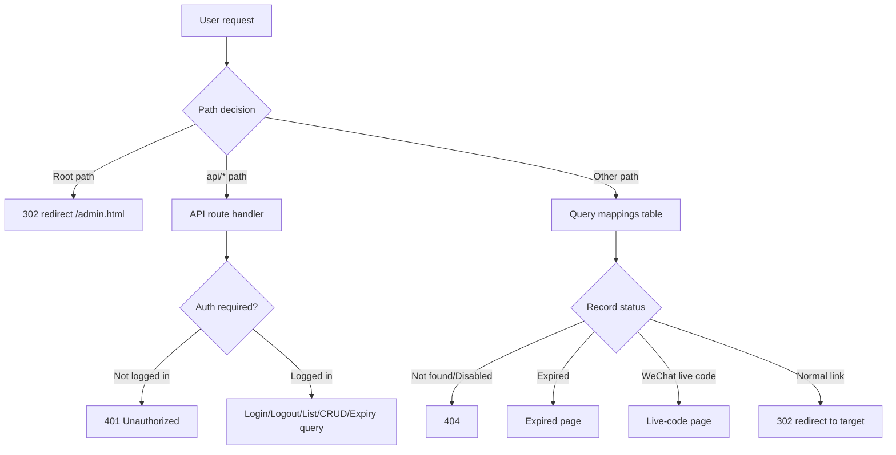

# serverless-qrcode-hub — Code Design Document

> 中文文档: [zh/CODE_DESIGN.md](./zh/CODE_DESIGN.md)

This document explains `serverless-qrcode-hub` file by file, function by function, and flow by flow. All descriptions are verified against the actual source code (`index.js`, `dist/login.html`, `dist/admin.html`, `wrangler.toml`, `package.json`) rather than being overview-level.

---

## Table of Contents

1. [Project Overview](#1-project-overview)
2. [Backend index.js Explained](#2-backend-indexjs-explained)
3. [Frontend login.html Explained](#3-frontend-loginhtml-explained)
4. [Frontend admin.html Explained](#4-frontend-adminhtml-explained)
5. [Configuration and Deployment](#5-configuration-and-deployment)
6. [Security and Optimization Suggestions](#6-security-and-optimization-suggestions)
   - [6.8 Architectural Decision: Why No Framework](#68-architectural-decision-why-no-framework)
   - [6.9 Timestamp Storage Refactoring Notes](#69-timestamp-storage-refactoring-notes)

---

## 1. Project Overview

### 1.1 Introduction

`serverless-qrcode-hub` is a "serverless" permanent QR-code and short-link system built on **Cloudflare Workers + D1 (SQLite-compatible) database**. Core capabilities:

- Users create **short links** or **WeChat group live codes** through an admin panel;
- When a visitor opens a short link: a normal link performs a `302` redirect, while a WeChat live code renders the original QR-code page for long-press recognition;
- Built-in password Cookie authentication (HMAC-signed token, not plaintext);
- A scheduled task (cron) that checks soon-to-expire / already-expired links, logs them, and physically deletes expired records;
- Dark / light / system-following three-state theme switching.

### 1.2 Tech Stack

| Layer | Technology |
|------|------------|
| Runtime | Cloudflare Workers (`compatibility_date = "2025-03-10"`) |
| Storage | Cloudflare D1 (SQLite-compatible, binding name `DB`) |
| Static assets | Cloudflare Assets (`./dist` directory, binding name `ASSETS`) |
| Frontend | Plain HTML + Tailwind CSS v4 + daisyUI v5 |
| QR generation | `qr-code-styling.js` (frontend) |
| QR recognition | `zxing.js` (frontend ZXing) |
| Deployment | Wrangler v4 (`dev` / `deploy` scripts) |

### 1.3 Directory Structure

```
serverless-qrcode-hub/
├── index.js            # Worker entry: routing, auth, API dispatch (imports src/*)
├── src/                # backend modules (bundled into one Worker by esbuild)
│   ├── state.js        # shared runtime state: DB + initState(env)
│   ├── util.js         # escapeHtml()
│   ├── db.js           # data layer: schema/migration, CRUD, validation, banPath
│   └── pages.js        # public pages: PUBLIC_I18N, pickLang, expired/WeChat renderers
├── wrangler.toml       # Wrangler deploy config (D1 binding, cron, Assets, env vars)
├── package.json        # scripts and dependencies (wrangler dev dependency only)
├── pnpm-lock.yaml
├── README.md           # project README (English)
├── README.v1.md        # old (KV-based) version README (English)
├── docs/
│   ├── CODE_DESIGN.md  # this document (English)
│   └── zh/             # Chinese docs
│       ├── README.md
│       ├── README.v1.md
│       └── CODE_DESIGN.md
├── MIGRATE.md          # deployment / migration illustrated guide
├── LICENSE
├── images/             # screenshots used by README/MIGRATE
├── dist/               # build output (static frontend), served by ASSETS
│   ├── login.html      # login page
│   ├── admin.html      # admin panel
│   ├── i18n.js         # shared i18n engine (dictionaries + auto-detect + switcher)
│   ├── daisyui@5.css
│   ├── tailwindcss@4.js
│   ├── theme.css        # professional business design system (DaisyUI theme overrides + unified component styles)
│   ├── common.js        # shared by login/admin: pre-paint theme, theme toggle, unified Toast/Alert, i18n bootstrap
│   ├── qr-code-styling.js
│   ├── zxing.js
│   ├── wechat.svg
│   └── favicon.svg
```

### 1.4 Overall Architecture (Backend Request Flow)



Static assets (e.g. `/login.html`, `/daisyui@5.css`) are served automatically by Cloudflare Assets and never reach `index.js`'s `fetch` logic (Assets take priority over the Worker script, or fall back per configuration).

### 1.5 Data Model

The D1 `mappings` table is created via `initDatabase()` using `CREATE TABLE IF NOT EXISTS`, with the following columns:

| Column | Type | Constraint | Description |
|--------|------|------------|-------------|
| `path` | TEXT | `PRIMARY KEY` | Short-link name, used as the primary key (the URL path part) |
| `target` | TEXT | `NOT NULL` | Target URL (normal short link) or original QR DataURL (WeChat live code, stored together with `qrCodeData`) |
| `name` | TEXT | nullable | Entry name (for display, e.g. "Music Group 1") |
| `expiry` | TEXT | nullable | Expiry date (millisecond-timestamp string); empty means permanently valid |
| `enabled` | INTEGER | `DEFAULT 1` | Whether enabled (1=enabled, 0=disabled); disabled entries return 404 when accessed |
| `created_at` | TEXT | no default | Creation time (millisecond timestamp), written by the JS layer `Date.now()` inside `createMapping` |
| `isWechat` | INTEGER | `DEFAULT 0` (added later) | Whether it is a WeChat QR code (1=yes) |
| `qrCodeData` | TEXT | added later | DataURL of the original WeChat live-code QR image |
| `pinned` | INTEGER | `DEFAULT 0` (added later) | Whether globally pinned (1=pinned). With `ORDER BY pinned DESC`, pinned items always sort first, across pages/sessions |

> Historical compatibility note: the three columns `isWechat`, `qrCodeData`, and `pinned` are added dynamically via the `ALTER TABLE` compatibility logic in `initDatabase()` (see 2.2). `isWechat`/`qrCodeData` are leftovers from migrating the old KV structure to D1; `pinned` is the later-added "global pin" feature column.

Indexes:

- `idx_expiry ON mappings(expiry)`
- `idx_created_at ON mappings(created_at)`
- `idx_enabled_expiry ON mappings(enabled, expiry)` (composite index, used for expiry queries)

### 1.6 Data Flow

- **Write path**: the frontend `admin.html` calls `/api/mapping` (POST/PUT/DELETE) → `createMapping` / `updateMapping` / `deleteMapping` → D1 write; `/api/mapping/pin` POST → `pinMapping` → updates the `pinned` column (global pin).
- **Read path (admin)**: `/api/mappings` (paginated list), `/api/mapping?path=` (single record), `/api/expiring-mappings` (expiry statistics).
- **Read path (visitor)**: any non-`api/` path → query `mappings` → decide 302 redirect / live-code page / expired page / 404.
- **Auth**: login writes a signed `auth` Cookie (`issuedAt.<hmac>`, see 2.3); subsequent APIs are validated via `verifyAuthCookie` → `verifyAuthToken`.

---

## 2. Backend index.js Explained

### 2.1 Module-level Variables and `banPath`

```js
let DB;
const banPath = [
  'login', 'admin', '__total_count',
  'admin.html', 'login.html',
  'daisyui@5.css', 'tailwindcss@4.js',
  'qr-code-styling.js', 'zxing.js',
  'robots.txt', 'wechat.svg',
  'favicon.svg',
];
```

- `DB`: module-level mutable variable, assigned from `env` by `initState(env)` at the start of each request / scheduled task (see `fetch` and `scheduled` entry points). `state.js` holds the single `DB` binding shared across all `src/*` modules via ES-module live binding.
- `banPath`: list of system-reserved paths. Used in two places:
  1. `listMappings` queries with `WHERE path NOT IN (...)` to avoid showing reserved names in the admin list;
  2. `createMapping` / `deleteMapping` / `updateMapping` reject these names (to avoid conflicts with static assets / routes).
  - `__total_count` is a special placeholder reserved name (historically used for KV pagination counting; has no real effect now, only kept in the list).

### 2.2 `initDatabase()` — Database Initialization

```js
async function initDatabase() { ... }
```

- **Arguments**: none (uses the module-level `DB` directly).
- **Logic steps**:
  1. `CREATE TABLE IF NOT EXISTS mappings (...)`: create the table with primary key `path`.
  2. `PRAGMA table_info(mappings)`: read column info into a `columns` array (column-name list).
  3. If `columns` does not contain `'isWechat'`, execute `ALTER TABLE mappings ADD COLUMN isWechat INTEGER DEFAULT 0`.
  4. If `columns` does not contain `'qrCodeData'`, execute `ALTER TABLE mappings ADD COLUMN qrCodeData TEXT`.
  4.5 If `columns` does not contain `'pinned'`, execute `ALTER TABLE mappings ADD COLUMN pinned INTEGER DEFAULT 0` (for global pinning).
  5. Sequentially `CREATE INDEX IF NOT EXISTS` the three indexes (`idx_expiry`, `idx_created_at`, `idx_enabled_expiry`).
  6. **Timestamp data migration**: detect whether `expiry` is in the old `YYYY-MM-DD` format (GLOB pattern); if so, convert each row to a millisecond timestamp (`new Date(dateStr + 'T00:00:00Z').getTime()`). Also detect whether `created_at` is in the old `YYYY-MM-DD HH:MM:SS` format (`CURRENT_TIMESTAMP` string) and convert to `new Date(str + 'Z').getTime()`. Once migrated, all old-format rows become pure numeric timestamps and will not trigger again.
- **Design intent**: implement a **forward-compatible table migration** — an old table (only the first 7 columns, no `isWechat`/`qrCodeData`) automatically gains columns on first run, avoiding manual table changes on every deployment.
- **Call timing**: both the `fetch` and `scheduled` entry points `await initDatabase()` before doing business work. A module-level `dbInitialized` flag makes the function a one-time, idempotent setup: after the first successful run the DDL round-trips are skipped entirely (the `IF NOT EXISTS` / existence checks already made it safe, but the flag removes the per-request cost). Repeated calls are therefore harmless.
- **Boundary**: `PRAGMA` and `ALTER TABLE` are both supported on D1; if the table is already at the latest schema, the column-adding branches are skipped and only indexes are recreated (index creation is itself idempotent). Data migration runs only once when old-format data is detected (via GLOB pattern); afterward all rows are timestamps and will not trigger again.

### 2.3 Auth Cookie (HMAC-signed)

The admin password is **never** stored in the Cookie. On login the Worker issues a signed token `issuedAt.<hmac>` (see `src/util.js`): `issuedAt` is `Date.now()` and the HMAC-SHA256 of `issuedAt` is keyed by `env.PASSWORD` (no extra secret to configure). The cookie name is `auth`. Verification recomputes the HMAC and also rejects tokens older than `Max-Age` (1 day), so a captured token cannot be replayed indefinitely.

#### 2.3.1 `verifyAuthToken(token, secret)`

```js
export async function verifyAuthToken(token, secret) {
  const parts = (token || '').split('.');
  if (parts.length !== 2) return false;
  const [issuedAt, sig] = parts;
  if (!Number.isFinite(Number(issuedAt))) return false;
  if (Date.now() - Number(issuedAt) > COOKIE_MAX_AGE * 1000) return false;
  const expected = await hmacSign(issuedAt, secret);
  return safeEqual(expected, sig);   // constant-time compare
}
```

- **Arguments**: `token` (the `auth` cookie value); `secret` (the admin `PASSWORD`).
- **Logic**: split into `issuedAt.sig`; reject wrong shape, non-numeric/old `issuedAt`, or a signature that does not match `hmacSign(issuedAt, secret)`. Uses `crypto.subtle` (available in the Workers runtime).
- **Return**: boolean.

#### 2.3.2 `authCookieHeader(secret)` / `clearAuthCookieHeader()`

```js
export async function authCookieHeader(secret) {
  const token = await makeAuthToken(secret);     // issuedAt + '.' + HMAC
  return `auth=${token}; Path=/; HttpOnly; SameSite=Strict; Max-Age=${COOKIE_MAX_AGE}`;
}
export function clearAuthCookieHeader() {
  return `auth=; Path=/; HttpOnly; SameSite=Strict; Max-Age=0`;
}
```

- **`authCookieHeader`**: builds the signed token via `makeAuthToken` then returns the `Set-Cookie` header (scope `/`, `HttpOnly`, `SameSite=Strict`, `Max-Age=86400`). Used as the login response header.
- **`clearAuthCookieHeader`**: returns a `Set-Cookie` that expires the `auth` cookie immediately, implementing logout.

#### 2.3.3 `verifyAuthCookie(request, env)`

```js
async function verifyAuthCookie(request, env) {
  const cookie = request.headers.get('Cookie') || '';
  const authCookie = cookie.split(';').find(c => c.trim().startsWith('auth='));
  if (!authCookie) return false;
  const token = authCookie.split('=')[1].trim();
  return verifyAuthToken(token, env.PASSWORD);
}
```

- Thin wrapper used by the API layer: extracts the `auth` cookie and delegates to `verifyAuthToken`. Because the token is signed with `PASSWORD`, the old plaintext cookie format is automatically rejected (wrong shape), giving a clean security upgrade with no migration step.

### 2.4 Database Operation Functions

#### 2.4.1 `listMappings(page = 1, pageSize = 10, search = '')`

```js
async function listMappings(page = 1, pageSize = 10, search = '') { ... }
```

- **Arguments**: `page` (page number, default 1), `pageSize` (items per page, default 10), `search` (fuzzy search keyword, default empty string).
- **Logic**:
  1. `offset = (page - 1) * pageSize`.
  2. `hasSearch = search.trim() !== ''`; if true, build `searchTerm = '%' + search.trim() + '%'` for `LIKE`.
  3. Build SQL with a CTE:
     - `filtered_mappings` CTE: `SELECT * FROM mappings WHERE path NOT IN (?, ?, ...)`, with `banPath` expanded into `?` placeholders; **when `hasSearch` is true, append `AND (name LIKE ? OR path LIKE ?)`**, doing a substring fuzzy match on the entry name (`name`) and the short-link name (`path`) (`path` is the primary key so always has a value; `name` is nullable so NULL rows never match).
     - The main query selects all columns from `filtered_mappings` plus a subquery `(SELECT COUNT(*) FROM filtered_mappings) as total_count`, `ORDER BY pinned DESC, created_at DESC`, `LIMIT ? OFFSET ?`.
     - `.bind(...banPath, ...(hasSearch ? [searchTerm, searchTerm] : []), pageSize, offset)`: first expand the `banPath` array, then when searching append the two `searchTerm` values (matching the two `LIKE` placeholders for `name`/`path`), and finally append `pageSize`, `offset`.
  3. If the result is empty (`results.results` empty or length 0), return `{ mappings: {}, total: 0, page, pageSize, totalPages: 0 }`.
  4. Otherwise: `total = results.results[0].total_count`; iterate each row and build a `mappings` object keyed by `path` (with `target/name/expiry/enabled(===1)/isWechat(===1)/qrCodeData`).
  5. Return `{ mappings, total, page, pageSize, totalPages: Math.ceil(total / pageSize) }`.
- **Key point**: a **single query** returns both the paginated data and the total (`total_count` computed via the CTE subquery), avoiding the N+1 problem of "query total first, then query page". `total_count` appears on every row; just take the first row.
- **Return structure**:
  ```json
  {
    "mappings": { "<path>": { "target":"...", "name": "...", "expiry": "...", "enabled": true, "isWechat": false, "qrCodeData": null } },
    "total": 42,
    "page": 1,
    "pageSize": 10,
    "totalPages": 5
  }
  ```
- **Note**: `mappings` is an **object (key-value pairs)**, not an array. The frontend `loadMappings` uses `Object.entries(data.mappings)` to turn it into an array.

#### 2.4.2 `createMapping(path, target, name, expiry, enabled = true, isWechat = false, qrCodeData = null)`

```js
async function createMapping(path, target, name, expiry, enabled = true, isWechat = false, qrCodeData = null) { ... }
```

- **Arguments**: the full set of mapping fields.
- **Validation**: lightweight guards (path/target presence, `RESERVED_PATH`) plus a single call to `validateMappingInput(path, target, name, expiry, isWechat, qrCodeData)`, which centralizes all remaining rules (path regex + length limits, strictly-http(s) target, `INVALID_EXPIRY` for unparseable expiry, and for WeChat entries: `WECHAT_REQUIRES_QR` when `qrCodeData` is empty, `QR_INVALID` when it is not a `data:image/` or `http(s)://` value, and `QR_TOO_LARGE` when it exceeds `QR_MAX` = 1 MiB). The upstream API handler runs `normalizeTarget` first so `target` already carries a scheme.
- **Failure** → `throw new Error` with one of the stable codes above.
- **Write**: `INSERT INTO mappings (path, target, name, expiry, enabled, isWechat, qrCodeData) VALUES (?, ?, ?, ?, ?, ?, ?)`. Where:
  - `name` → `name || null`
  - `expiry` → `expiry || null`
  - `enabled` → boolean to `1/0`
  - `isWechat` → boolean to `1/0`
  - `qrCodeData` → original value (DataURL for WeChat)
- **Boundary**: `path` is the primary key; if it already exists, D1 throws a unique-constraint error, caught by the upper `fetch` try/catch (not `Invalid input`, so mapped to HTTP 500, see 2.11).
- **Caller**: only the `fetch` POST `/api/mapping`.

#### 2.4.3 `deleteMapping(path)`

```js
async function deleteMapping(path) { ... }
```

- **Arguments**: `path` (string).
- **Validation**:
  1. `!path || non-string type` → `Invalid input`.
  2. `banPath.includes(path)` → `RESERVED_PATH` ("This short link name is reserved by the system and cannot be deleted").
- **Write**: `DELETE FROM mappings WHERE path = ?`.
- **Boundary**: deleting a non-existent `path` does not error (D1 `DELETE` with no matching rows affects 0 rows).

#### 2.4.4 `pinMapping(path, pinned)`

```js
async function pinMapping(path, pinned) { ... }
```

- **Arguments**: `path` (string primary key), `pinned` (truthy means pinned).
- **Validation**: `!path || non-string type` → `Invalid input`.
- **Write**: `UPDATE mappings SET pinned = ? WHERE path = ?`, `pinned` truthy → `1`, else `0`.
- **Usage**: called by `/api/mapping/pin` to pin/unpin an entry globally; the pinned state persists at the list level via `listMappings`'s `ORDER BY pinned DESC`.
- **Boundary**: updating a non-existent `path` does not error (D1 `UPDATE` with no matching rows affects 0 rows).

#### 2.4.4 `updateMapping(originalPath, newPath, target, name, expiry, enabled = true, isWechat = false, qrCodeData = null)`

```js
async function updateMapping(originalPath, newPath, target, name, expiry, enabled = true, isWechat = false, qrCodeData = null) { ... }
```

- **Arguments**: `originalPath` (locates the original record), `newPath` (new short-link name, may be a rename).
- **Validation**:
  1. `!originalPath || !newPath || !target` → `Invalid input`.
  2. `banPath.includes(newPath)` → reserved name rejected.
  3. `expiry` present and unparseable → `INVALID_EXPIRY`.
  4. **Preserve original QR data**: if `!qrCodeData && isWechat`, first `SELECT qrCodeData FROM mappings WHERE path = originalPath` to get the original value for fallback; if still empty and `isWechat` is true → `WECHAT_REQUIRES_QR`.
- **Write**: `UPDATE mappings SET path=?, target=?, name=?, expiry=?, enabled=?, isWechat=?, qrCodeData=? WHERE path = ?`, binding `newPath, target, name||null, expiry||null, enabled?1:0, isWechat?1:0, qrCodeData, originalPath`.
- **Design intent**: when editing a WeChat live code, if the user does not re-upload an image, the old `qrCodeData` is reused to avoid accidental clearing; normal-link edits are unaffected.

#### 2.4.5 `getExpiringMappings()`

```js
async function getExpiringMappings() { ... }
```

- **Arguments**: none.
- **Timestamp calculation (millisecond level)**:
  - `now = Date.now()` → current millisecond timestamp.
  - `threeDaysLater = now + 3 * 24 * 60 * 60 * 1000` → timestamp 3 days later.
- **SQL** (CTE + CASE + numeric comparison):
  ```sql
  WITH categorized_mappings AS (
    SELECT path,name,target,expiry,enabled,isWechat,qrCodeData,
      CASE
        WHEN CAST(expiry AS INTEGER) < ? THEN 'expired'
        WHEN CAST(expiry AS INTEGER) <= ? THEN 'expiring'
      END as status
    FROM mappings
    WHERE expiry IS NOT NULL
      AND CAST(expiry AS INTEGER) <= ?
      AND enabled = 1
  )
  SELECT * FROM categorized_mappings ORDER BY CAST(expiry AS INTEGER) ASC
  ```
  - Bind: `(dayStart, threeDaysLater, threeDaysLater)`.
- **Classification logic**:
  - `expiry` timestamp < current time → `expired`;
  - `expiry` timestamp ≤ `now + 3 days` → `expiring`;
  - `expiry` timestamp > `now + 3 days` → filtered out by `WHERE CAST(expiry AS INTEGER) <= threeDaysLater`, not returned.
- **Return structure**: iterate results, group by `status` into `{ expiring: [], expired: [] }`, each item containing `path/name/target/expiry/enabled/isWechat/qrCodeData`.
- **Note**: the calculation window is **3 days** and the `scheduled` log text now correctly says "expiring in 3 days", so comment and logic are consistent. This endpoint **does not use pagination parameters** and returns all matching records at once; the frontend `loadExpiringMappings` re-paginates on the client (see 4.17).

#### 2.4.6 `cleanupExpiredMappings(batchSize = 100)`

```js
async function cleanupExpiredMappings(batchSize = 100) { ... }   // returns number deleted
```

- **Logic**: loop to delete `expiry < now` records in batches:
  1. `SELECT path FROM mappings WHERE expiry IS NOT NULL AND expiry < ? LIMIT batchSize` (bind `now = Date.now().toString()`, numeric comparison against the millisecond-timestamp column).
  2. Empty → `break`.
  3. Otherwise `DELETE FROM mappings WHERE path IN (...)`.
  4. If this batch size `< batchSize` → `break` (done).
- **Return**: total number of rows deleted across all batches.
- **Status**: **now called by `scheduled`** after the expiring/expired report is logged (see 2.6). The report lists enabled links inside the 3-day window; cleanup then physically removes everything past its `expiry` (including disabled entries), so expired short links stop resolving as 404.

#### 2.4.7 ~~`migrateFromKV()`~~ — removed

The historical KV→D1 migration function (`migrateFromKV()`) and its `KV_BINDING` dependency have been **removed** from the codebase. The old KV-based version remains available as `README.v1.md` for reference, but the current D1-only code no longer carries any KV migration logic or `[kv_namespaces]` requirement.

### 2.5 `fetch(request, env)` — Request Entry

```js
export default {
  async fetch(request, env) {
    initState(env);          // populates the shared DB binding
    await initDatabase();
    const url = new URL(request.url);
    const path = url.pathname.slice(1);   // strip leading '/'
    ...
  },
  async scheduled(...) { ... }
};
```

- **First step**: `initState(env)` populates the shared `DB` binding, then `await initDatabase()`.
- `path = url.pathname.slice(1)`: e.g. `/admin.html` → `admin.html`, `/abc` → `abc`, `/` → `''`.

#### 2.5.1 Root Path Redirect

```js
if (path === '') {
  return Response.redirect(url.origin + '/admin.html', 302);
}
```

- Accessing the site root `/` → 302 redirect to `/admin.html` (admin panel).

#### 2.5.2 API Routes (`path.startsWith('api/')`)

Branching by `path` and `method`:

**a) Login `api/login` POST (no pre-auth required)**

```js
if (path === 'api/login' && request.method === 'POST') {
  const { password } = await request.json();
  if (password === env.PASSWORD) {
    return new Response(JSON.stringify({ success: true }), { headers: setAuthCookie(password) });
  }
  return new Response('Unauthorized', { status: 401 });
}
```

- Parse JSON, get `password`.
- Equals `env.PASSWORD` → return `{ success: true }` with the signed `auth` cookie from `authCookieHeader(env.PASSWORD)`.
- Otherwise → 401 `Unauthorized` (plain text, no JSON body).

**b) Logout `api/logout` POST (no pre-auth required)**

```js
if (path === 'api/logout' && request.method === 'POST') {
  return new Response(JSON.stringify({ success: true }), { headers: clearAuthCookie() });
}
```

- Return `{ success: true }`, `Set-Cookie` invalidates the `auth` cookie (`clearAuthCookieHeader()`).

**c) Auth Interception**

```js
if (!verifyAuthCookie(request, env)) {
  return new Response('Unauthorized', { status: 401 });
}
```

- All subsequent APIs require Cookie validation, otherwise 401.

**d) Authenticated branch (wrapped in `try`)**

- `api/expiring-mappings` GET → `getExpiringMappings()` → JSON.
- `api/mappings` GET → parse `page` / `pageSize` (`parseInt(...) || 1/10`) and `search` (`params.get('search') || ''` then `slice(0, 64)`); call `listMappings(page, pageSize, search)` → JSON.
- `api/mapping` (no subpath) dispatched by `method`:
  - **GET**: read `?path=`, missing → 400 `{ error: 'Missing path parameter' }`; not found → 404 `{ error: 'Mapping not found' }`; otherwise return the single mapping JSON.
  - **POST**: `request.json()` → `createMapping(...)` → `{ success: true }`.
  - **PUT**: `request.json()` → `updateMapping(...)` → `{ success: true }`.
  - **DELETE**: `request.json()` get `path` → `deleteMapping(path)` → `{ success: true }`.
- `api/mapping/pin` POST (pin / unpin):
  - Parse `{ path, pinned }`; missing `path` → 400 `{ error: 'Missing path' }`.
  - Call `pinMapping(path, pinned)` (`UPDATE mappings SET pinned = ? WHERE path = ?`, `pinned` truthy → `1/0`) → `{ success: true }`.
  - The frontend "pin / unpin" button calls this endpoint then reloads `loadMappings()` so the `ORDER BY pinned DESC` sort takes effect immediately.
- Other `api/*` → 404 `Not Found`.
- **Exception catch**: `catch (error)` returns:
  ```js
  new Response(JSON.stringify({ error: error.message || 'Internal Server Error' }),
    { status: error.message === 'Invalid input' ? 400 : 500, headers: {...} })
  ```
  i.e. `Invalid input` → 400, others (including D1 unique constraint / SQL errors) → 500.
- **Stable error codes**: the errors thrown by `createMapping` / `deleteMapping` / `updateMapping` use stable English constants `RESERVED_PATH` / `INVALID_EXPIRY` / `WECHAT_REQUIRES_QR` / `INVALID_INPUT` (instead of inline Chinese), and the frontend maps them to localized messages via `apiErrorMessage()`, avoiding coupling the backend to any specific language.

#### 2.5.3 URL Redirect Handling (`path` non-empty and not `api/`)

```js
if (path) {
  try {
    const mapping = await DB.prepare(`SELECT ... FROM mappings WHERE path = ?`).bind(path).first();
    if (mapping) {
      if (!mapping.enabled) return 404 'Not Found';
      if (mapping.expiry) {
        const today = new Date(); today.setHours(23,59,59,999);
        if (new Date(mapping.expiry) < today) {
          // return the "link expired" HTML page
        }
      }
      if (mapping.isWechat === 1 && mapping.qrCodeData) {
        // return the WeChat live-code HTML page
      }
      return Response.redirect(mapping.target, 302);   // normal redirect
    }
    return new Response('Not Found', { status: 404 });
  } catch (error) {
    return new Response('Internal Server Error', { status: 500 });
  }
}
```

- **Query**: `WHERE path = ?`. `path` comes from the URL; reserved names in `banPath` (e.g. `login.html`) are actually served first by Assets and never reach this branch.
- **Disabled**: `!mapping.enabled` → 404 (pretending not to exist, to avoid exposing reserved/disabled items).
- **Expiry check**: `Number(mapping.expiry) < Date.now()` — direct numeric comparison, where `mapping.expiry` is a millisecond-timestamp string. When expired, return a polished expired page (status code 404) showing the entry name and expiry date (formatted with `toLocaleDateString()` in the visitor's browser local timezone, automatically adapting to different system timezones). Also return `Cache-Control: no-store` to prevent CDN caching.
- **Expired page**: returns hardcoded HTML (`text/html;charset=UTF-8`, `Cache-Control: no-store`, **status code 404**). Content includes the entry name, expiry date (`toLocaleDateString`), and "Contact the admin to update this link". Uses a professional business style (centered card + clock icon + enterprise blue `--brand:#2563EB`, with CSS variables + `@media (prefers-color-scheme: dark)` for light/dark adaptation, consistent with the admin design system). **Multi-language**: the expired and WeChat pages select the language via `pickLang(request)` (parsing `Accept-Language`) using the `PUBLIC_I18N` dictionary (supports en/zh/ru/ja/ko/es/fr/de, falling back to English), and apply `escapeHtml()` to the user-provided `name` to prevent XSS.
- **WeChat live-code page**: when `isWechat===1` and there is `qrCodeData`, return hardcoded HTML with an inline `` (DataURL rendered directly, wrapped in a white rounded `qr-wrap` container for long-press), with the `wechat.svg` icon and the "Long-press to recognize the QR code below" hint. `Cache-Control: no-store`. Same professional business style as the expired page (enterprise blue `--brand` + light/dark adaptation). **Key point**: the WeChat live code shows the original QR image for visitors to long-press, distinct from a normal 302 redirect.
- **Normal redirect**: `Response.redirect(mapping.target, 302)`.

### 2.6 `scheduled(controller, env, ctx)` — Scheduled Task

```js
async scheduled(controller, env, ctx) {
  initState(env);
  await initDatabase();
  const result = await getExpiringMappings();
  console.log(`Cron job report: Found ${result.expired.length} expired mappings`);
  if (result.expired.length > 0) console.log('Expired mappings:', JSON.stringify(result.expired, null, 2));
  console.log(`Found ${result.expiring.length} mappings expiring in 3 days`);
  if (result.expiring.length > 0) console.log('Expiring soon mappings:', JSON.stringify(result.expiring, null, 2));
  // Physically delete expired mappings (reports above only cover the 3-day window).
  const deleted = await cleanupExpiredMappings();
  console.log(`Cleaned up ${deleted} expired mappings`);
}
```

- **Trigger**: `wrangler.toml` `[triggers] crons = ["0 2 */1 * *"]` (production, daily at 02:00) or the dev environment `*/10 * * * * *` (every 10 seconds, for local `--test-scheduled` debugging).
- **Logic**: after init, build the expiring/expired report via `getExpiringMappings()` and `console.log` statistics + details to the Worker log, then **physically delete** all records whose `expiry` is in the past via `cleanupExpiredMappings()` (the deleted count is logged). Email notification is not implemented (see admin.html text and [6.4](#64-unimplemented-feature-declaration)).

---

## 3. Frontend login.html Explained

`login.html` is a purely static login page, depending on `/daisyui@5.css` (styles) and `/tailwindcss@4.js` (Tailwind runtime). The theme and alert logic's **pre-paint script, theme toggle, Toast/Alert, and i18n bootstrap have all been extracted into `dist/common.js` and `dist/i18n.js`** (loaded synchronously in `<head>` via `<script src="/i18n.js">` and `<script src="/common.js">`), shared by both pages to avoid duplication. The visual layer is carried by `dist/theme.css` with unified design tokens (see below).

### 3.1 Pre-paint Theme Script (`common.js`)

```js
(function () {
  const savedTheme = localStorage.getItem('theme');
  const mq = window.matchMedia && window.matchMedia('(prefers-color-scheme: dark)');
  if (savedTheme === 'system' || !savedTheme) {
    if (!savedTheme) localStorage.setItem('theme', 'system');
    document.documentElement.setAttribute('data-theme', mq && mq.matches ? 'dark' : 'light');
  } else {
    document.documentElement.setAttribute('data-theme', savedTheme);
  }
})();
```

- **Purpose**: set `<html data-theme>` based on `localStorage.theme` before HTML renders (avoid flicker).
- **Branches**: `system` → follow system; an explicit stored value → use directly; none → default to `system` and follow system.
- The logic is identical to admin.html and is now unified in `common.js` (see 4.1).

### 3.2 Theme Toggle Functions (`toggleTheme` / `updateThemeIcon` in `common.js`)

- `toggleTheme()`: read the current `theme` (`system`/`light`/`dark`), cycle `system → light → dark → system`; write back to `localStorage`; when `system`, decide the actual `data-theme` via `matchMedia`, otherwise use the new value directly; finally `updateThemeIcon(newTheme)`.
- `updateThemeIcon(theme)`: switch the SVG path via `setAttribute('d', ...)` on `#themeToggleBtn path` — `system` uses a monitor icon, `dark` a moon, `light` a sun.
- **System change listener**: `window.matchMedia('(prefers-color-scheme: dark)').addEventListener('change', ...)`: only when `theme==='system'` does it follow the system in real time.
- **Initialization**: on `DOMContentLoaded`, `initThemeToggle()` binds the button `click → toggleTheme` and initializes the icon (registered uniformly at the end of `common.js`, no need for each page to repeat).

### 3.3 Login UI Structure

- `<body class="auth-page">`: `theme.css` provides a light/dark gradient background (dual radial glow + light gray base), professional business style.
- Fixed `themeToggleBtn` (ghost round button) at top right.
- Centered card `.auth-card`: contains the **brand area** (`brand-logo` gradient block + `favicon.svg` + title "QR Code Hub" + subtitle "Serverless QR Code Hub"), a `password` input with a lock icon (`autocomplete="current-password"`), and a "Sign In" button (with loading spinner and "Signed in successfully" state).
- Error hint `#error` (`alert alert-error`, `display:none` by default, containing the "Wrong password, please try again" text).
- Footer with GitHub link and a "give us a Star" message.
- Language switcher: `<div data-lang-switcher></div>` at top right, rendered by `common.js` as a dropdown selector; switching writes `localStorage.lang` and re-renders static text immediately.

### 3.4 `login()` — Login Request

```js
async function login() {
  const password = document.getElementById('password').value;
  const error = document.getElementById('error');
  const button = document.querySelector('button');
  button.disabled = true;
  button.innerHTML = '<span class="loading loading-spinner"></span> Signing in...';
  try {
    const response = await fetch('/api/login', { method:'POST', headers:{'Content-Type':'application/json'}, body: JSON.stringify({ password }) });
    if (response.ok) {
      // show "Signed in successfully", redirect /admin
      window.location.href = '/admin';
    } else {
      const data = await response.json().catch(() => ({}));
      error.querySelector('span').textContent = data.error || 'Wrong password, please try again';
      error.style.display = 'flex';
      button.disabled = false;
      button.textContent = 'Sign In';
    }
  } catch (e) {
    error.querySelector('span').textContent = 'Network error, please try again later';
    error.style.display = 'flex';
    button.disabled = false;
    button.textContent = 'Sign In';
  }
}
```

- **Flow**: disable button → show "Signing in..." spinner → POST `/api/login`.
- **Success** (`response.ok`): button becomes "Signed in successfully", `window.location.href = '/admin'` (note: the backend only sets the Cookie on success; the frontend does the redirect; `/admin` is actually served as `admin.html` by Assets).
- **Failure**: try to parse the JSON error, update `#error` text and show again; re-enable button.
- **Network error**: catch shows "Network error".
- **Note**: `response.json().catch(() => ({}))` — the backend 401 returns plain text `Unauthorized` rather than JSON, so `.catch` falls back to an empty object, ultimately showing the default "Wrong password, please try again".
- **Multi-language**: the prompt texts in `login()` (Signing in / Signed in successfully / Wrong password / Network error / Sign In) are all obtained via `I18N.t('login.*')` and switch with the user's language.

### 3.5 Auxiliary Interactions

- Enter to submit: `password` input `keypress` → `e.key==='Enter'` calls `login()`.
- Auto-focus: `password.focus()`.

---

## 4. Frontend admin.html Explained

`admin.html` is the admin panel, depending on `/daisyui@5.css`, `/tailwindcss@4.js`, and loading `/qr-code-styling.js` and `/zxing.js` at the bottom. All business logic is inlined in one large `DOMContentLoaded` callback (plus an independent QR-setup `DOMContentLoaded` listener, see 4.18). Theme, Toast/Alert, and i18n bootstrap are shared via `common.js` and `i18n.js`.

### 4.1 Pre-paint Theme Script

Identical logic to `login.html`, now unified in `dist/common.js` (loaded synchronously in `<head>` via `<script src="/i18n.js">` and `<script src="/common.js">`, setting `data-theme` before render). `admin.html` no longer inlines the pre-paint IIFE, theme toggle functions, or a second `DOMContentLoaded` (see 4.18). The visual layer is carried by `dist/theme.css`: overriding DaisyUI theme variables (enterprise blue `--color-primary:#2563EB`, slate neutral grays, `--radius-box:1rem`, etc.) and unifying the refined styles and micro-interactions of cards/buttons/inputs/modals/Toasts/skeletons.

### 4.2 Top Script: Frontend `banPath`

```js
const banPath = [ 'login','admin','__total_count','admin.html','login.html','daisyui@5.css','tailwindcss@4.js','qr-code-styling.js','zxing.js','robots.txt','wechat.svg','favicon.svg' ];
```

- Mirrors the backend `banPath` (the backend in `src/db.js` is the single source of truth; the frontend copy is only for **input-validation hints** and should be kept in sync — see [6.6](#66-other-optimization-points)). The frontend split flows only validate the format `^[a-zA-Z0-9-_]+$`.

### 4.3 Page Structure (HTML)

- Two `<dialog>` modals:
  - `#detail-modal`: short-link details (read-only, with merged QR preview). Contains entry info (`#detailName`/`#detailPath`/`#detailTarget`/`#detailExpiry`, status badges `#detailEnabled`/`#detailWechat`/`#detailPinned`), QR preview (`#qr-loading` progress bar / `#qr-container` / `#qr-url` read-only / `#qr-show-logo` checkbox / `#qr-dots-style` dropdown / `#qr-download` button), copy buttons `#copyTargetBtn` (copy target URL) and `#copyUrlBtn` (copy link URL), and an edit button `#detailEditBtn`.
  - `#delete-confirm-modal`: delete confirmation (`#confirm-delete-btn`).
  - `#edit-modal`: a modal version of the inline editor, containing `#editModalName`/`#editModalPath`/`#editModalTarget`/`#editModalExpiry`/`#editEnabled`/`#editIsWechat` and a save button (`data-i18n="admin.save"`).
- `#alertContainer`: floating alert container (top center).
- Hidden field `#qrCodeData`: stores the DataURL of the currently uploaded QR.
- Navbar: title "Dashboard" (`#pageLabel` provided by `admin.dashboard`), language switcher `<div data-lang-switcher></div>`, theme button, logout button.
- "Help" card (collapsible: usage steps, notes — note mentions "you will be notified by email when a link expires", but this is not yet implemented; see [6.4](#64-unimplemented-feature-declaration)).
- Two **Add** buttons in the create area: `#addLinkBtn` ("Add Link", normal short link) and `#addWechatBtn` ("Add WeChat QR", requires a QR image). Each toggles its own panel:
  - `#createLinkPanel`: normal-link form (`#linkName` / `#linkPath` / `#linkTarget` / `#linkExpiry` / `#linkEnabled` / `#addLinkSubmitBtn`).
  - `#createWechatPanel`: WeChat form with an upload area `#qr-upload-area` / result `#qr-result` / decoded text `#decoded-text`, plus `#wName` / `#wPath` / `#wTarget` (read-only, auto-filled from the QR) / `#wExpiry` / `#wEnabled` / `#qrCodeData` (hidden) / `#addWechatSubmitBtn`.
- A reusable QR-recognition widget is shared by the create-WeChat and edit flows via `setupQRUpload(areaId, fileInputId, resultId, decodedTextId, targetInputId, qrDataInputId)` (parameterized, no `newIsWechat` toggle).
- "QR Link Management" card: title area (top-left "QR Link Management" title, right side a `join` group combining "search box + filter button group"); search box `#searchInput` (real-time fuzzy search, 300ms debounce) and one-click clear button `#clearSearchBtn` (shown only when there is input); filter button group (All `#showAllBtn` / Expiring soon `#showExpiringBtn` / Expired `#showExpiredBtn`, highlighted with `btn-primary`/`btn-warning`/`btn-error` respectively); below, `#loading`, `#skeleton` skeleton screen, table `#mappingsTableBody`, pagination controls (page size `#pageSize`, previous `#prevPage`, current `#currentPage`, next `#nextPage`).
- **Multi-language**: all static text is declared via `data-i18n` / `data-i18n-ph` / `data-i18n-title` / `data-i18n-aria` / `data-i18n-tip` attributes, filled uniformly by `I18N.applyI18n()` on load and on language switch; dynamically generated content (cards, modals, alerts) is obtained via `I18N.t('admin.*'/'app.*')`.

### 4.4 Global State Variables

Declared inside the `DOMContentLoaded` callback:

```js
let allMappings = [];   // mapping array of the current "All" view (after Object.entries)
let currentPage = 1;
let pageSize = 10;
```

### 4.5 `checkAuth()` — Authentication Check

```js
async function checkAuth() {
  try {
    const response = await fetch('/api/mappings');
    if (response.status === 401) return false;
    return true;
  } catch (error) {
    console.error('Auth check failed:', error);
    return false;
  }
}
```

- **Principle**: directly request `/api/mappings`; a 401 means not logged in → return `false`; otherwise `true`. Depends on the backend returning 401 for unauthenticated APIs.
- **Call**: on `DOMContentLoaded`, `checkAuth().then(isAuthenticated => { if (!isAuthenticated) window.location.href='/login'; else initializePage(); })`.

### 4.6 `initializePage()` — Initialization

Bind events, load data, and set filter button states:

```js
function initializePage() {
  document.getElementById('logoutBtn').addEventListener('click', logout);
  document.getElementById('addLinkBtn').addEventListener('click', toggleCreateLinkPanel);
  document.getElementById('addWechatBtn').addEventListener('click', toggleCreateWechatPanel);
  setupQRUpload('qr-upload-area', 'qr-file', 'qr-result', 'decoded-text', 'wTarget', 'qrCodeData');
  setupQRUpload('editQrUploadArea', 'editQrFile', 'editQrResult', 'editDecodedText', 'editModalTarget', 'editQrCodeData');
  themeToggleBtn.addEventListener('click', toggleTheme);
  loadMappings();
  setupErrorHandling();
}
```

- **Filter button group object** `filterButtons`: `showAllBtn→btn-primary`, `showExpiringBtn→btn-warning`, `showExpiredBtn→btn-error`.
- **Three filter button clicks** (each resets `currentPage=1`, switches the highlight class, then loads data):
  - `showAllBtn` → add `btn-primary`, remove others, call `loadMappings()`.
  - `showExpiringBtn` → add `btn-warning`, call `loadExpiringMappings('expiring')`.
  - `showExpiredBtn` → add `btn-error`, call `loadExpiringMappings('expired')`.
- **Creation flows are two independent features** (no `newIsWechat` toggle): "Add Link" opens `#createLinkPanel` (normal short link, no QR), "Add WeChat QR" opens `#createWechatPanel` (requires an uploaded QR image, target auto-filled and read-only). See 4.13.

### 4.7 `setupErrorHandling()` — Global Error Handling

```js
window.addEventListener('unhandledrejection', function (event) {
  if (event.reason.status === 401) window.location.href = '/login';
});
```

- Catches unhandled Promise rejections; if `reason.status===401`, redirect to the login page. Acts as a fallback for the explicit 401 redirects in each request.

### 4.8 QR Recognition → Target Auto-fill (no WeChat switch)

The old `newIsWechat` checkbox is gone. Recognition now lives in `setupQRUpload` (parameterized by target input id). On a successful decode inside the **WeChat** flow the recognized text is written into the target input and that input is set `readOnly=true` (the WeChat short link's target *is* the QR content). The WeChat-vs-normal distinction is fixed at creation time by which "Add" button the user opened, so there is no runtime toggle to keep in sync.

### 4.9 QR Upload and Recognition

#### 4.9.1 `setupQRUpload()`

Binds: click upload area → trigger file selection; `dragover`/`dragleave`/`drop` handle drag (prevent default, toggle highlight, get `dataTransfer.files`); file `change`; copy button → `copyDecodedText`.

#### 4.9.2 `handleFiles(files)`

1. Empty → return.
2. First file `file`: not an image (`!file.type.startsWith('image/')`) → `showAlert(I18N.t('app.imageRequired'))` and return.
3. **Reset state**: clear the QR data input (`#qrCodeData` in the create flow, `#editQrCodeData` in the edit flow), hide `#qr-result`, clear `#decoded-text`, clear the target input, and restore its `readOnly=false`.
4. `FileReader.readAsDataURL(file)` → `onload`: create an `Image`, on `img.onload` call `decodeQR(img)`, and store `e.target.result` (image DataURL) into `#qrCodeData` (for WeChat live-code submission).

#### 4.9.3 `decodeQR(img)` — Core Recognition

```js
async function decodeQR(img) {
  try {
    const codeReader = new ZXing.BrowserMultiFormatReader();
    const canvas = document.createElement('canvas');
    const ctx = canvas.getContext('2d');
    // 1. Scale: limit longest side to maxSize=1024, keep aspect ratio
    // 2. Draw img to canvas (imageSmoothing high quality)
    // 3. Grayscale binarize: per pixel avg=(r+g+b)/3, >128→255 else 0
    // 4. canvas.toBlob → imageUrl (URL.createObjectURL)
    // 5. codeReader.decodeFromImageUrl(imageUrl) decode
    // 6. Success: fill decoded-text, show result, fill newTarget, enable WeChat switch, auto-check WeChat link
    // 7. Failure: invert colors (255-c) and retry once
    // 8. Still fail: showAlert hint
  } catch (error) { showAlert(I18N.t('app.imageProcessError')); }
}
```

- **Scale**: compute `width/height`; if either > 1024, scale down to 1024 proportionally for recognition quality and performance.
- **Binarize (first attempt)**: iterate `ImageData`, `avg>128` → white else black, enhancing contrast.
- **Decode**: `ZXing.BrowserMultiFormatReader().decodeFromImageUrl(imageUrl)`.
- **Success branch**:
  - Write `decoded-text`, show `#qr-result`, fill `newTarget`;
  - For the WeChat flow, set the target input `readOnly=true` and fill it with the decoded text (the WeChat live-code target is the QR content itself);
  - `showAlert(I18N.t('app.decodeSuccess'), 'success')`.
- **Failure branch**: first `clearRect` and redraw the original image, then apply **color inversion** (`255 - c`) on pixels, `toBlob` again and retry once (handles inverted QR codes).
- **Still fails**: `showAlert(I18N.t('app.decodeFail'))` and hide the result.
- `URL.revokeObjectURL` is released after decoding to avoid memory leaks.
- **Note**: regardless of success or failure, `#qrCodeData` has already stored the original image DataURL in `img.onload`, for submitting the WeChat live code.

#### 4.9.4 `copyDecodedText()`

- Read `decoded-text` → `navigator.clipboard.writeText(text)`; on `.then` fill `newTarget`, smoothly scroll to `#newTarget` (`scrollIntoView({ behavior:'smooth', block:'center' })`), `showAlert(I18N.t('app.copySuccess'), 'success')`; `.catch` shows copy failure.

### 4.10 `showAlert(message, type = 'error')`

- Create a `div`; `type==='error'` → `alert alert-error`, otherwise `alert alert-success`.
- Contains an SVG icon (cross path for error, check path for success) and the `message`.
- Entrance: first `opacity:0`, after `appendChild` `setTimeout(10)` fade in; after `3000ms` fade out and `remove()`.

### 4.11 `loadMappings()` — Load Full List

```js
async function loadMappings() {
  tableBody.style.display = 'none';
  skeleton.classList.remove('hidden');   // show skeleton
  try {
    const query = searchKeyword
      ? `/api/mappings?page=${currentPage}&pageSize=${pageSize}&search=${encodeURIComponent(searchKeyword)}`
      : `/api/mappings?page=${currentPage}&pageSize=${pageSize}`;
    const response = await fetch(query);
    if (response.status === 401) { location.href='/login'; return; }
    if (!response.ok) throw new Error('Failed to load data');
    const data = await response.json();
    allMappings = Object.entries(data.mappings);
    await new Promise(resolve => setTimeout(resolve, 300));  // artificial delay so skeleton is visible
    renderCurrentPage();
    currentPage = data.page;
    document.getElementById('currentPage').textContent = currentPage;
    document.getElementById('prevPage').disabled = currentPage <= 1;
    document.getElementById('nextPage').disabled = currentPage >= data.totalPages;
    document.getElementById('pageSize').value = pageSize;
  } catch (error) { showAlert(I18N.t('app.loadFail')); }
  finally { skeleton.classList.add('hidden'); tableBody.style.display = ''; }
}
```

- **Pagination**: uses backend pagination directly (`page`/`pageSize` query params), backend returns `totalPages` to disable prev/next buttons.
- **Fuzzy search**: the search box next to the "QR Link Management" title (`#searchInput`, with magnifier icon; its right-side `#clearSearchBtn` clears in one click, shown only when there is input). After ~`300ms` debounce (`searchTimer` + `setTimeout`) on input; when non-empty, `loadMappings` appends `&search=`, and the backend `listMappings` does `LIKE` filtering on `name`/`path`; search **only applies to the "All" view** — the `input` callback calls `activateAllView()` (add `btn-primary` to `#showAllBtn`, remove highlight from the other two) to switch back to "All" and reset `currentPage=1` before triggering; `#clearSearchBtn` click goes through `clearSearch()` (clear `searchKeyword`, `#searchInput`, and the hidden clear button) then also switches back to "All" and reloads `loadMappings()`.
- `allMappings = Object.entries(data.mappings)`: turn the backend key-value object into an array for `renderCurrentPage` to iterate.
- Skeleton: hide the table and show the skeleton during the request; restore at the end. The artificial `300ms` delay makes the skeleton visible even on fast networks.
- **Note**: the backend `listMappings` already filters system-reserved items via `banPath`, so the list the frontend sees contains no reserved names.

### 4.12 `renderCurrentPage()`

```js
function renderCurrentPage() {
  const table = document.getElementById('mappingsTableBody');
  table.innerHTML = '';
  const fragment = document.createDocumentFragment();
  for (const [path, mapping] of allMappings) {
    fragment.appendChild(createMappingRow(path, mapping));
  }
  table.appendChild(fragment);
}
```

- Clear `<tbody>`, build rows in batch with `DocumentFragment` (`createMappingRow`) and insert once, reducing reflow.

### 4.13 `addLinkMapping()` / `addWechatMapping()` — Create Short Link

The single `addMapping` is split into two independent handlers:

- **`addLinkMapping()`** — normal short link: reads `#linkName/#linkPath/#linkTarget/#linkExpiry/#linkEnabled`, sends `{ name, path, target, expiry, enabled, isWechat: false, qrCodeData: null }`.
- **`addWechatMapping()`** — WeChat live code: reads `#wName/#wPath/#wExpiry/#wEnabled` and the hidden `#qrCodeData` (the uploaded QR's DataURL); sends `{ name, path, target, expiry, enabled, isWechat: true, qrCodeData }`. Frontend validation: `!qrCodeData` → `app.wechatImageRequired` (a QR image is mandatory for WeChat entries).

Both share the same submission pipeline (read fields, frontend validation via `I18N.t('app.*')` — `entryNameRequired`/`pathRequired`/`pathInvalid`/`targetRequired`/`wechatImageRequired`, then `fetch('/api/mapping', POST, ...)`):
- 401 → redirect to login;
- `!ok` → parse error hint (`data.error`, falling back to a generic message);
- success → `showAlert(I18N.t('app.addSuccess'), 'success')` + `location.reload()`.
- A WeChat entry's `qrCodeData` is the original QR image DataURL; normal links always send `null`.

### 4.14 `deleteMapping(path)` — Delete Short Link

- Returns a `Promise`: show `#delete-confirm-modal`, bind the confirm button `handleConfirm`:
  - `fetch('/api/mapping', DELETE, { path })`;
  - 401 → redirect to login;
  - `!ok` → error hint (`app.deleteFail` / `app.deleteNetworkFail`);
  - success → `showAlert(I18N.t('app.deleteSuccess'), 'success')`, `loadMappings()` reload (no full refresh);
  - if currently in the "expiring"/"expired" view, additionally `loadExpiringMappings(...)` to sync;
  - `modal.close()`; in `finally` `removeEventListener` cleanup + `resolve()`.
- Design: Promise + modal + event listener, avoiding callback hell; partial refresh after deletion rather than full-page refresh.

### 4.15 `generateQRForMapping(url, newPath)` — Preview/Download QR

```js
function generateQRForMapping(url, newPath) {
  // clear qr-container; set qr-url input;
  // read qr-show-logo / qr-dots-style from localStorage and apply;
  // getQRConfig(showLogo, dotsType): return qr-code-styling config
  //   (300x300 canvas, dotsOptions color/type, rounded position dots, white background, errorCorrectionLevel H, optional wechat.svg logo)
  // currentQRCode = new QRCodeStyling(getQRConfig(...)); currentQRCode.append(container);
  // updateQRCode: 200ms transition switch (clear+rebuild+save settings to localStorage)
  // showLogoCheckbox.onchange / dotsStyleSelect.onchange = updateQRCode
  // downloadBtn.onclick: build filename qr-<newPath>-<timestamp> and currentQRCode.download({name, extension:'png'})
  // modal.showModal()
}
```

- **Usage**: clicking the "QR" button on each table row → generate a previewable/downloadable QR (pointing to `window.location.origin + '/' + path`).
- **Config source**: `getQRConfig` builds based on `showLogo` (checkbox) and `dotsStyle` (dropdown: dots/rounded/classy/classy-rounded/square/extra-rounded), and persists the user's choice to `localStorage` (auto-applied next time).
- **Transition animation**: when switching styles, add `.switching` (CSS `opacity:0`) to `#qr-container`, rebuild after 200ms and remove the class.
- **Download**: `QRCodeStyling.download({ name: 'qr-<path>-<timestamp>', extension: 'png' })`.

### 4.16 `createMappingRow(path, mapping)` — Render One Row

```js
function createMappingRow(path, mapping) {
  const row = document.createElement('tr');
  row.dataset.originalData = JSON.stringify({ name, path, target, expiry, enabled, isWechat, qrCodeData });
  // cells 0-3: name/path/target/expiry (target cell gets word-break style and min width)
  // cell 4 (status): enabled/disabled badge + WeChat badge
  // cell 5 (actions): detail/edit/delete/QR button group
  // bind: detailBtn→showDetailModal; editBtn→openEditModal(row); deleteBtn→deleteMapping(path); qrBtn→generateQRForMapping(origin+'/'+path, path)
  return row;
}
```

- **`dataset.originalData`**: the full original data JSON-ified into the row, for edit/cancel/restore (avoiding repeated requests).
- **Cell content**: `name||'-'`, `path`, `target`, `expiry||I18N.t('app.forever')`.
- **Status column**: `badge-success`/"Enabled"(`app.badgeEnabled`) or `badge-error`/"Disabled"(`app.badgeDisabled`); when `isWechat`, append `badge-info`/"WeChat"(`admin.badgeWechat`).
- **Actions column**: four buttons, with text and tooltips obtained via `I18N.t('app.detail'/'app.edit'/'app.delete'/'app.pin'/'app.unpin')`.

### 4.17 Inline Editing (`openEditModal` / `saveEdit` / `restoreRow`)

#### `openEditModal(row)`

- Get data from `row.dataset.originalData`, open `#edit-modal`, fill `#editModalName`/`#editModalPath`/`#editModalTarget`/`#editModalExpiry`/`#editEnabled`/`#editIsWechat`; title from `admin.editTitle` ("Edit short link"), save button from `admin.save` ("Save").

#### `saveEdit(row)`

1. Read `newName/newPath/newTarget/newExpiry/newEnabled/newIsWechat` from the edit controls.
2. **Change detection**: compare item-by-item with `dataset.originalData`; if `hasChanges` is false → close the modal and exit directly (save a request).
3. **Save**: the entry type (`isWechat`) is fixed by the original record and cannot be flipped between normal/WeChat. Build the payload: for a WeChat record, `qrCodeData` is the re-uploaded value (`#editQrCodeData`) if present, otherwise the server-side original (`GET /api/mapping?path=originalPath`); for a normal record `qrCodeData` stays `null`. Then `PUT /api/mapping` with `{ originalPath, path, target, name, expiry, enabled, isWechat, qrCodeData }`.
4. Success → `showAlert(I18N.t('app.updateSuccess'), 'success')` + `loadMappings()` partial refresh; if in the expired view, also sync-refresh.
- **Key point**: when editing, `qrCodeData` always uses the server-side original value (because the edit form does not re-upload an image), consistent with the backend's "reuse original QR" logic.

#### `restoreRow(row)`

- Restore all cell text/status/buttons from `dataset.originalData`, re-bind events, and remove the `editing` class.

### 4.18 Theme and QR Setup

The **second** `DOMContentLoaded` listener that once existed (handling `qr-show-logo`/`qr-dots-style` change bindings and depending on an undeclared global `qrCode`), along with the accompanying `updateQRCode()`, has been **removed** (see [6.5](#65-frontend-potential-issues) fix record). Currently QR rendering is handled only by `generateQRForMapping` from 4.15 (using the local `currentQRCode`), with no global-variable hazard. Theme toggle and initialization are unified in `common.js`'s `initThemeToggle()` on `DOMContentLoaded`.

### 4.19 Theme Toggle (`toggleTheme` / `updateThemeIcon`)

The homonymous functions from `login.html` are now **merged into `common.js`** (system→light→dark→system cycle + icon switch + system-change listener). `updateThemeIcon` uniformly switches the SVG path via `#themeToggleBtn path`; both pages' button structures can match, no need to re-implement separately.

### 4.20 Pagination and Filter Events

- `nextPage`: first `currentPage++`, then call `loadExpiringMappings` or `loadMappings` according to the current view (`btn-warning`/`btn-error`/default).
- `prevPage`: only `currentPage>1` then `currentPage--` and load.
- `pageSize` change: `pageSize = parseInt(value)`, `currentPage=1`, reload by view.
- The three filter buttons (see 4.6) switch the data source.

### 4.21 `logout()`

```js
async function logout() {
  const response = await fetch('/api/logout', { method:'POST', headers:{'Content-Type':'application/json'} });
  if (!response.ok) { showAlert(I18N.t('app.logoutFail')); return; }
  window.location.href = '/login';
}
```

- POST `/api/logout` clears the Cookie, then redirects to `/login` on success.

### 4.22 `loadExpiringMappings(type)` — Expired View

```js
async function loadExpiringMappings(type) {
  // skeleton
  const response = await fetch(`/api/expiring-mappings?page=${currentPage}&pageSize=${pageSize}`);
  if (401) location.href='/login';
  const data = await response.json();
  const today = new Date(); today.setHours(0,0,0,0);
  const mappingsArray = data[type];   // type = 'expiring' | 'expired'
  mappingsArray.forEach(m => {
    const expiryDate = new Date(m.expiry); expiryDate.setHours(0,0,0,0);
    m.isExpired = expiryDate < today;
  });
  const filteredMappings = type==='expired' ? mappingsArray.filter(m=>m.isExpired) : mappingsArray.filter(m=>!m.isExpired);
  const total = filteredMappings.length;
  const start = (currentPage-1)*pageSize, end = Math.min(start+pageSize, total);
  const currentPageData = filteredMappings.slice(start, end);
  // render rows (createMappingRow)
  // pagination button disable logic
}
```

- **Important**: the backend `/api/expiring-mappings` is **not paginated** (returns all `expiring`/`expired` at once). The frontend does **client-side secondary pagination** here: first take `data[type]`, re-split by `isExpired` (compared with today 0:00) on the frontend, then `slice` the current page.
- **Difference from backend classification**: the backend uses "today 0:00" to judge `expired`; the frontend also uses "today 0:00" to judge `isExpired`, consistent. The frontend `type==='expired'` takes `isExpired` true, otherwise false, exactly corresponding to the backend's `expired`/`expiring` parts.
- In this view the table is still rendered by `createMappingRow`; inline edit/delete/QR buttons are all available.

### 4.23 `updateMapping(mapping)` — Old-style Update (Removed)

- The old-style full-page-refresh update function from the original 4.23 was deleted during the UI optimization (duplicated with `saveEdit` and with no caller). Inline editing is unified via `saveEdit` (see [6.5](#65-frontend-potential-issues)).

### 4.24 `showDetailModal(path, mapping)` — Detail Modal

- The "Details" button on a table row (`btn-detail`) → `showDetailModal(path, mapping)`.
- Fill read-only fields: `detailName`/`detailPath`/`detailTarget`/`detailExpiry` (`timestampToDateStr`), status badges (`detailEnabled`/`detailWechat`/`detailPinned`).
- Embedded QR preview (`#qr-container`/`#qr-loading`/`#qr-url`/`#qr-show-logo`/`#qr-dots-style`/`#qr-download`). `renderQR()` wraps the rendering: `qrLoading` shows a progress bar → `container.innerHTML=''` → `new QRCodeStyling(getQRConfig(...)).append(container)` → hide the progress bar after 300ms; called both initially and when switching style/logo (including the original 4.15 `updateQRCode` 200ms transition). Download filename `qr-<path>-<timestamp>`. `urlInput.value = window.location.origin + '/' + path`.
- Edit button `#detailEditBtn` → close details and `openEditModal` (assemble `originalData`).
- **Mobile reachability**: `.modal-box` gets `max-height: calc(100vh - 4em); overflow-y: auto`; when content overflows (including the 300px QR), the modal scrolls, and the bottom `modal-action` (edit/close) is no longer clipped on narrow screens.
- **Copy functions**:
  - `#copyTargetBtn` and `#detailTarget` (whole row clickable) → copy `mapping.target`, hint `app.targetCopied` ("Target URL copied").
  - `#copyUrlBtn` → copy `urlInput.value`, hint `app.linkCopied` ("Link URL copied").
  - Both go through `copyTextToClipboard()` (see 4.25); empty value (`-`) hints `app.nothingToCopy` ("Nothing to copy").

### 4.25 `copyTextToClipboard(text, successMsg)`

```js
function copyTextToClipboard(text, successMsg) {
  if (!text || text === '-') { showAlert(I18N.t('app.nothingToCopy'), 'warning'); return; }
  navigator.clipboard.writeText(text)
    .then(() => showAlert(successMsg || I18N.t('app.copySuccess'), 'success'))
    .catch(err => { console.error('Copy failed:', err); showAlert(I18N.t('app.copyFail')); });
}
```

- Generic copy helper: reused for the "Target URL" and "Link URL" copies in the detail modal (same `navigator.clipboard` dependency as 4.9.4 `copyDecodedText`, requiring an HTTPS/localhost secure context).
- Empty-value guard: when the target URL is `-` (no data), do not copy and show a warning.

---

## 5. Configuration and Deployment

### 5.1 `wrangler.toml`

```toml
name = "serverless-qrcode-hub"
main = "index.js"
compatibility_date = "2025-03-10"

[env.dev.vars]
PASSWORD = "test1234"          # dev environment password

[[d1_databases]]
binding = "DB"
database_name = "qrcode_hub"
database_id = "060f6d75-397d-4d39-b6b3-339b9224d6d7"

[triggers]
crons = ["0 2 */1 * *"]        # production: run scheduled daily at 2 AM

[[env.dev.d1_databases]]
binding = "DB"
database_name = "qrcode_hub_dev"
database_id = "1cfa1ef6-a076-410b-aa19-50f63411313c"

[env.dev.triggers]
crons = ["*/10 * * * * *"]     # dev: every 10 seconds (includes seconds field), for --test-scheduled debugging

[assets]
directory = "./dist"
binding = "ASSETS"
```

| Config item | Description |
|-------------|-------------|
| `name` | Worker name |
| `main` | entry script `index.js` |
| `compatibility_date` | Workers runtime compatibility date |
| `[env.dev.vars].PASSWORD` | dev plaintext password (**dev only**; production must use `wrangler secret put PASSWORD`, do not write in plaintext here) |
| `[[d1_databases]]` | production D1 binding (`DB` / `qrcode_hub` / specified `database_id`) |
| `[triggers].crons` | production scheduled task (daily at 2 AM) |
| `[[env.dev.d1_databases]]` | dev D1 binding (separate `qrcode_hub_dev` / `database_id`) |
| `[env.dev.triggers].crons` | dev scheduled task (every 10 seconds, 6-field cron with seconds) |
| `[assets]` | static asset directory `./dist`, bound to `ASSETS`; `login.html`/`admin.html` etc. are served from here |

- **No KV binding required**: the current code is D1-only — `migrateFromKV()` and `KV_BINDING` have been removed, and `wrangler.toml` needs no `[kv_namespaces]`.
- **Production password security**: `PASSWORD` should not be written in plaintext at the top level of `wrangler.toml` (the `[env.dev.vars]` value is for local testing only). In production inject the encrypted variable via `wrangler secret put PASSWORD` (see the comment above `[env.dev.vars]`).

### 5.2 `package.json`

```json
{
  "name": "serverless-qrcode-hub",
  "version": "1.0.0",
  "private": true,
  "scripts": {
    "dev": "echo '...' && wrangler dev --ip 0.0.0.0 --env dev --test-scheduled",
    "deploy": "wrangler deploy"
  },
  "devDependencies": { "wrangler": "^4.0.0" },
  "pnpm": { "onlyBuiltDependencies": ["core-js-pure","esbuild","sharp","workerd"] }
}
```

- `dev`: start `wrangler dev` in the `dev` environment (`--ip 0.0.0.0` listens on all interfaces, `--test-scheduled` enables manual cron triggering for debugging).
- `deploy`: `wrangler deploy` publishes to production.
- The only dependency is `wrangler` (v4). `pnpm.onlyBuiltDependencies` lists the native dependencies that need compiling (esbuild/workerd/sharp etc.).

### 5.3 D1 Schema (Create Table Statement)

```sql
CREATE TABLE IF NOT EXISTS mappings (
  path TEXT PRIMARY KEY,
  target TEXT NOT NULL,
  name TEXT,
  expiry TEXT,
  enabled INTEGER DEFAULT 1,
  created_at TEXT,
  isWechat INTEGER DEFAULT 0,
  qrCodeData TEXT
);
CREATE INDEX IF NOT EXISTS idx_expiry ON mappings(expiry);
CREATE INDEX IF NOT EXISTS idx_created_at ON mappings(created_at);
CREATE INDEX IF NOT EXISTS idx_enabled_expiry ON mappings(enabled, expiry);
```

- The actual table creation is done in two steps by `initDatabase()`: first build the 6 base columns, then use `PRAGMA` + `ALTER TABLE` to add `isWechat`/`qrCodeData` (forward-compatible).

### 5.4 Deployment Flow (see `MIGRATE.md`)

1. In the Cloudflare console, create a D1 database, copy the `database_id` into `wrangler.toml`.
2. In your GitHub fork, sync the code and modify the `database_id` in `wrangler.toml`.
3. Wait for Cloudflare to auto-deploy (Pages/Workers integration).
4. Original KV data must be re-added manually in the admin panel (WeChat QR codes are recommended to be re-uploaded; the official note says "automatic migration is not supported").

---

## 6. Security and Optimization Suggestions

### 6.1 Authentication Security

- **Signed cookie, not plaintext**: on successful login the Worker writes `auth=issuedAt.<hmac>` (HMAC-SHA256 of `issuedAt` keyed by `PASSWORD`, see 2.3). The raw password is **never** embedded in the Cookie, so a leaked cookie no longer equals the password. `verifyAuthToken` (2.3.1) recomputes the HMAC and rejects tokens older than `Max-Age=86400` (1 day) and uses a constant-time compare — closing the plaintext-comparison and indefinite-replay gaps.
- **Hardened attributes**: the Cookie is `HttpOnly` + `SameSite=Strict` + `Max-Age=86400`; Cloudflare terminates TLS so it is also `Secure` in practice.
- **Remaining suggestions**:
  1. Optionally shorten `Max-Age` or add server-side revocation if stronger session control is needed;
  2. Keep `PASSWORD` injected via `wrangler secret` (not plaintext in `wrangler.toml`) — already the production guidance.

### 6.2 Unused Functions

- None currently. `cleanupExpiredMappings()` is now invoked by `scheduled` to physically delete expired records (see 2.6), and the historical `migrateFromKV()` / `KV_BINDING` code has been removed entirely (the project is D1-only).

### 6.3 Note: Timestamps Uniformly Stored in TEXT Columns

- `expiry` and `created_at` are stored as **millisecond-timestamp strings** in TEXT columns (e.g. `"1755360000000"`).
- SQL comparison must use `CAST(col AS INTEGER)` to convert to a number (e.g. `CAST(expiry AS INTEGER) < ?`), and bind parameters as millisecond numbers.
- Data migration is performed automatically in `initDatabase()`: detect the old `expiry` format via the GLOB pattern `'[0-9][0-9][0-9][0-9]-[0-9][0-9]-[0-9][0-9]'`, and convert each row to a millisecond timestamp `new Date(dateStr + 'T00:00:00Z').getTime().toString()`. `created_at` is similar (append `'Z'` for UTC). Migration runs only once when old-format data is detected.
- The frontend `admin.html` does the `date input value ↔ timestamp` conversion in three functions `dateToTimestamp()` / `timestampToDateStr()` / `timestampToInputValue()`. When displaying, `toLocaleDateString()` automatically adapts to the visitor's browser local timezone.

### 6.4 Unimplemented Feature Declaration

- The admin.html notes state "you will be notified by email when a link expires", but **there is no email-notification implementation in the code** (no email sending on the backend, no external integration; `scheduled` only does `console.log`). This is an intended-but-unimplemented feature; it is recommended to either implement it or correct the text to avoid misleading users.

### 6.5 Frontend Potential Issues

> The **first three items below were fixed** in the "UI optimization (professional business design system)"; records are kept for traceability.

- ~~**Undeclared global variable `qrCode`**~~ (fixed): the second `DOMContentLoaded` and `updateQRCode()` were removed; QR rendering is now only `generateQRForMapping` (local `currentQRCode`), no undeclared global remains.
- ~~**`copyDecodedText` referenced a non-existent element**~~ (fixed): the scroll target changed from the non-existent `#addNewRow` to the existing `#newTarget` (`scrollIntoView({ behavior:'smooth', block:'center' })`).
- ~~**`updateMapping(mapping)` redundant**~~ (fixed): the old-style full-page-refresh update function from original 4.23 was deleted; editing is unified via `saveEdit`.
- ~~**Duplicate theme scripts on both pages**~~ (fixed): login and admin previously inlined their own pre-paint theme IIFE, `toggleTheme`/`updateThemeIcon`, and system listener; these are now extracted into the shared `dist/common.js`; visual tokens and unified component styles are extracted into `dist/theme.css`; multi-language logic is extracted into `dist/i18n.js`.
- **`fetch` error-handling inconsistency**: on login failure the backend returns plain text `Unauthorized` (not JSON), and the frontend uses `.catch(()=>({}))` as a fallback; but `addMapping`/`saveEdit` etc. parse the backend 500 body as `data.message || data.error`, while the backend 500 returns `{error: "..."}` — the field matches, but the `message` field does not exist, so the error text may degrade to a generic message. It is recommended that the backend 500 also return a readable `error`.

### 6.6 Other Optimization Points

- **`listMappings` returns `mappings` as an object**: a `path`-keyed object could be returned as an array directly when there are many entries, reducing the frontend `Object.entries` conversion; the current implementation is functionally correct.
- **Redirect 404 status code**: both the expired page and disabled items return **404** (rather than 410 Gone or 403); this is debatable for SEO/semantics, but can be kept if it is an intentional "pretend not to exist" design.
- **`expiry` validation only `Date.parse`**: allows any parseable date (including past times); neither frontend nor backend prevents "creating an already-expired short link". Add business validation if needed.
- **Live-code page and expired page `Cache-Control: no-store`**: correctly avoids CDN/browser caching of dynamic content, good practice.
- **`banPath` single source**: `src/db.js` is the single source of truth for `banPath` (exported for reuse). The frontend `admin.html` still keeps a copy for input hints, but it now carries a comment pointing to `src/db.js` as the canonical list — keep the two in sync when adding reserved names (see 2.1 / 4.2).

### 6.7 Admin Header Layout Fix Record

- **Title vertical / narrow-column issue** (fixed in commit `0d39fda`): the original "QR Link Management" card header used a `flex md:flex-row` layout, which entered horizontal layout in the 768–1279px range, but the `<h2>` title lacked `shrink-0` / `whitespace-nowrap` protection; the browser breaks consecutive Chinese characters per-character, compressing the title column to about 1em wide, causing the title to stack vertically one character per line. Fix: ① raise the horizontal breakpoint from `md`(768px) to `xl`(1280px) so the title occupies its own line on medium screens; ② add `shrink-0 whitespace-nowrap` to the title and `shrink-0` to the filter button group to prevent compression; ③ change the inner search/button group to `flex-col sm:flex-row sm:items-center sm:justify-end` right-aligned stacking; ④ remove a redundant `</div>` left over from the last edit, restoring DOM balance.

### 6.8 Architectural Decision: Why No Framework

**Conclusion: there is no need to introduce a React/Vue frontend framework at the current stage.**

#### Project Size Assessment

| Dimension | Data |
|-----------|------|
| Backend | `index.js` (entry) + `src/{state,util,db,pages}.js`; bundled into one Worker by esbuild |
| Frontend admin | `admin.html` ~1288 lines (HTML + inline JS) |
| Frontend login | `login.html` ~142 lines |
| Shared code | `common.js` 87 lines + `theme.css` 254 lines + `i18n.js` |
| Page count | 2 (login + admin) |
| Build step | **Zero** — Tailwind runtime loaded via CDN, static files served directly |

#### Reasons to Keep the Status Quo

1. **Poor ROI**: introducing a framework means adding an `npm install` + Vite/Webpack build chain, an extra `npm run build` step per deployment, and framework runtime size (React ~40KB gzipped, Vue ~33KB), while the componentization and state-management benefits for a 2-page single-user admin are very limited.

2. **The current architecture is clear enough**:
   - Modal logic (detail/edit/delete-confirm/QR preview) is independent
   - Timestamp conversion extracted into 3 utility functions
   - Theme/Toast/i18n extracted into the shared `common.js` + `i18n.js`
   - Card rendering goes through the `createMappingRow` factory function
   - Card grid layout is fully responsive (1/2/3 columns)

3. **What frameworks are good for (currently not applicable)**:
   - 5+ pages, complex routing
   - Multi-person collaboration needing unified component conventions
   - Complex forms (multi-step wizards, linked validation, dynamic fields)
   - Real-time data (WebSocket push, state sync)
   - Need for SSR/SSG

#### Lightweight Progressive Enhancement (Optional)

If you want to improve code organization in the future without introducing a build tool, consider **Alpine.js** (~15KB gzipped, one-line CDN include, zero build step):

- `x-data` declarative state (replaces global-variable patching)
- `x-show` / `x-if` conditional rendering (replaces manual `classList.toggle`)
- `x-model` two-way binding (reduces `getElementById` hell)
- Naturally compatible with Tailwind + DaisyUI, progressive migration

#### Signals to Introduce a Framework

Consider a framework when any of the following is met:

| Signal | Description |
|--------|-------------|
| Frontend JS total > 3000 lines | complexity threshold where vanilla JS maintenance cost rises sharply |
| Admin pages ≥ 3 | routing/navigation becomes a hard requirement |
| Multi-person collaborative maintenance | need unified component conventions and type constraints |

Until then, **keep vanilla JS + Tailwind + DaisyUI, and spend effort on feature iteration**.

---

### 6.9 Timestamp Storage Refactoring Notes

- **`expiry` / `created_at` changed to millisecond-timestamp storage**: in the backend `index.js`, `expiry` and `created_at` changed from date strings (`YYYY-MM-DD` / `CURRENT_TIMESTAMP`) to millisecond timestamps. `created_at` dropped `DEFAULT CURRENT_TIMESTAMP` and is written by the JS layer `Date.now()`. SQL comparison changed from `datetime(expiry) < datetime(?)` to `CAST(expiry AS INTEGER) < ?`. `getExpiringMappings`' time window also changed to numeric comparison of `Date.now()` and `now + 3 days`. `initDatabase()` added automatic data migration: detect old-format dates via GLOB pattern and convert each row to a millisecond timestamp `new Date(str + 'T00:00:00Z').getTime()`.
- **Frontend `input[type=date]` ↔ millisecond-timestamp conversion**: added three utility functions `dateToTimestamp()` / `timestampToDateStr()` / `timestampToInputValue()`. When creating/editing, convert the date input value to a timestamp to send; when displaying, use `toLocaleDateString()` to render automatically in the browser's local timezone, achieving cross-timezone adaptation.

---

> End of document. Last updated: added section 6.8 Architectural Decision and multi-language (i18n) support notes, recording the rationale for keeping vanilla JS.
