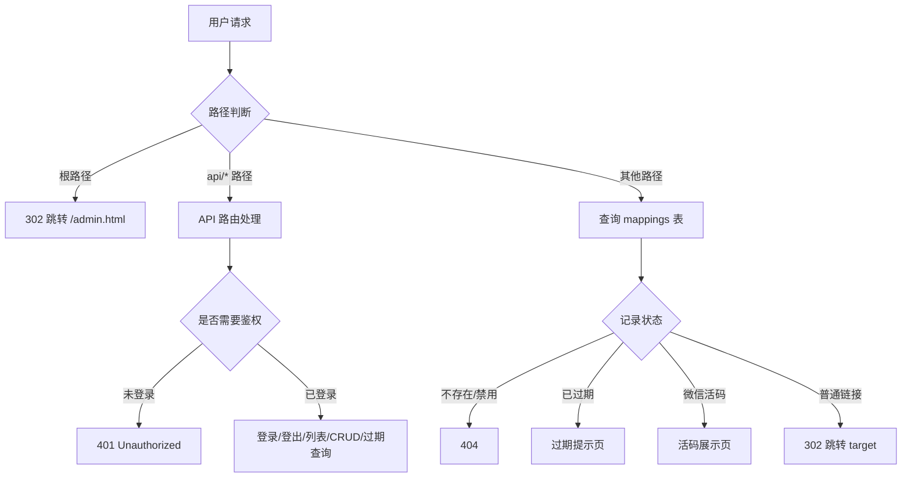

# serverless-qrcode-hub 代码设计文档（中文版）

> English documentation: [CODE_DESIGN.md](../CODE_DESIGN.md)

本文档对 `serverless-qrcode-hub` 项目进行逐文件、逐函数、逐流程的详尽说明，所有说明均基于当前真实源码（`index.js`、`dist/login.html`、`dist/admin.html`、`wrangler.toml`、`package.json`）核实，而非概览性描述。

---

## 目录

1. [项目概览](#1-项目概览)
2. [后端 index.js 详解](#2-后端-indexjs-详解)
3. [前端 login.html 详解](#3-前端-loginhtml-详解)
4. [前端 admin.html 详解](#4-前端-adminhtml-详解)
5. [配置与部署](#5-配置与部署)
6. [安全与优化建议](#6-安全与优化建议)
   - [6.8 架构决策：为什么不用框架](#68-架构决策为什么不用框架)
   - [6.9 时间戳存储改造记录](#69-时间戳存储改造记录)

---

## 1. 项目概览

### 1.1 简介

`serverless-qrcode-hub` 是一个基于 **Cloudflare Workers + D1（SQLite 兼容）数据库**的"无服务器"永久二维码与短链接系统。核心能力：

- 用户通过管理后台创建**短链**或**微信群活码**；
- 访客访问短链时：普通链接执行 `302` 跳转，微信活码渲染原始二维码页面供长按识别；
- 自带密码 Cookie 鉴权（HMAC 签名令牌，非明文）；
- 提供定时任务（cron）检查即将过期 / 已过期链接、输出日志并物理删除已过期记录；
- 支持深色 / 浅色 / 跟随系统三态主题切换。

### 1.2 技术栈

| 层次 | 技术 |
|------|------|
| 运行环境 | Cloudflare Workers（`compatibility_date = "2025-03-10"`） |
| 存储 | Cloudflare D1（SQLite 兼容，绑定名 `DB`） |
| 静态资源 | Cloudflare Assets（`./dist` 目录，绑定名 `ASSETS`） |
| 前端 | 原生 HTML + Tailwind CSS v4 + daisyUI v5 |
| 二维码生成 | `qr-code-styling.js`（前端） |
| 二维码识别 | `zxing.js`（前端 ZXing） |
| 部署 | Wrangler v4（`dev` / `deploy` 脚本） |

### 1.3 目录结构

```
serverless-qrcode-hub/
├── index.js            # Worker 入口：路由、鉴权、API 分发（import src/*）
├── src/                # 后端模块（由 esbuild 打包为单一 Worker）
│   ├── state.js        # 共享运行时状态：DB + initState(env)
│   ├── util.js         # escapeHtml()
│   ├── db.js           # 数据层：建表/迁移、CRUD、输入校验、banPath
│   └── pages.js        # 公开页：PUBLIC_I18N、pickLang、过期页/微信页渲染函数
├── wrangler.toml       # Wrangler 部署配置（D1 绑定、cron、Assets、环境变量）
├── package.json        # 脚本与依赖（仅 wrangler 开发依赖）
├── pnpm-lock.yaml
├── README.md           # 项目说明（英文）
├── README.v1.md        # 旧版（基于 KV）说明（英文）
├── docs/
│   ├── CODE_DESIGN.md  # 代码设计文档（英文）
│   └── zh/             # 中文文档
│       ├── README.md
│       ├── README.v1.md
│       └── CODE_DESIGN.md
├── MIGRATE.md          # 部署 / 迁移图文指引
├── LICENSE
├── images/             # README/MIGRATE 用到的截图
├── dist/               # 构建产物（静态前端），由 ASSETS 提供
│   ├── login.html      # 登录页
│   ├── admin.html      # 管理后台
│   ├── i18n.js         # 共享多语言引擎（字典 + 自动检测 + 切换）
│   ├── daisyui@5.css
│   ├── tailwindcss@4.js
│   ├── theme.css        # 专业商务风设计系统（覆盖 DaisyUI 主题变量 + 统一组件样式）
│   ├── common.js        # 登录/后台共享：首屏主题、主题切换、统一 Toast/Alert、i18n 引导
│   ├── qr-code-styling.js
│   ├── zxing.js
│   ├── wechat.svg
│   └── favicon.svg
```

### 1.4 整体架构（后端请求流转）



静态资源（如 `/login.html`、`/daisyui@5.css`）由 Cloudflare Assets 自动服务，不经过 `index.js` 的 `fetch` 逻辑（Assets 优先于 Worker 脚本，或按配置 fallback）。

### 1.5 数据模型

D1 表 `mappings` 通过 `initDatabase()` 以 `CREATE TABLE IF NOT EXISTS` 创建，字段如下：

| 字段 | 类型 | 约束 | 说明 |
|------|------|------|------|
| `path` | TEXT | `PRIMARY KEY` | 短链名，作为主键（URL path 部分） |
| `target` | TEXT | `NOT NULL` | 目标 URL（普通短链）或原始二维码 DataURL（微信活码，与 `qrCodeData` 同时存） |
| `name` | TEXT | 可空 | 条目名称（展示用，如"音乐群1"） |
| `expiry` | TEXT | 可空 | 有效日期（毫秒时间戳字符串），为空表示永久有效 |
| `enabled` | INTEGER | `DEFAULT 1` | 是否启用（1=启用，0=禁用），禁用后访问返回 404 |
| `created_at` | TEXT | 无默认值 | 创建时间（毫秒时间戳），由 JS 层 `Date.now()` 在 `createMapping` 中写入 |
| `isWechat` | INTEGER | `DEFAULT 0`（后加列） | 是否为微信二维码（1=是） |
| `qrCodeData` | TEXT | 后加列 | 微信活码原始二维码图片的 DataURL |
| `pinned` | INTEGER | `DEFAULT 0`（后加列） | 是否全局置顶（1=置顶）。列表查询 `ORDER BY pinned DESC` 时置顶项始终排最前，跨分页/会话一直生效 |

> 历史兼容说明：`isWechat`、`qrCodeData` 与 `pinned` 三列通过 `initDatabase()` 中的 `ALTER TABLE` 兼容逻辑动态添加（见 2.2）。`isWechat`/`qrCodeData` 是从旧版 KV 结构向 D1 迁移的遗留产物；`pinned` 为后续新增的「全局置顶」功能字段。

索引：

- `idx_expiry ON mappings(expiry)`
- `idx_created_at ON mappings(created_at)`
- `idx_enabled_expiry ON mappings(enabled, expiry)`（组合索引，用于过期查询）

### 1.6 数据流

- **写路径**：前端 `admin.html` 通过 `/api/mapping`（POST/PUT/DELETE）→ `createMapping` / `updateMapping` / `deleteMapping` → D1 写入；通过 `/api/mapping/pin` POST → `pinMapping` → 更新 `pinned` 字段（全局置顶）。
- **读路径（后台）**：`/api/mappings`（分页列表）、`/api/mapping?path=`（单条）、`/api/expiring-mappings`（过期统计）。
- **读路径（访客）**：任意非 `api/` 路径 → 查询 `mappings` → 决定 302 跳转 / 活码页 / 过期页 / 404。
- **鉴权**：登录写入签名 `auth` Cookie（`issuedAt.<hmac>`，见 2.3）；后续 API 通过 `verifyAuthCookie` → `verifyAuthToken` 校验。

---

## 2. 后端 index.js 详解

### 2.1 模块级变量与 `banPath`

```js
let DB;
const banPath = [
  'login', 'admin', '__total_count',
  'admin.html', 'login.html',
  'daisyui@5.css', 'tailwindcss@4.js',
  'qr-code-styling.js', 'zxing.js',
  'robots.txt', 'wechat.svg',
  'favicon.svg',
];
```

- `DB`：模块级可变变量，在每次请求 / 定时任务开始时由 `env` 经 `initState(env)` 赋值（见 `fetch` 与 `scheduled` 入口）。`state.js` 持有唯一的 `DB` 绑定，通过 ES module 的 live binding 在所有 `src/*` 模块间共享。
- `banPath`：系统保留路径名单。用途有两处：
  1. `listMappings` 查询时 `WHERE path NOT IN (...)`，避免在管理列表里显示系统保留名；
  2. `createMapping` / `deleteMapping` / `updateMapping` 校验时拒绝用户使用这些名称（避免与静态资源 / 路由冲突）。
  - 其中 `__total_count` 是一个特殊的占位保留名（历史上用于 KV 分页计数，当前无实际作用，仅保留在名单中）。

### 2.2 `initDatabase()` — 数据库初始化

```js
async function initDatabase() { ... }
```

- **入参**：无（直接使用模块级 `DB`）。
- **逻辑步骤**：
  1. `CREATE TABLE IF NOT EXISTS mappings (...)`：建表，主键 `path`。
  2. `PRAGMA table_info(mappings)`：读取列信息，得到 `columns` 数组（列名列表）。
  3. 若 `columns` 不含 `'isWechat'`，执行 `ALTER TABLE mappings ADD COLUMN isWechat INTEGER DEFAULT 0`。
  4. 若 `columns` 不含 `'qrCodeData'`，执行 `ALTER TABLE mappings ADD COLUMN qrCodeData TEXT`。
  4.5 若 `columns` 不含 `'pinned'`，执行 `ALTER TABLE mappings ADD COLUMN pinned INTEGER DEFAULT 0`（用于条目全局置顶）。
  5. 依次 `CREATE INDEX IF NOT EXISTS` 创建三个索引（`idx_expiry`、`idx_created_at`、`idx_enabled_expiry`）。
  6. **时间戳数据迁移**：检测 `expiry` 是否为旧格式 `YYYY-MM-DD`（GLOB 模式），若是则逐行转为毫秒时间戳（`new Date(dateStr + 'T00:00:00Z').getTime()`）。同时检测 `created_at` 是否为旧格式 `YYYY-MM-DD HH:MM:SS`（`CURRENT_TIMESTAMP` 字符串），若是则转为 `new Date(str + 'Z').getTime()`。迁移完成后旧格式行全部转为纯数字时间戳，后续不会重复触发。
- **设计意图**：实现**向前兼容的表结构迁移**——旧表（仅有前 7 列，无 `isWechat` / `qrCodeData`）在首次运行时自动补列，避免每次部署都需手动改表。
- **调用时机**：`fetch` 与 `scheduled` 入口都会在执行业务前 `await initDatabase()`。模块级 `dbInitialized` 标志使该函数成为一次性、幂等的初始化：首次成功后直接跳过 DDL 往返（原本 `IF NOT EXISTS` / 存在性判断也保证了安全，该标志进一步省去每次请求的建表开销）。重复调用无害。
- **边界**：`PRAGMA` 与 `ALTER TABLE` 在 D1 上均支持；若表已是最新结构，补列分支跳过，仅重建索引（索引创建本身也幂等）。数据迁移仅在检测到旧格式数据时执行一次（通过 GLOB 模式检测），后续均为时间戳格式不再触发。

### 2.3 鉴权 Cookie（HMAC 签名）

管理密码**绝不**写入 Cookie。登录时 Worker 签发签名令牌 `issuedAt.<hmac>`（见 `src/util.js`）：`issuedAt` 为 `Date.now()`，HMAC-SHA256 以 `env.PASSWORD` 为密钥（无需额外密钥）。Cookie 名为 `auth`。校验时重算 HMAC，并拒绝超过 `Max-Age`（1 天）的旧令牌，使被截获的令牌无法无限重放。

#### 2.3.1 `verifyAuthToken(token, secret)`

```js
export async function verifyAuthToken(token, secret) {
  const parts = (token || '').split('.');
  if (parts.length !== 2) return false;
  const [issuedAt, sig] = parts;
  if (!Number.isFinite(Number(issuedAt))) return false;
  if (Date.now() - Number(issuedAt) > COOKIE_MAX_AGE * 1000) return false;
  const expected = await hmacSign(issuedAt, secret);
  return safeEqual(expected, sig);   // 常量时间比较
}
```

- **入参**：`token`（即 `auth` Cookie 值）；`secret`（管理 `PASSWORD`）。
- **逻辑**：拆为 `issuedAt.sig`；格式错误、非数字/过旧的 `issuedAt`、或与 `hmacSign(issuedAt, secret)` 不符的签名均判否。使用 `crypto.subtle`（Workers 运行时可用）。
- **返回值**：布尔。

#### 2.3.2 `authCookieHeader(secret)` / `clearAuthCookieHeader()`

```js
export async function authCookieHeader(secret) {
  const token = await makeAuthToken(secret);     // issuedAt + '.' + HMAC
  return `auth=${token}; Path=/; HttpOnly; SameSite=Strict; Max-Age=${COOKIE_MAX_AGE}`;
}
export function clearAuthCookieHeader() {
  return `auth=; Path=/; HttpOnly; SameSite=Strict; Max-Age=0`;
}
```

- **`authCookieHeader`**：经 `makeAuthToken` 生成签名令牌，返回 `Set-Cookie` 响应头（作用域 `/`、`HttpOnly`、`SameSite=Strict`、`Max-Age=86400`）。作为登录响应头。
- **`clearAuthCookieHeader`**：返回使 `auth` Cookie 立即失效的 `Set-Cookie`，实现登出。

#### 2.3.3 `verifyAuthCookie(request, env)`

```js
async function verifyAuthCookie(request, env) {
  const cookie = request.headers.get('Cookie') || '';
  const authCookie = cookie.split(';').find(c => c.trim().startsWith('auth='));
  if (!authCookie) return false;
  const token = authCookie.split('=')[1].trim();
  return verifyAuthToken(token, env.PASSWORD);
}
```

- API 层使用的薄封装：提取 `auth` Cookie 后委托给 `verifyAuthToken`。因令牌以 `PASSWORD` 签名，旧的明文 Cookie 格式会被自动拒绝（格式不符），实现无迁移负担的安全升级。

### 2.4 数据库操作函数

#### 2.4.1 `listMappings(page = 1, pageSize = 10, search = '')`

```js
async function listMappings(page = 1, pageSize = 10, search = '') { ... }
```

- **入参**：`page`（页码，默认 1）、`pageSize`（每页条数，默认 10）、`search`（模糊搜索关键字，默认空串）。
- **逻辑**：
  1. `offset = (page - 1) * pageSize`。
  2. `hasSearch = search.trim() !== ''`；若为真，构造 `searchTerm = '%' + search.trim() + '%'` 用于 `LIKE`。
  3. 构造带 CTE 的 SQL：
     - `filtered_mappings` CTE：`SELECT * FROM mappings WHERE path NOT IN (?, ?, ...)`，参数用 `banPath` 展开成 `?` 占位符；**当 `hasSearch` 为真时追加 `AND (name LIKE ? OR path LIKE ?)`**，对条目名称（`name`）与短链名（`path`）做子串模糊匹配（`path` 为主键必有值，`name` 为可空列，对 NULL 行自动不命中）。
     - 主查询从 `filtered_mappings` 取全部列，并附加子查询 `(SELECT COUNT(*) FROM filtered_mappings) as total_count`，`ORDER BY pinned DESC, created_at DESC`，`LIMIT ? OFFSET ?`。
     - `.bind(...banPath, ...(hasSearch ? [searchTerm, searchTerm] : []), pageSize, offset)`：先展开 `banPath` 数组，搜索时再追加两个 `searchTerm`（与 `name`/`path` 两个 `LIKE` 占位符对应），最后追加 `pageSize`、`offset`。
  3. 若结果为空（`results.results` 为空或长度 0），返回 `{ mappings: {}, total: 0, page, pageSize, totalPages: 0 }`。
  4. 否则：`total = results.results[0].total_count`；遍历每行，以 `path` 为键构建 `mappings` 对象（含 `target/name/expiry/enabled(===1)/isWechat(===1)/qrCodeData`）。
  5. 返回 `{ mappings, total, page, pageSize, totalPages: Math.ceil(total / pageSize) }`。
- **关键点**：用**单个查询**同时返回分页数据与总数（`total_count` 通过 CTE 子查询计算），避免"先查总数再查分页"的 N+1 问题。`total_count` 会出现在每一行上，取首行即可。
- **返回结构**：
  ```json
  {
    "mappings": { "<path>": { "target":"...", "name": "...", "expiry": "...", "enabled": true, "isWechat": false, "qrCodeData": null } },
    "total": 42,
    "page": 1,
    "pageSize": 10,
    "totalPages": 5
  }
  ```
- **注意**：`mappings` 是**对象（键值对）**而非数组。前端 `loadMappings` 用 `Object.entries(data.mappings)` 转成数组。

#### 2.4.2 `createMapping(path, target, name, expiry, enabled = true, isWechat = false, qrCodeData = null)`

```js
async function createMapping(path, target, name, expiry, enabled = true, isWechat = false, qrCodeData = null) { ... }
```

- **入参**：完整映射字段。
- **校验逻辑**：先过基础守卫（`path`/`target` 非空且为字符串、`RESERVED_PATH`），再统一调用 `validateMappingInput(path, target, name, expiry, isWechat, qrCodeData)` 完成其余全部规则（路径正则 + 长度上限、严格 http(s) 目标、`INVALID_EXPIRY` 不可解析的过期值，以及微信条目：`WECHAT_REQUIRES_QR`（无 `qrCodeData`）、`QR_INVALID`（非 `data:image/` 或 `http(s)://`）、`QR_TOO_LARGE`（超过 `QR_MAX` = 1 MiB））。上游 API 已先 `normalizeTarget`，故 `target` 必带协议。
- **失败** → `throw new Error`，抛出上述稳定错误码之一。
- **写入**：`INSERT INTO mappings (path, target, name, expiry, enabled, isWechat, qrCodeData) VALUES (?, ?, ?, ?, ?, ?, ?)`。其中：
  - `name` → `name || null`
  - `expiry` → `expiry || null`
  - `enabled` → 布尔转 `1/0`
  - `isWechat` → 布尔转 `1/0`
  - `qrCodeData` → 原值（微信时为 DataURL）
- **边界**：`path` 为主键，若已存在会抛 D1 唯一约束错误，由上层 `fetch` 的 try/catch 捕获（非 `Invalid input`，故映射为 HTTP 500，见 2.11）。
- **调用方**：仅 `fetch` 的 POST `/api/mapping`。

#### 2.4.3 `deleteMapping(path)`

```js
async function deleteMapping(path) { ... }
```

- **入参**：`path`（字符串）。
- **校验**：
  1. `!path || 类型非 string` → `Invalid input`。
  2. `banPath.includes(path)` → `RESERVED_PATH`（"系统保留的短链名无法删除"）。
- **写入**：`DELETE FROM mappings WHERE path = ?`。
- **边界**：删除不存在的 `path` 不会报错（D1 `DELETE` 无匹配行只影响 0 行）。

#### 2.4.4 `pinMapping(path, pinned)`

```js
async function pinMapping(path, pinned) { ... }
```

- **入参**：`path`（字符串主键）、`pinned`（真值表示置顶）。
- **校验**：`!path || 类型非 string` → `Invalid input`。
- **写入**：`UPDATE mappings SET pinned = ? WHERE path = ?`，`pinned` 真值转 `1`、否则 `0`。
- **用途**：供 `/api/mapping/pin` 调用，实现条目全局置顶/取消置顶；置顶状态由 `listMappings` 的 `ORDER BY pinned DESC` 在列表层持久生效。
- **边界**：更新不存在的 `path` 不会报错（D1 `UPDATE` 无匹配行只影响 0 行）。

#### 2.4.4 `updateMapping(originalPath, newPath, target, name, expiry, enabled = true, isWechat = false, qrCodeData = null)`

```js
async function updateMapping(originalPath, newPath, target, name, expiry, enabled = true, isWechat = false, qrCodeData = null) { ... }
```

- **入参**：`originalPath`（定位原记录）、`newPath`（新短链名，可为改名）。
- **校验**：
  1. `!originalPath || !newPath || !target` → `Invalid input`。
  2. `banPath.includes(newPath)` → 保留名拒绝。
  3. `expiry` 存在且不可解析 → `INVALID_EXPIRY`。
  4. **保留原二维码数据**：若 `!qrCodeData && isWechat`，先 `SELECT qrCodeData FROM mappings WHERE path = originalPath` 取原值回填；若仍为空且 `isWechat` 为真 → `WECHAT_REQUIRES_QR`。
- **写入**：`UPDATE mappings SET path=?, target=?, name=?, expiry=?, enabled=?, isWechat=?, qrCodeData=? WHERE path = ?`，依次绑定 `newPath, target, name||null, expiry||null, enabled?1:0, isWechat?1:0, qrCodeData, originalPath`。
- **设计意图**：编辑微信活码时，若用户未重新上传图片，则沿用旧 `qrCodeData`，避免误清空；普通链接编辑不受影响。

#### 2.4.5 `getExpiringMappings()`

```js
async function getExpiringMappings() { ... }
```

- **入参**：无。
- **时间戳计算（毫秒级）**：
  - `now = Date.now()` → 当前毫秒时间戳。
  - `threeDaysLater = now + 3 * 24 * 60 * 60 * 1000` → 3天后的时间戳。
- **SQL**（CTE + CASE + 数值比较）：
  ```sql
  WITH categorized_mappings AS (
    SELECT path,name,target,expiry,enabled,isWechat,qrCodeData,
      CASE
        WHEN CAST(expiry AS INTEGER) < ? THEN 'expired'
        WHEN CAST(expiry AS INTEGER) <= ? THEN 'expiring'
      END as status
    FROM mappings
    WHERE expiry IS NOT NULL
      AND CAST(expiry AS INTEGER) <= ?
      AND enabled = 1
  )
  SELECT * FROM categorized_mappings ORDER BY CAST(expiry AS INTEGER) ASC
  ```
  - 绑定：`(dayStart, threeDaysLater, threeDaysLater)`。
- **分类逻辑**：
  - `expiry` 时间戳 < 当前时间 → `expired`；
  - `expiry` 时间戳 ≤ `当前 + 3 天` → `expiring`；
  - `expiry` 时间戳 > `当前 + 3 天` → 被 `WHERE CAST(expiry AS INTEGER) <= threeDaysLater` 过滤掉，不返回。
- **返回结构**：遍历结果，按 `status` 归入 `{ expiring: [], expired: [] }`，每条含 `path/name/target/expiry/enabled/isWechat/qrCodeData`。
- **备注**：计算窗口为**3 天**，且 `scheduled` 日志文案现已正确写为"expiring in 3 days"，注释与逻辑一致。该接口**不使用分页参数**，一次返回全部符合条件的记录；前端 `loadExpiringMappings` 在客户端再做分页（见 4.17）。

#### 2.4.6 `cleanupExpiredMappings(batchSize = 100)`

```js
async function cleanupExpiredMappings(batchSize = 100) { ... }   // 返回删除总数
```

- **逻辑**：循环分批删除 `expiry < now` 的记录：
  1. `SELECT path FROM mappings WHERE expiry IS NOT NULL AND expiry < ? LIMIT batchSize`（绑定 `now = Date.now().toString()`，对毫秒时间戳列做数值比较）。
  2. 空则 `break`。
  3. 否则 `DELETE FROM mappings WHERE path IN (...)`。
  4. 若本批数量 `< batchSize` → `break`（已处理完）。
- **返回值**：所有批次累计删除的行数。
- **状态**：**现由 `scheduled` 调用**（见 2.6，先输出过期/即将过期报告，再物理删除）。报告只覆盖 3 天窗口内的启用记录，清理则会把所有已过 `expiry` 的记录（含禁用项）物理删除，使过期短链不再以 404 形式存在。

#### 2.4.7 ~~`migrateFromKV()`~~ — 已移除

历史 KV→D1 迁移函数 `migrateFromKV()` 及其依赖 `KV_BINDING` 已从代码库中**移除**。旧版 KV 说明保留在 `README.v1.md` 供参考，但当前纯 D1 代码不再包含任何 KV 迁移逻辑，也不再需要 `[kv_namespaces]`。

### 2.5 `fetch(request, env)` — 请求入口

```js
export default {
  async fetch(request, env) {
    initState(env);          // 填充共享的 DB 绑定
    await initDatabase();
    const url = new URL(request.url);
    const path = url.pathname.slice(1);   // 去掉前导 '/'
    ...
  },
  async scheduled(...) { ... }
};
```

- **入口首步**：`initState(env)` 填充共享的 `DB` 绑定，随后 `await initDatabase()`。
- `path = url.pathname.slice(1)`：例如 `/admin.html` → `admin.html`，`/abc` → `abc`，`/` → `''`。

#### 2.5.1 根路径跳转

```js
if (path === '') {
  return Response.redirect(url.origin + '/admin.html', 302);
}
```

- 访问站点根 `/` → 302 跳转到 `/admin.html`（管理后台）。

#### 2.5.2 API 路由（`path.startsWith('api/')`）

按 `path` 与 `method` 分支：

**a) 登录 `api/login` POST（无需先鉴权）**

```js
if (path === 'api/login' && request.method === 'POST') {
  const { password } = await request.json();
  if (password === env.PASSWORD) {
    return new Response(JSON.stringify({ success: true }), { headers: setAuthCookie(password) });
  }
  return new Response('Unauthorized', { status: 401 });
}
```

- 解析 JSON，取 `password`。
- 等于 `env.PASSWORD` → 返回 `{ success: true }`，并带由 `authCookieHeader(env.PASSWORD)` 生成的签名 `auth` Cookie。
- 否则 → 401 `Unauthorized`（纯文本，无 JSON 体）。

**b) 登出 `api/logout` POST（无需先鉴权）**

```js
if (path === 'api/logout' && request.method === 'POST') {
  return new Response(JSON.stringify({ success: true }), { headers: clearAuthCookie() });
}
```

- 返回 `{ success: true }`，`Set-Cookie` 使 `auth` Cookie 失效（`clearAuthCookieHeader()`）。

**c) 鉴权拦截**

```js
if (!verifyAuthCookie(request, env)) {
  return new Response('Unauthorized', { status: 401 });
}
```

- 之后所有 API 都需通过 Cookie 校验，否则 401。

**d) 已鉴权分支（`try` 包裹）**

- `api/expiring-mappings` GET → `getExpiringMappings()` → JSON。
- `api/mappings` GET → 解析 `page` / `pageSize`（`parseInt(...) || 1/10`）与 `search`（`params.get('search') || ''` 后 `slice(0, 64)` 裁剪），调 `listMappings(page, pageSize, search)` → JSON。
- `api/mapping`（无子路径）按 `method` 分发：
  - **GET**：取 `?path=`，缺失 → 400 `{ error: 'Missing path parameter' }`；查不到 → 404 `{ error: 'Mapping not found' }`；否则返回单条映射 JSON。
  - **POST**：`request.json()` → `createMapping(...)` → `{ success: true }`。
  - **PUT**：`request.json()` → `updateMapping(...)` → `{ success: true }`。
  - **DELETE**：`request.json()` 取 `path` → `deleteMapping(path)` → `{ success: true }`。
- `api/mapping/pin` POST（置顶 / 取消置顶）：
  - 解析 `{ path, pinned }`；`path` 缺失 → 400 `{ error: 'Missing path' }`。
  - 调 `pinMapping(path, pinned)`（`UPDATE mappings SET pinned = ? WHERE path = ?`，`pinned` 真值转 `1/0`）→ `{ success: true }`。
  - 前端「置顶 / 取消置顶」按钮调用此接口后重新 `loadMappings()`，使 `ORDER BY pinned DESC` 的排序立即生效。
- 其余 `api/*` → 404 `Not Found`。
- **异常捕获**：`catch (error)` 返回：
  ```js
  new Response(JSON.stringify({ error: error.message || 'Internal Server Error' }),
    { status: error.message === 'Invalid input' ? 400 : 500, headers: {...} })
  ```
  即 `Invalid input` → 400，其余（含 D1 唯一约束 / SQL 错误）→ 500。
- **稳定错误码**：`createMapping` / `deleteMapping` / `updateMapping` 抛出的错误使用稳定英文常量 `RESERVED_PATH` / `INVALID_EXPIRY` / `WECHAT_REQUIRES_QR` / `INVALID_INPUT`（而非内联中文），前端通过 `apiErrorMessage()` 统一映射为对应语言的提示文案，避免后端耦合具体语言。

#### 2.5.3 URL 重定向处理（`path` 非空且非 `api/`）

```js
if (path) {
  try {
    const mapping = await DB.prepare(`SELECT ... FROM mappings WHERE path = ?`).bind(path).first();
    if (mapping) {
      if (!mapping.enabled) return 404 'Not Found';
      if (mapping.expiry) {
        const today = new Date(); today.setHours(23,59,59,999);
        if (new Date(mapping.expiry) < today) {
          // 返回"链接已过期"HTML 页
        }
      }
      if (mapping.isWechat === 1 && mapping.qrCodeData) {
        // 返回微信活码展示页 HTML
      }
      return Response.redirect(mapping.target, 302);   // 普通跳转
    }
    return new Response('Not Found', { status: 404 });
  } catch (error) {
    return new Response('Internal Server Error', { status: 500 });
  }
}
```

- **查询**：`WHERE path = ?`。`path` 来自 URL，`banPath` 中的保留名（如 `login.html`）实际由 Assets 优先服务，不会落入此分支。
- **禁用**：`!mapping.enabled` → 404（伪装成不存在，避免暴露保留/禁用项）。
- **过期判断**：`Number(mapping.expiry) < Date.now()` — 直接数值比较，此时 `mapping.expiry` 为毫秒时间戳字符串。过期即返回美观的过期页面（状态码 404），显示条目名和过期日期（按访问者浏览器本地时区用 `toLocaleDateString()` 格式化，自动适配不同系统时区）。同时返回 `Cache-Control: no-store` 防止 CDN 缓存。
- **过期页**：返回硬编码 HTML（`text/html;charset=UTF-8`，`Cache-Control: no-store`，**状态码 404**）。内容含条目名、过期日期（`toLocaleDateString`）、"如需访问，请联系管理员更新链接"。采用专业商务风（居中卡片 + 时钟图标 + 企业蓝 `--brand:#2563EB`，通过 CSS 变量 + `@media (prefers-color-scheme: dark)` 自适应深浅色，与后台设计系统一致）。**多语言**：过期页与微信活码页通过 `pickLang(request)` 解析 `Accept-Language` 选取语言，使用 `PUBLIC_I18N` 字典（支持 en/zh/ru/ja/ko/es/fr/de，回落英文），并对用户提供的 `name` 做 `escapeHtml()` 防 XSS。
- **微信活码页**：当 `isWechat===1` 且有 `qrCodeData` 时返回硬编码 HTML，内联 ``（DataURL 直接渲染，外裹白色圆角 `qr-wrap` 容器便于长按），配 `wechat.svg` 图标与"请长按识别下方二维码"提示。`Cache-Control: no-store`。采用与过期页一致的专业商务风（企业蓝 `--brand` + 深浅色自适应）。**关键点**：微信活码通过展示原始二维码图片让访客长按识别，区别于普通 302 跳转。
- **普通跳转**：`Response.redirect(mapping.target, 302)`。

### 2.6 `scheduled(controller, env, ctx)` — 定时任务

```js
async scheduled(controller, env, ctx) {
  initState(env);
  await initDatabase();
  const result = await getExpiringMappings();
  console.log(`Cron job report: Found ${result.expired.length} expired mappings`);
  if (result.expired.length > 0) console.log('Expired mappings:', JSON.stringify(result.expired, null, 2));
  console.log(`Found ${result.expiring.length} mappings expiring in 3 days`);
  if (result.expiring.length > 0) console.log('Expiring soon mappings:', JSON.stringify(result.expiring, null, 2));
  // 物理删除已过期记录（上方报告只覆盖 3 天窗口）
  const deleted = await cleanupExpiredMappings();
  console.log(`Cleaned up ${deleted} expired mappings`);
}
```

- **触发**：由 `wrangler.toml` `[triggers] crons = ["0 2 */1 * *"]`（生产每天 2 点）或 dev 环境 `*/10 * * * * *`（每 10 秒，用于本地 `--test-scheduled` 调试）。
- **逻辑**：初始化后调 `getExpiringMappings()` 构建过期/即将过期报告，`console.log` 输出统计与明细到 Worker 日志，随后通过 `cleanupExpiredMappings()` **物理删除**所有 `expiry` 已过的记录（日志输出删除条数）。邮件通知相关功能当前未实现（见 admin.html 文字说明与 [6.4](#64-未完成的功能声明)）。

---

## 3. 前端 login.html 详解

`login.html` 是纯静态登录页，依赖 `/daisyui@5.css`（样式）与 `/tailwindcss@4.js`（Tailwind 运行时）。主题与提示逻辑的**首屏脚本、主题切换、Toast/Alert、i18n 引导均已抽到 `dist/common.js` 与 `dist/i18n.js`**（由 `<head>` 内 `<script src="/i18n.js">` 与 `<script src="/common.js">` 同步引入），两页共享、避免重复。视觉层由 `dist/theme.css` 承载统一设计令牌（见下文）。

### 3.1 首屏主题脚本（`common.js`）

```js
(function () {
  const savedTheme = localStorage.getItem('theme');
  const mq = window.matchMedia && window.matchMedia('(prefers-color-scheme: dark)');
  if (savedTheme === 'system' || !savedTheme) {
    if (!savedTheme) localStorage.setItem('theme', 'system');
    document.documentElement.setAttribute('data-theme', mq && mq.matches ? 'dark' : 'light');
  } else {
    document.documentElement.setAttribute('data-theme', savedTheme);
  }
})();
```

- **目的**：在 HTML 渲染前（避免闪烁）根据 `localStorage.theme` 设置 `<html data-theme>`。
- **分支**：`system` → 跟随系统；已存具体值 → 直接用；无 → 默认写入 `system` 并跟随系统。
- 逻辑与 admin.html 完全一致，现统一由 `common.js` 提供（见 4.1）。

### 3.2 主题切换函数（`common.js` 内 `toggleTheme` / `updateThemeIcon`）

- `toggleTheme()`：读取当前 `theme`（`system`/`light`/`dark`），按 `system → light → dark → system` 循环；写回 `localStorage`；`system` 时按 `matchMedia` 决定实际 `data-theme`，否则直接用新值；最后 `updateThemeIcon(newTheme)`。
- `updateThemeIcon(theme)`：通过 `#themeToggleBtn path` 的 `setAttribute('d', ...)` 切换 SVG 路径——`system` 用显示器图标、`dark` 用月亮、`light` 用太阳。
- **系统变化监听**：`window.matchMedia('(prefers-color-scheme: dark)').addEventListener('change', ...)`：仅当 `theme==='system'` 时实时跟随系统切换 `data-theme`。
- **初始化**：`DOMContentLoaded` 时 `initThemeToggle()` 绑定按钮 `click → toggleTheme` 并初始化图标（在 `common.js` 末尾统一注册，两页无需各自重复）。

### 3.3 登录 UI 结构

- `<body class="auth-page">`：由 `theme.css` 提供浅/深色渐变背景（双 radial 光晕 + 浅灰底），专业商务风。
- 右上角固定 `themeToggleBtn`（ghost 圆按钮）。
- 居中卡片 `.auth-card`：含**品牌区**（`brand-logo` 渐变方块 + `favicon.svg` + 标题"QR Code Hub" + 副标题"Serverless QR Code Hub"）、带锁图标的 `password` 输入框（`autocomplete="current-password"`）、"Sign In"按钮（含 loading spinner 与"Signed in successfully"态）。
- 错误提示 `#error`（`alert alert-error`，默认 `display:none`，含"Wrong password, please try again"文本）。
- 底部 footer 含 GitHub 链接与求 Star 文案。
- 语言切换：右上角 `<div data-lang-switcher></div>`，由 `common.js` 渲染为下拉选择器，切换后写入 `localStorage.lang` 并即时重渲染静态文案。

### 3.4 `login()` — 登录请求

```js
async function login() {
  const password = document.getElementById('password').value;
  const error = document.getElementById('error');
  const button = document.querySelector('button');
  button.disabled = true;
  button.innerHTML = '<span class="loading loading-spinner"></span> Signing in...';
  try {
    const response = await fetch('/api/login', { method:'POST', headers:{'Content-Type':'application/json'}, body: JSON.stringify({ password }) });
    if (response.ok) {
      // 显示"Signed in successfully"，跳转 /admin
      window.location.href = '/admin';
    } else {
      const data = await response.json().catch(() => ({}));
      error.querySelector('span').textContent = data.error || 'Wrong password, please try again';
      error.style.display = 'flex';
      button.disabled = false;
      button.textContent = 'Sign In';
    }
  } catch (e) {
    error.querySelector('span').textContent = 'Network error, please try again later';
    error.style.display = 'flex';
    button.disabled = false;
    button.textContent = 'Sign In';
  }
}
```

- **流程**：禁用按钮 → 显示"Signing in..." spinner → POST `/api/login`。
- **成功**（`response.ok`）：按钮变为"Signed in successfully"，`window.location.href = '/admin'`（注意：后端登录成功仅设 Cookie，前端负责跳转；`/admin` 实际由 Assets 提供 `admin.html`）。
- **失败**：尝试解析 JSON 错误，更新 `#error` 文案并重新显示；恢复按钮。
- **网络异常**：catch 显示"Network error"。
- **注意**：`response.json().catch(() => ({}))`——后端 401 返回的是纯文本 `Unauthorized` 而非 JSON，故 `.catch` 兜底为空对象，最终显示默认"Wrong password, please try again"。
- **多语言**：`login()` 中的提示文案（Signing in / Signed in successfully / Wrong password / Network error / Sign In）均通过 `I18N.t('login.*')` 取得，随用户语言切换。

### 3.5 辅助交互

- 回车提交：`password` 输入框 `keypress` → `e.key==='Enter'` 调 `login()`。
- 自动聚焦：`password.focus()`。

---

## 4. 前端 admin.html 详解

`admin.html` 是管理后台，依赖 `/daisyui@5.css`、`/tailwindcss@4.js`，并在底部引入 `/qr-code-styling.js` 与 `/zxing.js`。所有业务逻辑内联在一个大的 `DOMContentLoaded` 回调中（外加一个独立的二维码设置 `DOMContentLoaded` 监听，见 4.18）。主题、Toast/Alert、i18n 引导由 `common.js` 与 `i18n.js` 共享。

### 4.1 首屏主题脚本

与 `login.html` 完全一致的逻辑，现已统一抽到 `dist/common.js`（`<head>` 内 `<script src="/i18n.js">` 与 `<script src="/common.js">` 同步引入，于渲染前设定 `data-theme`）。`admin.html` 自身不再内联首屏 IIFE、主题切换函数或第二处 `DOMContentLoaded`（见 4.18）。视觉层由 `dist/theme.css` 承载：覆盖 DaisyUI 主题变量（企业蓝 `--color-primary:#2563EB`、slate 中性灰阶、`--radius-box:1rem` 等），并统一卡片/按钮/输入框/模态框/Toast/骨架屏的精致样式与微交互。

### 4.2 顶部脚本：前端 `banPath`

```js
const banPath = [ 'login','admin','__total_count','admin.html','login.html','daisyui@5.css','tailwindcss@4.js','qr-code-styling.js','zxing.js','robots.txt','wechat.svg','favicon.svg' ];
```

- 与后端 `banPath` 保持一致（后端 `src/db.js` 为唯一权威来源；前端副本仅作**输入校验提示**，需与之同步——见 [6.6](#66-其他优化点)）。拆分后的两类流程仅校验格式 `^[a-zA-Z0-9-_]+$`。

### 4.3 页面结构（HTML）

- 两个 `<dialog>` 模态：
  - `#detail-modal`：短链详情（只读，合并二维码预览）。含条目信息（`#detailName`/`#detailPath`/`#detailTarget`/`#detailExpiry`、状态 badge `#detailEnabled`/`#detailWechat`/`#detailPinned`）、二维码预览（`#qr-loading` 加载进度条/`#qr-container`/`#qr-url` 只读/`#qr-show-logo` 复选/`#qr-dots-style` 下拉/`#qr-download` 下载按钮）、复制按钮 `#copyTargetBtn`（复制目标 URL）与 `#copyUrlBtn`（复制链接地址）、编辑按钮 `#detailEditBtn`。
  - `#delete-confirm-modal`：删除确认（`#confirm-delete-btn`）。
  - `#edit-modal`：行内编辑的弹窗版本，含 `#editModalName`/`#editModalPath`/`#editModalTarget`/`#editModalExpiry`/`#editEnabled`/`#editIsWechat` 与保存按钮（`data-i18n="admin.save"`）。
- `#alertContainer`：浮动提示容器（顶部居中）。
- 隐藏字段 `#qrCodeData`：保存当前上传二维码的 DataURL。
- Navbar：标题"Dashboard"（#pageLabel 由 `admin.dashboard` 提供）、语言切换 `<div data-lang-switcher></div>`、主题按钮、退出登录按钮。
- "使用说明"卡片（折叠面板：使用步骤、注意事项——其中提到"过期会自动通过邮件通知"，但该功能当前未实现，见 [6.4](#64-未完成的功能声明)）。
- 创建区有两个**添加**按钮：`#addLinkBtn`（"Add Link"，普通短链）与 `#addWechatBtn`（"Add WeChat QR"，需上传二维码）。各自切换对应面板：
  - `#createLinkPanel`：普通链接表单（`#linkName` / `#linkPath` / `#linkTarget` / `#linkExpiry` / `#linkEnabled` / `#addLinkSubmitBtn`）。
  - `#createWechatPanel`：微信表单，含上传识别区 `#qr-upload-area` / 结果 `#qr-result` / 识别文本 `#decoded-text`，以及 `#wName` / `#wPath` / `#wTarget`（只读，自动填充识别结果）/ `#wExpiry` / `#wEnabled` / `#qrCodeData`（隐藏）/ `#addWechatSubmitBtn`。
- 可复用的二维码识别组件由 `setupQRUpload(areaId, fileInputId, resultId, decodedTextId, targetInputId, qrDataInputId)` 参数化封装，供"创建微信"与"编辑"两套流程共用（无 `newIsWechat` 开关）。
- "短链二维码管理"卡片：标题区（左上「短链二维码管理」标题，右侧 `join` 组合「搜索框 + 筛选按钮组」）；搜索框 `#searchInput`（实时模糊搜索，300ms 防抖）与一键清空按钮 `#clearSearchBtn`（有输入才显示）；筛选按钮组（全部 `#showAllBtn` / 即将过期 `#showExpiringBtn` / 已过期 `#showExpiredBtn`，分别对应 `btn-primary`/`btn-warning`/`btn-error` 高亮）；下方 `#loading`、`#skeleton` 骨架屏、表格 `#mappingsTableBody`、分页控件（每页大小 `#pageSize`、上一页 `#prevPage`、当前页 `#currentPage`、下一页 `#nextPage`）。
- **多语言**：所有静态文案通过 `data-i18n` / `data-i18n-ph` / `data-i18n-title` / `data-i18n-aria` / `data-i18n-tip` 属性声明，由 `I18N.applyI18n()` 在加载与语言切换时统一填充；动态生成的内容（卡片、模态、提示）通过 `I18N.t('admin.*'/'app.*')` 取得。

### 4.4 全局状态变量

在 `DOMContentLoaded` 回调内声明：

```js
let allMappings = [];   // 当前"全部"视图的映射数组（Object.entries 后的）
let currentPage = 1;
let pageSize = 10;
```

### 4.5 `checkAuth()` — 认证检查

```js
async function checkAuth() {
  try {
    const response = await fetch('/api/mappings');
    if (response.status === 401) return false;
    return true;
  } catch (error) {
    console.error('Auth check failed:', error);
    return false;
  }
}
```

- **原理**：直接请求 `/api/mappings`；若返回 401 说明未登录 → 返回 `false`；否则 `true`。依赖后端对未鉴权 API 返回 401。
- **调用**：`DOMContentLoaded` 时 `checkAuth().then(isAuthenticated => { if (!isAuthenticated) window.location.href='/login'; else initializePage(); })`。

### 4.6 `initializePage()` — 初始化

绑定各类事件、加载数据、设置筛选按钮状态：

```js
function initializePage() {
  document.getElementById('logoutBtn').addEventListener('click', logout);
  document.getElementById('addLinkBtn').addEventListener('click', toggleCreateLinkPanel);
  document.getElementById('addWechatBtn').addEventListener('click', toggleCreateWechatPanel);
  setupQRUpload('qr-upload-area', 'qr-file', 'qr-result', 'decoded-text', 'wTarget', 'qrCodeData');
  setupQRUpload('editQrUploadArea', 'editQrFile', 'editQrResult', 'editDecodedText', 'editModalTarget', 'editQrCodeData');
  themeToggleBtn.addEventListener('click', toggleTheme);
  loadMappings();
  setupErrorHandling();
}
```

- **筛选按钮组对象** `filterButtons`：`showAllBtn→btn-primary`、`showExpiringBtn→btn-warning`、`showExpiredBtn→btn-error`。
- **三个筛选按钮点击**（各自重置 `currentPage=1` 并切换高亮 class，然后加载数据）：
  - `showAllBtn` → 加 `btn-primary`，移除其他，调 `loadMappings()`。
  - `showExpiringBtn` → 加 `btn-warning`，调 `loadExpiringMappings('expiring')`。
  - `showExpiredBtn` → 加 `btn-error`，调 `loadExpiringMappings('expired')`。
- **创建流程拆为两个独立功能**（无 `newIsWechat` 开关）："Add Link" 打开 `#createLinkPanel`（普通短链，无二维码），"Add WeChat QR" 打开 `#createWechatPanel`（需上传二维码，目标自动填充且只读）。见 4.13。

### 4.7 `setupErrorHandling()` — 全局错误处理

```js
window.addEventListener('unhandledrejection', function (event) {
  if (event.reason.status === 401) window.location.href = '/login';
});
```

- 捕获未处理的 Promise 拒绝，若 `reason.status===401` 跳登录页。作为各请求中显式 401 跳转的兜底。

### 4.8 二维码识别 → 目标自动填充（无微信开关）

原有的 `newIsWechat` 复选框已移除。识别逻辑现内置于 `setupQRUpload`（按目标输入框 id 参数化）。在**微信**流程识别成功后，识别文本写入目标输入框并将其设为 `readOnly=true`（微信短链的目标即二维码内容本身）。微信与普通链接的区别在创建时由用户点击的"添加"按钮决定，故无需运行时开关维护。

### 4.9 二维码上传与识别

#### 4.9.1 `setupQRUpload()`

绑定：点击上传区 → 触发文件选择；`dragover`/`dragleave`/`drop` 处理拖拽（阻止默认、切换高亮、取 `dataTransfer.files`）；文件 `change`；复制按钮 → `copyDecodedText`。

#### 4.9.2 `handleFiles(files)`

1. 空 → 返回。
2. 首个文件 `file`：非图片（`!file.type.startsWith('image/')`）→ `showAlert(I18N.t('app.imageRequired'))` 返回。
3. **重置状态**：清空二维码数据输入框（创建流程为 `#qrCodeData`、编辑流程为 `#editQrCodeData`），隐藏 `#qr-result`，清空 `#decoded-text`，清空目标输入框，并恢复其 `readOnly=false`。
4. `FileReader.readAsDataURL(file)` → `onload`：创建 `Image`，`img.onload` 时调 `decodeQR(img)`，并把 `e.target.result`（图片 DataURL）存入 `#qrCodeData`（供微信活码提交用）。

#### 4.9.3 `decodeQR(img)` — 识别核心

```js
async function decodeQR(img) {
  try {
    const codeReader = new ZXing.BrowserMultiFormatReader();
    const canvas = document.createElement('canvas');
    const ctx = canvas.getContext('2d');
    // 1. 缩放：限制最长边 maxSize=1024，保持宽高比
    // 2. 绘制 img 到 canvas（imageSmoothing 高质量）
    // 3. 灰度二值化：每个像素 avg=(r+g+b)/3，>128→255 否则 0
    // 4. canvas.toBlob → imageUrl（URL.createObjectURL）
    // 5. codeReader.decodeFromImageUrl(imageUrl) 解码
    // 6. 成功：填充 decoded-text、显示结果、填充 newTarget、启用微信开关、微信链接自动勾选
    // 7. 失败：反转颜色（255-c）再试一次
    // 8. 仍失败：showAlert 提示
  } catch (error) { showAlert(I18N.t('app.imageProcessError')); }
}
```

- **缩放**：计算 `width/height`，若任一 > 1024 则按比例缩到 1024，保证识别质量与性能。
- **二值化（第一次尝试）**：遍历 `ImageData`，`avg>128` 置白否则置黑，增强对比。
- **解码**：`ZXing.BrowserMultiFormatReader().decodeFromImageUrl(imageUrl)`。
- **成功分支**：
  - 写 `decoded-text`、显示 `#qr-result`、填充 `newTarget`；
  - 在微信流程中，将目标输入框设为 `readOnly=true` 并填入识别文本（微信活码目标即二维码内容本身）；
  - `showAlert(I18N.t('app.decodeSuccess'), 'success')`。
- **失败分支**：先 `clearRect` 重绘原图，再对像素做**颜色反转**（`255 - c`），重新 `toBlob` 解码重试一次（应对反色二维码）。
- **再失败**：`showAlert(I18N.t('app.decodeFail'))` 并隐藏结果。
- `URL.revokeObjectURL` 在解码后释放，避免内存泄漏。
- **注意**：无论成功失败，`#qrCodeData` 已在 `img.onload` 中存好原始图片 DataURL，供提交微信活码时使用。

#### 4.9.4 `copyDecodedText()`

- 读 `decoded-text` → `navigator.clipboard.writeText(text)`；`.then` 中填充 `newTarget`、平滑滚动到 `#newTarget`（`scrollIntoView({ behavior:'smooth', block:'center' })`）、`showAlert(I18N.t('app.copySuccess'), 'success')`；`.catch` 提示复制失败。

### 4.10 `showAlert(message, type = 'error')`

- 创建 `div`，`type==='error'` → `alert alert-error`，否则 `alert alert-success`。
- 内含 SVG 图标（错误用叉号路径，成功用勾号路径）与 `message`。
- 入场：先 `opacity:0`，`appendChild` 后 `setTimeout(10)` 渐显；`3000ms` 后渐隐并 `remove()`。

### 4.11 `loadMappings()` — 加载全量列表

```js
async function loadMappings() {
  tableBody.style.display = 'none';
  skeleton.classList.remove('hidden');   // 显示骨架屏
  try {
    const query = searchKeyword
      ? `/api/mappings?page=${currentPage}&pageSize=${pageSize}&search=${encodeURIComponent(searchKeyword)}`
      : `/api/mappings?page=${currentPage}&pageSize=${pageSize}`;
    const response = await fetch(query);
    if (response.status === 401) { location.href='/login'; return; }
    if (!response.ok) throw new Error('Failed to load data');
    const data = await response.json();
    allMappings = Object.entries(data.mappings);
    await new Promise(resolve => setTimeout(resolve, 300));  // 人为延迟，保证骨架屏可见
    renderCurrentPage();
    currentPage = data.page;
    document.getElementById('currentPage').textContent = currentPage;
    document.getElementById('prevPage').disabled = currentPage <= 1;
    document.getElementById('nextPage').disabled = currentPage >= data.totalPages;
    document.getElementById('pageSize').value = pageSize;
  } catch (error) { showAlert(I18N.t('app.loadFail')); }
  finally { skeleton.classList.add('hidden'); tableBody.style.display = ''; }
}
```

- **分页**：直接使用后端分页（`page`/`pageSize` 查询参数），后端返回 `totalPages`，据此禁用上/下一页按钮。
- **模糊搜索**：管理卡片头部「短链二维码管理」旁的搜索框（`#searchInput`，带放大镜图标；其右侧 `#clearSearchBtn` 一键清空、仅在有输入时显示）。输入后约 `300ms` 防抖（`searchTimer` + `setTimeout`）触发；非空时 `loadMappings` 拼接 `&search=`，后端 `listMappings` 按 `name`/`path` 做 `LIKE` 过滤；搜索**仅作用于「全部」视图**——`input` 回调在触发前会调用 `activateAllView()`（给 `#showAllBtn` 加 `btn-primary`、移除另外两个按钮高亮）切回「全部」视图并重置 `currentPage=1`；`#clearSearchBtn` 点击走 `clearSearch()`（清空 `searchKeyword`、`#searchInput` 与隐藏清空按钮）后同样切回「全部」视图并重新 `loadMappings()`。
- `allMappings = Object.entries(data.mappings)`：把后端键值对对象转数组，供 `renderCurrentPage` 遍历。
- 骨架屏：请求期间隐藏表格、显示骨架屏；最后恢复。人为 `300ms` 延迟使骨架屏在快速网络下也可见。
- **注意**：后端 `listMappings` 已从 `banPath` 过滤系统保留项，前端看到的列表不含保留名。

### 4.12 `renderCurrentPage()`

```js
function renderCurrentPage() {
  const table = document.getElementById('mappingsTableBody');
  table.innerHTML = '';
  const fragment = document.createDocumentFragment();
  for (const [path, mapping] of allMappings) {
    fragment.appendChild(createMappingRow(path, mapping));
  }
  table.appendChild(fragment);
}
```

- 清空 `<tbody>`，用 `DocumentFragment` 批量构建行（`createMappingRow`）后一次性插入，减少重排。

### 4.13 `addLinkMapping()` / `addWechatMapping()` — 创建短链

原单一的 `addMapping` 拆分为两个独立处理函数：

- **`addLinkMapping()`** —— 普通短链：读取 `#linkName/#linkPath/#linkTarget/#linkExpiry/#linkEnabled`，提交 `{ name, path, target, expiry, enabled, isWechat: false, qrCodeData: null }`。
- **`addWechatMapping()`** —— 微信活码：读取 `#wName/#wPath/#wExpiry/#wEnabled` 与隐藏字段 `#qrCodeData`（上传二维码的 DataURL），提交 `{ name, path, target, expiry, enabled, isWechat: true, qrCodeData }`。前端校验：`!qrCodeData` → `app.wechatImageRequired`（微信条目必须上传二维码）。

两者共用同一提交流程（读取字段、经 `I18N.t('app.*')` 做前端校验 —— `entryNameRequired`/`pathRequired`/`pathInvalid`/`targetRequired`/`wechatImageRequired`，再 `fetch('/api/mapping', POST, ...)`）：
- 401 → 跳登录；
- `!ok` → 解析错误提示（`data.error`，回退到通用文案）；
- 成功 → `showAlert(I18N.t('app.addSuccess'), 'success')` + `location.reload()`。
- 微信条目的 `qrCodeData` 为原始二维码图片 DataURL；普通链接始终传 `null`。

### 4.14 `deleteMapping(path)` — 删除短链

- 返回 `Promise`：显示 `#delete-confirm-modal`，绑定确认按钮 `handleConfirm`：
  - `fetch('/api/mapping', DELETE, { path })`；
  - 401 → 跳登录；
  - `!ok` → 错误提示（`app.deleteFail` / `app.deleteNetworkFail`）；
  - 成功 → `showAlert(I18N.t('app.deleteSuccess'), 'success')`，`loadMappings()` 重新加载（不刷新整页）；
  - 若当前处于"即将过期"/"已过期"视图，额外 `loadExpiringMappings(...)` 同步；
  - `modal.close()`；`finally` 中 `removeEventListener` 清理 + `resolve()`。
- 设计：用 Promise + 模态框 + 事件监听，避免回调地狱；删除后局部刷新而非整页刷新。

### 4.15 `generateQRForMapping(url, newPath)` — 预览/下载二维码

```js
function generateQRForMapping(url, newPath) {
  // 清空 qr-container；设置 qr-url 输入框；
  // 从 localStorage 读取 qr-show-logo / qr-dots-style 应用；
  // getQRConfig(showLogo, dotsType)：返回 qr-code-styling 配置
  //   （300x300 canvas，dotsOptions 颜色/类型，圆角定位点，白底，errorCorrectionLevel H，可选 wechat.svg logo）
  // currentQRCode = new QRCodeStyling(getQRConfig(...)); currentQRCode.append(container);
  // updateQRCode：200ms 过渡切换（清空+重建+保存设置到 localStorage）
  // showLogoCheckbox.onchange / dotsStyleSelect.onchange = updateQRCode
  // downloadBtn.onclick：生成文件名 qr-<newPath>-<时间戳> 并 currentQRCode.download({name, extension:'png'})
  // modal.showModal()
}
```

- **用途**：表格每行"二维码"按钮点击 → 生成可预览/下载的二维码（指向 `window.location.origin + '/' + path`）。
- **配置来源**：`getQRConfig` 根据 `showLogo`（复选框）与 `dotsStyle`（下拉：dots/rounded/classy/classy-rounded/square/extra-rounded）生成，且将用户选择持久化到 `localStorage`（下次自动应用）。
- **过渡动画**：切换样式时给 `#qr-container` 加 `.switching`（CSS `opacity:0`），200ms 后重建并移除类。
- **下载**：`QRCodeStyling.download({ name: 'qr-<path>-<时间戳>', extension: 'png' })`。

### 4.16 `createMappingRow(path, mapping)` — 渲染单行

```js
function createMappingRow(path, mapping) {
  const row = document.createElement('tr');
  row.dataset.originalData = JSON.stringify({ name, path, target, expiry, enabled, isWechat, qrCodeData });
  // 单元格 0-3：name/path/target/expiry（target 单元格加断词样式与最小宽度）
  // 单元格 4（状态）：启用/禁用 badge + 微信 badge
  // 单元格 5（操作）：详情/编辑/删除/二维码 按钮组
  // 绑定：detailBtn→showDetailModal；editBtn→openEditModal(row)；deleteBtn→deleteMapping(path)；qrBtn→generateQRForMapping(origin+'/'+path, path)
  return row;
}
```

- **`dataset.originalData`**：完整原始数据 JSON 化存入行，供编辑/取消/恢复使用（避免反复请求）。
- **单元格内容**：`name||'-'`、`path`、`target`、`expiry||I18N.t('app.forever')`。
- **状态列**：`badge-success`/"Enabled"(`app.badgeEnabled`)或 `badge-error`/"Disabled"(`app.badgeDisabled`)，`isWechat` 时追加 `badge-info`/"WeChat"(`admin.badgeWechat`)。
- **操作列**：四个按钮，文案与提示均通过 `I18N.t('app.detail'/'app.edit'/'app.delete'/'app.pin'/'app.unpin')` 取得。

### 4.17 行内编辑（`openEditModal` / `saveEdit` / `restoreRow`）

#### `openEditModal(row)`

- 从 `row.dataset.originalData` 取数据，打开 `#edit-modal`，填充 `#editModalName`/`#editModalPath`/`#editModalTarget`/`#editModalExpiry`/`#editEnabled`/`#editIsWechat`，标题取 `admin.editTitle`（"Edit short link"），保存按钮取 `admin.save`（"Save"）。

#### `saveEdit(row)`

1. 从编辑控件读取 `newName/newPath/newTarget/newExpiry/newEnabled/newIsWechat`。
2. **变更检测**：与 `dataset.originalData` 逐项比较，`hasChanges` 为假 → 关闭弹窗直接退出（节省请求）。
3. **保存**：条目的类型（`isWechat`）由原始记录固定，普通/微信之间不可互转。组装负载：微信记录取重新上传的 `#editQrCodeData`（若有），否则取服务端原值（`GET /api/mapping?path=originalPath`）；普通记录 `qrCodeData` 恒为 `null`。随后 `PUT /api/mapping` 提交 `{ originalPath, path, target, name, expiry, enabled, isWechat, qrCodeData }`。
4. 成功 → `showAlert(I18N.t('app.updateSuccess'), 'success')` + `loadMappings()` 局部刷新；若处于过期视图则同步刷新。
- **要点**：编辑时 `qrCodeData` 始终使用服务端原值（因为编辑表单不重新上传图片），符合后端"沿用原二维码"逻辑。

#### `restoreRow(row)`

- 用 `dataset.originalData` 还原所有单元格文本/状态/按钮组，并重新绑定事件，移除 `editing` class。

### 4.18 主题与二维码设置

原文件中曾存在的**第二个** `DOMContentLoaded` 监听（负责 `qr-show-logo`/`qr-dots-style` 的 change 绑定并依赖未声明的全局 `qrCode`）以及与之并存的 `updateQRCode()` 已**移除**（见 [6.5](#65-前端潜在问题) 修复记录）。当前二维码渲染仅由 4.15 的 `generateQRForMapping`（使用局部 `currentQRCode`）负责，逻辑单一、无全局变量隐患。主题切换与初始化统一由 `common.js` 的 `initThemeToggle()` 在 `DOMContentLoaded` 时完成。

### 4.19 主题切换（`toggleTheme` / `updateThemeIcon`）

与 `login.html` 的同名函数**现已合并到 `common.js`**（system→light→dark→system 循环 + 图标切换 + 系统变化监听）。`updateThemeIcon` 统一通过 `#themeToggleBtn path` 切换 SVG 路径，两页按钮结构均可匹配，无需各自重复实现。

### 4.20 分页与筛选事件

- `nextPage`：先 `currentPage++`，按当前视图（`btn-warning`/`btn-error`/默认）调 `loadExpiringMappings` 或 `loadMappings`。
- `prevPage`：仅 `currentPage>1` 时 `currentPage--` 再加载。
- `pageSize` change：`pageSize = parseInt(value)`，`currentPage=1`，按视图重载。
- 三个筛选按钮（见 4.6）切换数据源。

### 4.21 `logout()`

```js
async function logout() {
  const response = await fetch('/api/logout', { method:'POST', headers:{'Content-Type':'application/json'} });
  if (!response.ok) { showAlert(I18N.t('app.logoutFail')); return; }
  window.location.href = '/login';
}
```

- POST `/api/logout` 清 Cookie，成功后跳 `/login`。

### 4.22 `loadExpiringMappings(type)` — 过期视图

```js
async function loadExpiringMappings(type) {
  // 骨架屏
  const response = await fetch(`/api/expiring-mappings?page=${currentPage}&pageSize=${pageSize}`);
  if (401) location.href='/login';
  const data = await response.json();
  const today = new Date(); today.setHours(0,0,0,0);
  const mappingsArray = data[type];   // type = 'expiring' | 'expired'
  mappingsArray.forEach(m => {
    const expiryDate = new Date(m.expiry); expiryDate.setHours(0,0,0,0);
    m.isExpired = expiryDate < today;
  });
  const filteredMappings = type==='expired' ? mappingsArray.filter(m=>m.isExpired) : mappingsArray.filter(m=>!m.isExpired);
  const total = filteredMappings.length;
  const start = (currentPage-1)*pageSize, end = Math.min(start+pageSize, total);
  const currentPageData = filteredMappings.slice(start, end);
  // 渲染行（createMappingRow）
  // 分页按钮禁用逻辑
}
```

- **重要**：后端 `/api/expiring-mappings` **不分页**（一次返回全部 `expiring`/`expired`）。前端在此**客户端二次分页**：先取 `data[type]`，按 `isExpired`（与今天 0 点比较）在前端再细分，再 `slice` 出当前页。
- **与后端分类的差异**：后端用"今天 0 点"判 `expired`；前端同样用"今天 0 点"判 `isExpired`，二者一致。前端 `type==='expired'` 取 `isExpired` 真，否则取假，恰好对应后端 `expired`/`expiring` 两部分。
- 该视图下表格仍由 `createMappingRow` 渲染，行内编辑/删除/二维码按钮均可用。

### 4.23 `updateMapping(mapping)` — 旧式更新（已移除）

- 原 4.23 的旧式整页刷新更新函数已于 UI 优化时删除（与 `saveEdit` 重复且无调用方）。行内编辑统一走 `saveEdit`（见 [6.5](#65-前端潜在问题)）。

### 4.24 `showDetailModal(path, mapping)` — 详情弹窗

- 表格行"详情"按钮（`btn-detail`）→ `showDetailModal(path, mapping)`。
- 填充只读字段：`detailName`/`detailPath`/`detailTarget`/`detailExpiry`（`timestampToDateStr`）、状态 badge（`detailEnabled`/`detailWechat`/`detailPinned`）。
- 内嵌二维码预览（`#qr-container`/`#qr-loading`/`#qr-url`/`#qr-show-logo`/`#qr-dots-style`/`#qr-download`）。`renderQR()` 封装渲染：`qrLoading` 显示加载进度条 → `container.innerHTML=''` → `new QRCodeStyling(getQRConfig(...)).append(container)` → 300ms 后隐藏进度条；初始与切换样式/logo 时均调用（含原 4.15 的 `updateQRCode` 200ms 过渡）。下载文件名 `qr-<path>-<时间戳>`。`urlInput.value = window.location.origin + '/' + path`。
- 编辑按钮 `#detailEditBtn` → 关闭详情并 `openEditModal`（组装 `originalData`）。
- **手机端可达性**：`.modal-box` 加 `max-height: calc(100vh - 4em); overflow-y: auto`，内容超长（含 300px 二维码）时弹窗可滚动，底部 `modal-action`（编辑/关闭）在窄屏不再被裁切。
- **复制功能**：
  - `#copyTargetBtn` 与 `#detailTarget`（整段可点击）→ 复制 `mapping.target`，提示 `app.targetCopied`（"Target URL copied"）。
  - `#copyUrlBtn` → 复制 `urlInput.value`，提示 `app.linkCopied`（"Link URL copied"）。
  - 二者均经 `copyTextToClipboard()`（见 4.25），空值（`-`）提示 `app.nothingToCopy`（"Nothing to copy"）。

### 4.25 `copyTextToClipboard(text, successMsg)`

```js
function copyTextToClipboard(text, successMsg) {
  if (!text || text === '-') { showAlert(I18N.t('app.nothingToCopy'), 'warning'); return; }
  navigator.clipboard.writeText(text)
    .then(() => showAlert(successMsg || I18N.t('app.copySuccess'), 'success'))
    .catch(err => { console.error('Copy failed:', err); showAlert(I18N.t('app.copyFail')); });
}
```

- 通用复制辅助：复用于详情弹窗的"目标 URL"与"链接地址"复制（与 4.9.4 `copyDecodedText` 同样依赖 `navigator.clipboard`，需 HTTPS/localhost 安全上下文）。
- 空值保护：目标 URL 为 `-`（无数据）时不执行复制并给出警告提示。

---

## 5. 配置与部署

### 5.1 `wrangler.toml`

```toml
name = "serverless-qrcode-hub"
main = "index.js"
compatibility_date = "2025-03-10"

[env.dev.vars]
PASSWORD = "test1234"          # 开发环境密码

[[d1_databases]]
binding = "DB"
database_name = "qrcode_hub"
database_id = "060f6d75-397d-4d39-b6b3-339b9224d6d7"

[triggers]
crons = ["0 2 */1 * *"]        # 生产：每天 2 点执行 scheduled

[[env.dev.d1_databases]]
binding = "DB"
database_name = "qrcode_hub_dev"
database_id = "1cfa1ef6-a076-410b-aa19-50f63411313c"

[env.dev.triggers]
crons = ["*/10 * * * * *"]     # 开发：每 10 秒（含秒字段），便于 --test-scheduled 调试

[assets]
directory = "./dist"
binding = "ASSETS"
```

| 配置项 | 说明 |
|--------|------|
| `name` | Worker 名称 |
| `main` | 入口脚本 `index.js` |
| `compatibility_date` | Workers 运行时兼容日期 |
| `[env.dev.vars].PASSWORD` | 开发环境明文密码（**仅 dev**，生产需通过 `wrangler secret put PASSWORD` 设置，勿明文写此处） |
| `[[d1_databases]]` | 生产 D1 绑定（`DB` / `qrcode_hub` / 指定 `database_id`） |
| `[triggers].crons` | 生产定时任务（每天 2 点） |
| `[[env.dev.d1_databases]]` | 开发 D1 绑定（独立 `qrcode_hub_dev` / `database_id`） |
| `[env.dev.triggers].crons` | 开发定时任务（每 10 秒，6 段 cron 含秒） |
| `[assets]` | 静态资源目录 `./dist`，绑定 `ASSETS`；`login.html`/`admin.html` 等由此提供 |

- **无需 KV 绑定**：当前代码为纯 D1，`migrateFromKV()` 与 `KV_BINDING` 已移除，`wrangler.toml` 不需要 `[kv_namespaces]`。
- **生产密码安全**：`PASSWORD` 不应以明文写在 `wrangler.toml` 顶层（`[env.dev.vars]` 仅为本地测试）。生产应通过 `wrangler secret put PASSWORD` 注入加密变量（见 `[env.dev.vars]` 上方注释）。

### 5.2 `package.json`

```json
{
  "name": "serverless-qrcode-hub",
  "version": "1.0.0",
  "private": true,
  "scripts": {
    "dev": "echo '...' && wrangler dev --ip 0.0.0.0 --env dev --test-scheduled",
    "deploy": "wrangler deploy"
  },
  "devDependencies": { "wrangler": "^4.0.0" },
  "pnpm": { "onlyBuiltDependencies": ["core-js-pure","esbuild","sharp","workerd"] }
}
```

- `dev`：以 `dev` 环境启动 `wrangler dev`（`--ip 0.0.0.0` 监听所有网卡，`--test-scheduled` 启用手动触发 cron 调试）。
- `deploy`：`wrangler deploy` 发布到生产。
- 依赖仅有 `wrangler`（v4）。`pnpm.onlyBuiltDependencies` 列出需要编译的原生依赖（esbuild/workerd/sharp 等）。

### 5.3 D1 Schema（建表语句）

```sql
CREATE TABLE IF NOT EXISTS mappings (
  path TEXT PRIMARY KEY,
  target TEXT NOT NULL,
  name TEXT,
  expiry TEXT,
  enabled INTEGER DEFAULT 1,
  created_at TEXT,
  isWechat INTEGER DEFAULT 0,
  qrCodeData TEXT
);
CREATE INDEX IF NOT EXISTS idx_expiry ON mappings(expiry);
CREATE INDEX IF NOT EXISTS idx_created_at ON mappings(created_at);
CREATE INDEX IF NOT EXISTS idx_enabled_expiry ON mappings(enabled, expiry);
```

- 实际建表由 `initDatabase()` 分两步执行：先建 6 基础列，再用 `PRAGMA` + `ALTER TABLE` 补 `isWechat`/`qrCodeData`（向前兼容）。

### 5.4 部署流程（参见 `MIGRATE.md`）

1. Cloudflare 控制台创建 D1 数据库，复制 `database_id` 填入 `wrangler.toml`。
2. 在 GitHub Fork 仓库同步代码并修改 `wrangler.toml` 的 `database_id`。
3. 等待 Cloudflare 自动部署（Pages/Workers 集成）。
4. 原 KV 数据需手动在管理面板重新添加（微信二维码建议重新上传，官方说明"不支持自动迁移"）。

---

## 6. 安全与优化建议

### 6.1 鉴权安全性

- **签名 Cookie，非明文**：登录成功时 Worker 写入 `auth=issuedAt.<hmac>`（以 `PASSWORD` 为密钥的 HMAC-SHA256，见 2.3）。原始密码**绝不**写入 Cookie，故泄露的 Cookie 不再等同于密码。`verifyAuthToken`（2.3.1）重算 HMAC，并拒绝超过 `Max-Age=86400`（1 天）的旧令牌，且使用常量时间比较 —— 填补了明文比对与无限重放两个缺口。
- **加固属性**：Cookie 为 `HttpOnly` + `SameSite=Strict` + `Max-Age=86400`；Cloudflare 终止 TLS，实际也等效 `Secure`。
- **剩余建议**：
  1. 若需更强会话控制，可缩短 `Max-Age` 或增加服务端吊销；
  2. 保持 `PASSWORD` 通过 `wrangler secret` 注入（勿明文写在 `wrangler.toml`）——已是生产指引。

### 6.2 未启用的函数

- 当前没有。 `cleanupExpiredMappings()` 现已被 `scheduled` 调用以物理删除过期记录（见 2.6），历史 `migrateFromKV()` / `KV_BINDING` 代码已整体移除（项目为纯 D1）。

### 6.3 注意：时间戳统一存储在 TEXT 列

- `expiry` 和 `created_at` 以**毫秒时间戳字符串**形式存储在 TEXT 列中（如 `"1755360000000"`）。
- SQL 比较时需用 `CAST(col AS INTEGER)` 转为数值（如 `CAST(expiry AS INTEGER) < ?`），绑定参数也用毫秒数值。
- 数据迁移在 `initDatabase()` 中自动执行：通过 `GLOB '[0-9][0-9][0-9][0-9]-[0-9][0-9]-[0-9][0-9]'` 检测旧格式 `expiry`，逐行转为 `new Date(dateStr + 'T00:00:00Z').getTime().toString()` 毫秒时间戳。`created_at` 同理（追加 `'Z'` 表示 UTC）。迁移仅在检测到旧格式时运行一次。
- 前端 `admin.html` 在 `dateToTimestamp()` / `timestampToDateStr()` / `timestampToInputValue()` 三函数中完成 date input 值 ↔ 时间戳互转。展示时用 `toLocaleDateString()` 自动适配访问者浏览器本地时区。

### 6.4 未完成的功能声明

- `admin.html` 注意事项文案声明"如果过期会自动通过邮件通知"，但**代码中并无邮件通知实现**（后端无邮件发送、无外部集成；`scheduled` 仅 `console.log`）。属预期但尚未实现的功能，建议要么实现要么修正文案，以免误导用户。

### 6.5 前端潜在问题

> 以下条目中的**前三项已在「UI 优化（专业商务风设计系统）」中修复**，保留记录以追溯。

- ~~**全局变量 `qrCode` 未声明**~~（已修复）：原第二处 `DOMContentLoaded` 与 `updateQRCode()` 已移除，二维码渲染仅保留 `generateQRForMapping`（局部 `currentQRCode`），不再有未声明全局变量。
- ~~**`copyDecodedText` 引用不存在的元素**~~（已修复）：滚动目标由不存在的 `#addNewRow` 改为存在的 `#newTarget`（`scrollIntoView({ behavior:'smooth', block:'center' })`）。
- ~~**`updateMapping(mapping)` 冗余**~~（已修复）：原 4.23 旧式整页刷新更新函数已删除，编辑统一走 `saveEdit`。
- ~~**两页主题脚本重复**~~（已修复）：登录页与管理后台原先各自内联首屏主题 IIFE、`toggleTheme`/`updateThemeIcon`/`updateThemeIcon` 与系统监听，现已抽到 `dist/common.js` 共享；视觉令牌与统一组件样式抽到 `dist/theme.css`；多语言逻辑抽到 `dist/i18n.js`。
- **`fetch` 错误处理差异**：登录失败后端返回纯文本 `Unauthorized`（非 JSON），前端已用 `.catch(()=>({}))` 兜底；但 `addMapping`/`saveEdit` 等把后端 500 错误体当作 `data.message || data.error` 解析，而后端 500 返回的是 `{error: "..."}` 形态，字段对得上，但 `message` 字段不存在——错误信息可能退化为通用文案。建议后端 500 也尽量给出可读 `error`。

### 6.6 其他优化点

- **`listMappings` 的 `mappings` 返回对象**：以 `path` 为键的对象在条目多时可考虑直接返回数组，减少前端 `Object.entries` 转换；当前实现功能正确。
- **重定向 404 状态码**：过期页与禁用项均返回 **404**（而非 410 Gone 或 403），对 SEO/语义可斟酌；但若为"伪装不存在"的有意设计可保留。
- **`expiry` 校验仅 `Date.parse`**：允许任意可解析日期（含过去时间），前端/后端均未阻止"创建已过期的短链"。若需约束可加业务校验。
- **活码页与过期页 `Cache-Control: no-store`**：正确避免 CDN/浏览器缓存动态内容，良好实践。
- **`banPath` 单一来源**：`src/db.js` 是 `banPath` 的唯一权威（导出供复用）。前端 `admin.html` 仍保留一份用于输入提示，但已加注释指向 `src/db.js` 为权威列表 —— 新增保留名时请保持两者同步（见 2.1 / 4.2）。

### 6.7 后台头部布局修复记录

- **标题竖排/窄列问题**（提交 `0d39fda` 修复）：原「短链二维码管理」卡片头部采用 `flex md:flex-row` 布局，在 768–1279px 区间进入横排，但 `<h2>` 标题缺少 `shrink-0` / `whitespace-nowrap` 保护，浏览器对连续中文按"每字可断"处理，把标题列压到约 1em 宽，导致标题竖排、一行一字。修复方式：① 将横排断点从 `md`(768px) 提高到 `xl`(1280px)，使中屏下标题独占一行；② 标题加 `shrink-0 whitespace-nowrap`、筛选按钮组加 `shrink-0` 防止被压缩；③ 内层搜索框/按钮组改为 `flex-col sm:flex-row sm:items-center sm:justify-end` 右对齐堆叠；④ 清除上次编辑时多出的一个冗余 `</div>`，恢复 DOM 闭合平衡。

### 6.8 架构决策：为什么不用框架

**结论：当前阶段不需要引入 React/Vue 等前端框架。**

#### 项目规模评估

| 维度 | 数据 |
|------|------|
| 后端 | `index.js`（入口）+ `src/{state,util,db,pages}.js`；由 esbuild 打包为单一 Worker |
| 前端 admin | `admin.html` ~1288 行（HTML + 内联 JS） |
| 前端 login | `login.html` ~142 行 |
| 共享代码 | `common.js` 87 行 + `theme.css` 254 行 + `i18n.js` |
| 页面数 | 2 个（登录 + 管理后台） |
| 构建步骤 | **零** — Tailwind 运行时 CDN 加载，静态文件直接服务 |

#### 保持现状的理由

1. **投入产出比不划算**：引入框架意味着增加 `npm install` + Vite/Webpack 构建链路、每次部署多一步 `npm run build`、框架运行时体积（React ~40KB gzipped，Vue ~33KB），而实际获取的组件化和状态管理红利对 2 页单用户管理后台非常有限。

2. **当前架构足够清晰**：
   - 模态框（详情/编辑/删除确认/二维码预览）逻辑独立
   - 时间戳转换抽了 3 个工具函数
   - 主题/Toast/i18n 抽到了 `common.js` + `i18n.js` 共享
   - 卡片渲染走 `createMappingRow` 工厂函数
   - 卡片网格布局响应式完整（1/2/3 列）

3. **框架适合什么场景（当前不沾）**：
   - 5+ 页面、复杂路由
   - 多人协作需要统一组件规范
   - 复杂表单（多步向导、联动验证、动态字段）
   - 实时数据（WebSocket 推送、状态同步）
   - 需要 SSR/SSG

#### 轻量渐进式增强方案（可选）

如果未来想改善代码组织而不引入构建工具，可考虑 **Alpine.js**（~15KB gzipped，一行 CDN 引入，零构建步骤）：

- `x-data` 声明式状态（替代全局变量拼凑）
- `x-show` / `x-if` 条件渲染（替代手动 `classList.toggle`）
- `x-model` 双向绑定（减少 `getElementById` 地狱）
- 与 Tailwind + DaisyUI 天然兼容，可渐进式迁移

#### 引入框架的信号

当以下任一条件满足时再考虑上框架：

| 信号 | 说明 |
|------|------|
| 前端 JS 总量 > 3000 行 | 复杂度临界点，vanilla JS 维护成本开始陡增 |
| 管理页面 ≥ 3 个 | 路由/导航成为刚需 |
| 多人协作维护 | 需要统一的组件规范和类型约束 |

在此之前，**保持 vanilla JS + Tailwind + DaisyUI，把精力花在功能迭代上**。

---

### 6.9 时间戳存储改造记录

- **expiry / created_at 改为毫秒时间戳存储**：后端 `index.js` 中 `expiry` 和 `created_at` 由日期字符串（`YYYY-MM-DD` / `CURRENT_TIMESTAMP`）改为毫秒时间戳。`created_at` 去掉 `DEFAULT CURRENT_TIMESTAMP`，改为 JS 层 `Date.now()` 写入。SQL 比较从 `datetime(expiry) < datetime(?)` 改为 `CAST(expiry AS INTEGER) < ?`。`getExpiringMappings` 时间窗口也改为 `Date.now()` 和 `now + 3天` 的数值比较。`initDatabase()` 新增自动数据迁移：检测旧格式日期并通过 `GLOB` 模式识别，逐行转为 `new Date(str + 'T00:00:00Z').getTime()` 毫秒时间戳。
- **前端时间格式 `input[type=date]` ↔ 毫秒时间戳互转**：新增 `dateToTimestamp()` / `timestampToDateStr()` / `timestampToInputValue()` 三工具函数。创建/编辑时将 date input 值转时间戳发送，展示时用 `toLocaleDateString()` 按浏览器本地时区自动渲染，实现跨时区适配。

---

> 文档结束。最后更新：新增 6.8 架构决策章节与多语言（i18n）支持说明，记录保持 vanilla JS 的技术选型理由。
